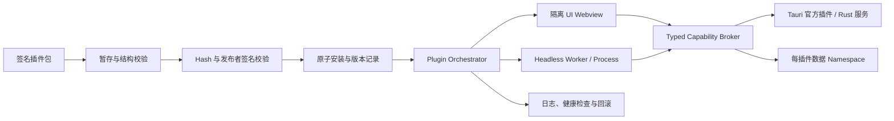

# FlowTools 生产化路线图

> 基线日期：2026-07-18
>
> 当前定位：技术预览 / 集成原型
>
> 目标定位：可签名发布、可安全扩展、可回滚的桌面工具平台

本文档是 FlowTools 从 Demo 级原型走向生产版本的执行台账。它不以
“页面已存在”或“类型已定义”作为完成标准，而以真实执行、失败可恢复、
权限可强制、产物可验证和发布可回滚作为完成标准。

## 1. 使用规则

1. 本文档是生产化工作的路线图和进度来源。范围发生变化时，先更新路线图，
   再开始实现。
2. 每个里程碑都有唯一 ID、依赖、交付物、验证方式和退出标准。
3. 只有验证命令全部通过、人工验证有记录、退出标准全部满足时，状态才能从
   `in-progress` 更新为 `done`。
4. 路线图中尚不存在的命令，例如 `bun run test:security`，是对应里程碑必须
   新增的工程契约，不能通过删除验证项来宣告完成。
5. 架构或开发流程发生重大变化时，同一里程碑必须同步 `README.md`、
   `AGENTS.md`、`architecture.md`、`docs/structure.md` 和 `docs/plugin.md`。
6. 未明确认证的 ZTools 插件只能标记为 `indexed`，不能标记为 `compatible`。

## 2. 成熟度与状态图例

### 2.1 成熟度

- `M0 Demo`：只覆盖演示路径，存在硬编码、假状态或未接通的执行链。
- `M1 Prototype`：主要模块已连接，但契约、错误处理和质量门禁不完整。
- `M2 Internal Alpha`：真实闭环可用，关键失败可恢复，适合内部日常使用。
- `M3 Public Beta`：安全、升级、诊断和发布链可验证，适合受控外部用户。
- `M4 Production`：达到稳定性、安全、兼容性和支持 SLA，可正式发布。

当前总体成熟度为 `M1 Prototype`，其中第三方插件安全、供应链和发布能力仍处于
`M0 Demo`。Phase 0 至 Phase 3 的目标分别是建立可信基线、达到内部 Alpha、
完成安全内核、进入公开 Beta；完成 Beta 验证后才能评审 `M4 Production`。

### 2.2 工作状态

- `pending`：尚未开始。
- `in-progress`：负责人已接受，正在实现，尚未满足退出标准。
- `blocked`：存在明确阻断；必须在进度台账中记录原因和解除条件。
- `done`：交付物、验证记录和退出标准均已满足，且已独立提交。

## 3. 当前基线证据

以下结论来自 2026-07-18 的只读审计和本地验证。后续修复不得删除这些失败
证据，而应通过里程碑提交让同一验证转为通过。

### 3.1 工程门禁

- `bun run lint` 失败。`packages/ui` 存在 63 个真实的
  `no-floating-promises` 问题；另有当前沙箱产生的 Tailwind/进程权限噪声。
- 根 `bun run check-types` 表面通过，但只运行 5 个 workspace。`web-vite`
  使用 `check:types`，Desktop 没有 `check-types`，因此这是漏检而非全仓通过。
- `bun run build` 在 `apps/ui-test` 失败，原因包括 TypeScript 的
  `module` / `moduleResolution` 组合和 Vite React 插件配置不匹配。
- `bun run --cwd apps/web-vite build` 存在多处真实 TypeScript 错误，包括访问
  不存在的插件字段、组件 variant 和 Vite 配置不匹配。
- Desktop Rust 的 `cargo check --locked` 通过；完整 Desktop 前端构建仍需在
  无沙箱干扰的 Windows CI 中复验。
- 根 `bun run test` 当前是 no-op，仓库没有可见的持续集成工作流。

相关入口：

- [根 workspace 脚本](../package.json)
- [Turbo 任务定义](../turbo.json)
- [Web Vite 脚本](../apps/web-vite/package.json)
- [UI Test 配置](../apps/ui-test/tsconfig.app.json)

### 3.2 真实执行与插件运行时

- CLI 的 `list` 能报告 12 个内置插件可运行，但实际执行 UUID 插件失败。
  当前发现器依赖正则扫描和源码改写，临时目录中的模块无法可靠解析依赖。
- Web 工具页仍存在延时后变换字符串的演示执行，不等价于调用插件 `run()`。
- Web 外部插件通过 Blob module 注入宿主页面运行，第三方代码与宿主共享
  DOM、网络和存储权限。
- Registry、Loader 和 Lifecycle Manager 对生命周期职责有重复；状态迁移、
  hook 失败回滚和动态命令注册尚未形成单一可信闭环。
- Watchdog 只能发出 `AbortSignal`，不能终止忽略信号、死循环或灾难性正则。

相关入口：

- [CLI 插件发现](../packages/cli/src/discovery.ts)
- [CLI 运行器](../packages/cli/src/runner.ts)
- [插件文件加载器](../packages/sdk/src/services/plugin-file-loader.ts)
- [插件加载器](../packages/sdk/src/registry/plugin-loader.ts)
- [Watchdog](../packages/sdk/src/registry/watchdog.ts)

### 3.3 Desktop、安全与数据

- Desktop 配置的 CSP 为 `null`，默认 capability 同时开放多个原生插件。
- React 插件在主 React/Tauri WebView 内运行；依赖注入不能阻止其绕过 SDK
  直接访问浏览器或 Tauri API。
- HTML bridge 存在通用 `native.invoke`、共享 raw SQL、任意路径文件能力和
  `postMessage('*')`，权限声明尚不是强制安全边界。
- 插件市场的“安装”主要更新元数据，没有下载、校验、解包、原子切换、健康
  检查和回滚。
- Debug 启动固定删除插件数据库；正式 schema migration、备份和回滚缺失。
- 设置、权限页面和多个状态仍是静态或内存态，不能视为持久化产品能力。

相关入口：

- [Tauri 配置](../apps/desktop/src-tauri/tauri.conf.json)
- [默认 capability](../apps/desktop/src-tauri/capabilities/default.json)
- [Desktop capability adapter](../apps/desktop/src/runtime/desktop-capabilities.ts)
- [HTML bridge](../apps/desktop/src/runtime/html-plugin-bridge.ts)
- [数据库初始化](../apps/desktop/src-tauri/src/db/init.rs)

### 3.4 ZTools 对标结论

ZTools 的产品闭环比当前 FlowTools 完整：它已经覆盖启动器搜索、拼音与历史、
置顶与别名、全局触发、真实插件安装更新、后台插件、独立窗口、持久会话和
跨平台构建。FlowTools 应学习这些产品能力和生态闭环。

但 ZTools 不是安全基线。其第三方 WebContents 配置中存在关闭
`contextIsolation`、`webSecurity` 和 `sandbox` 等高风险选项，插件包和更新
链也缺少足够的签名与完整性保障。因此目标是：

> 产品体验追平 ZTools；隔离、权限和供应链安全显著超过 ZTools。

当前本地 HTML Catalog 共索引 125 个插件、723 个命令，但只有一部分存在可
发布的静态入口，且 Catalog 包含开发机绝对路径。`metadata` 可读取不代表插件
可运行，API bridge 存在也不代表行为兼容。第一版不得宣称兼容全部 125 个插件。

## 4. 目标信任架构

### 4.1 信任等级

- `T0 Host Core`：Rust 宿主、签名发布代码和最小化 UI shell。拥有原生能力，
  但所有插件调用都必须经过 capability broker。
- `T1 Built-in`：随宿主编译和签名的内置 React 插件。可在主 UI 树运行，仍需
  使用标准 SDK 契约，以避免形成第二套实现。
- `T2 Third-party UI`：签名的第三方 UI 插件。每个插件在独立 Tauri webview
  或 window 中运行，拥有独立 origin、CSP、身份、存储 namespace 和能力集。
- `T3 Headless`：无 UI 的第三方工具。运行在 Worker、受限子进程或等价的
  可终止边界中，并设置时间、内存、输出和并发预算。
- `TL Legacy`：ZTools HTML 兼容层。必须置于独立隔离区，只开放经过认证的
  API；未认证插件只能进入显式的开发模式。

第三方 React 插件不能作为任意源码注入主 React 树。需要同级 UI 体验时，使用
SDK 定义的视图协议、受控组件描述或隔离 webview，而不是共享宿主 JavaScript
realm。

### 4.2 目标数据流



### 4.3 不可破坏的架构约束

1. 默认拒绝：Manifest 未声明、用户未授权、scope 不匹配时必须在 Rust 边界
   拒绝，不能只在前端隐藏 API。
2. 不提供通用 `native.invoke`、raw SQL、任意绝对路径文件访问或无策略的全局
   `fetch`。
3. 每个插件有稳定身份、不可变版本、内容 hash、发布者身份、独立数据空间和
   独立 crash budget。
4. 插件包、应用更新和回滚包都必须通过签名与完整性校验。
5. UI 与 headless 插件均必须可停用；超时后必须可强制终止，不能依赖插件合作。
6. Plugin Orchestrator 是生命周期和命令状态的单一事实来源。Desktop、Web 和
   CLI 只能通过 adapter 使用它，不能分别维护静态 Registry。
7. 生命周期迁移必须经过显式状态机和并发锁，并具备 hook 补偿与失败回滚。
8. CSP、origin、message source 和 payload schema 必须同时校验；禁止
   `postMessage('*')` 和不受控远程内容。
9. 数据库迁移必须是版本化、幂等且可恢复的；启动时不得隐式删除用户数据。
10. 所有外部状态都要可诊断：安装、授权、执行、升级、崩溃和回滚必须产生
    脱敏、结构化事件。

### 4.4 目标插件状态机

稳定状态：

```text
discovered -> verified -> installed -> loaded -> enabled
                                      |          |
                                      v          v
                                   disabled <- deactivating

installed -> updating -> installed
任意可恢复状态 -> error -> disabled / rollback / quarantined
installed / disabled -> uninstalling -> removed
```

每次迁移必须记录插件 ID、版本、前后状态、触发源、时间、错误码和 `runId`。
并发的 load、enable、disable、update 和 uninstall 必须串行化或返回确定性冲突。

## 5. 工程与提交策略

### 5.1 一里程碑一提交

- 路线图与 `AGENTS.md` 的首次落库可使用一次引导提交，例如：
  `docs: add production roadmap`。
- 后续每个 Conventional Commit 只能完成一个里程碑；一个里程碑也不能在未
  满足验证和退出标准时标记为完成。
- 如果一个里程碑无法在一个可审查提交中完成，必须先把它拆成新的子 ID，
  再开始实现，不能用混合提交绕过范围控制。
- 完成提交必须同时更新本文末尾的进度台账、验证记录和受影响文档。
- 验证失败时不得创建“完成”提交；将状态保持为 `in-progress` 或记录为
  `blocked`。
- 提交前必须确认工作树只包含该里程碑和必要的文档同步，不得夹带格式化或
  重构无关文件。

推荐提交示例：

```text
ci: establish repository quality gates (P0.1)
fix(web): route tool runs through sdk executor (P0.2)
feat(sdk): validate versioned plugin manifests (P1.1)
feat(desktop): isolate third-party plugin webviews (P2.1)
feat(market): add transactional signed installs (P2.5)
```

### 5.2 通用完成定义

每个里程碑都必须满足：

- TypeScript strict，不新增 `any` 或未说明的 lint suppression。
- 失败路径有稳定错误码，用户输入和插件输出不出现在未脱敏日志中。
- 新协议、新状态和安全边界包含自动化验证；不只依赖手工点击。
- 对用户可见的异步行为包含 loading、成功、错误、取消或重试状态。
- 重要架构变化完成文档同步。
- Windows 验证通过；涉及跨平台发布时同时验证 macOS。

## 6. Phase 0：可信基线与去 Demo 化

目标周期：第 0–2 周。

阶段目标：停止假阳性，确保仓库报告的能力与实际能力一致。

### P0.1 建立全仓质量门禁

- 状态：`in-progress`
- 负责人：`Codex (Build / Platform)`
- 依赖：无

P0.1 是质量基线的父里程碑。它拆分为 P0.1a–P0.1d；四个子里程碑全部
`done` 后，P0.1 才能标记完成。

#### P0.1a 统一 Workspace 任务契约

- 状态：`done`
- 负责人：`Codex (Build / Platform)`
- 开始日期：`2026-07-18`
- 完成日期：`2026-07-18`
- 依赖：无

交付物：

- SDK、UI、CLI、plugins、web-vite、desktop 和 ui-test 全部暴露名称一致的
  `lint`、`check-types`、`build` 和 `test` 脚本。
- 根 `test` 改为 Turbo 任务，不再是 no-op；`turbo.json` 声明测试任务及其依赖。
- CI 使用的 `lint` 不修改源文件；自动修复仅通过显式 `lint:fix` 暴露。
- 根任务执行图包含所有应参与的 workspace，不再因任务别名产生假阳性。

验证：

```powershell
bun run verify:workspace-tasks
bun x turbo run lint check-types test build --dry=json
```

退出标准：

- 所有 workspace 的标准脚本可被 Turbo 发现。
- 根 `test` 不包含“deprecated”或只打印信息的实现。
- 运行只读 gate 后工作树保持干净。

#### P0.1b 修复现有静态检查与构建错误

- 状态：`done`
- 负责人：`Codex (Build / Frontend)`
- 完成日期：`2026-07-18`
- 依赖：P0.1a

P0.1b 是构建修复的父里程碑，拆分如下：

##### P0.1b1 修复 UI Promise Lint

- 状态：`done`
- 负责人：`Codex`
- 完成日期：`2026-07-18`
- 范围：`packages/ui`
- 验证：`bun run --cwd packages/ui lint`、
  `bun run --cwd packages/ui check-types`
- 退出：修复所有已知 `no-floating-promises`，不使用规则 suppression，动画行为
  不变。

##### P0.1b2 修复 Web Host 构建

- 状态：`done`
- 负责人：`Codex`
- 完成日期：`2026-07-18`
- 范围：`apps/web-vite`
- 验证：`bun run --cwd apps/web-vite check-types`、
  `bun run --cwd apps/web-vite build`
- 退出：SDK 契约、HeroUI v3、TypeScript 与 Vite 配置错误清零。

##### P0.1b3 修复 UI Test Consumer 构建

- 状态：`done`
- 负责人：`Codex`
- 完成日期：`2026-07-18`
- 范围：`apps/ui-test`
- 验证：`bun run --cwd apps/ui-test lint`、
  `bun run --cwd apps/ui-test check-types`、
  `bun run --cwd apps/ui-test build`
- 退出：consumer 使用当前 Vite/TypeScript 配置从 workspace 源码成功构建。

##### P0.1b4 修复 Desktop 静态门禁

- 状态：`done`
- 负责人：`Codex`
- 完成日期：`2026-07-18`
- 范围：`apps/desktop`
- 验证：Desktop `lint`、`check-types`、`build` 和 Rust `cargo check --locked`
- 退出：移除失效 TypeScript 配置和真实 lint 错误；前端与 Rust 构建通过。

##### P0.1b5 全仓集成收口

- 状态：`done`
- 负责人：`Codex`
- 完成日期：`2026-07-18`
- 范围：根 Turbo 图及剩余跨 workspace 构建问题
- 依赖：P0.1b1–P0.1b4
- 验证：根 `lint`、`check-types`、`build`，并确认执行后工作树干净。
- 退出：P0.1b 父里程碑的全部验证命令通过。

完成内容：

- SDK 所有声明的公开子路径均生成对应 JS/DTS 产物，Desktop 使用的
  `utils/capability` 具有显式 export。
- 共享 tsdown 配置迁移到当前 `deps.*` API，并纳入 Turbo 全局输入哈希。
- 根 lint 覆盖 7 个 workspace 且达到 0 warning；剩余插件类型警告已清零。

交付物：

- 修复 `packages/ui` 当前的 Promise 处理 lint 错误。
- 修复 web-vite 的真实 TypeScript、HeroUI 和 Vite 配置错误。
- 修复 ui-test 的 TypeScript module 配置和 Vite React 插件配置。
- 确保 Desktop 前端与 Rust 分别存在可重复的静态检查和构建命令。

验证：

```powershell
bun run lint
bun run check-types
bun run build
bun run --cwd apps/web-vite build
bun run --cwd apps/desktop build
cargo check --locked --manifest-path apps/desktop/src-tauri/Cargo.toml
```

退出标准：

- 上述命令在支持环境中全部退出 0。
- 不通过禁用 strict、跳过 workspace 或扩大 lint ignore 来获得绿色结果。

#### P0.1c 恢复核心自动化测试

- 状态：`in-progress`
- 负责人：`Codex (SDK / CLI / Desktop)`
- 开始日期：`2026-07-18`
- 依赖：P0.1a、P0.1b

P0.1c 是自动化回归基线的父里程碑，拆分如下：

##### P0.1c1 锁定 SDK 值对象与 HTML 兼容契约

- 状态：`done`
- 负责人：`Codex`
- 完成日期：`2026-07-18`
- 范围：`packages/sdk` 的 Result、`definePlugin`、capability、runtime error、
  HTML manifest 规范化和公开 package exports。
- 实施：把 SDK `test` 从 0-test no-op 改为真实 Bun 测试；覆盖成功与拒绝路径，
  且不引入第三方测试依赖。
- 验证：SDK `test`、`lint`、`check-types`、`build`；移除测试文件必须导致
  `test` 失败。

##### P0.1c2 覆盖 SDK Registry、Loader 与异步失败

- 状态：`pending`
- 依赖：P0.1c1
- 范围：Plugin/Command Registry、PluginLoader、生命周期和 watchdog。
- 实施：覆盖订阅、状态事件、MRU、加载隔离、hook 幂等和错误传播；测试暴露的
  activate/deactivate 状态覆盖问题在同一里程碑修复。
- 约束：watchdog 只承诺合作式取消；不编写能够终止同步死循环的虚假测试。
- 验证：SDK `test`、`lint`、`check-types`、`build`。

##### P0.1c3 覆盖 CLI 输入、输出与 Runner 契约

- 状态：`pending`
- 范围：`packages/cli` 的 schema/flag coercion、formatter、runner、timeout 和失败
  退出码。
- 实施：把库函数中的 stderr/exit 副作用收敛到 CLI 边界，提供稳定错误类型和
  可注入的执行 seam；不冻结现有源码正则发现实现。
- 验证：CLI `test`、`lint`、`check-types`、`build`，以及构建后 `--version` 和
  missing-plugin 非零退出 smoke。

##### P0.1c4 覆盖 Desktop Rust DTO 与 Repository 契约

- 状态：`pending`
- 范围：plugin DTO 校验、默认值、序列化、内存 SQLite repository 往返、隔离和
  错误路径。
- 实施：Desktop `test` 运行真实 `cargo test --locked --lib`；使用 Toasty 内存
  数据库，不访问用户 app-data，不为 Tauri `State` 编写低价值 mock。
- 验证：`cargo fmt --check`、`cargo test --locked --lib`、
  `cargo clippy --all-targets -- -D warnings` 和 Desktop `test`。

##### P0.1c5 收口 Workspace 与根测试图

- 状态：`pending`
- 依赖：P0.1c1–P0.1c4
- 范围：`packages/ui`、`plugins`、`apps/web-vite`、`apps/ui-test` 及根 Turbo
  `test` 图。
- 实施：为剩余 workspace 提供真实 smoke/contract 测试，稳定现有 browser
  suite，删除全部 `--pass-with-no-tests`；测试不得依赖开发服务器或用户状态。
- 验证：7 个 workspace 的 `test` 均实际执行断言，根 `bun run test` 退出 0，
  删除任一测试入口会使对应任务失败。

交付物：

- SDK 至少覆盖 Manifest/Result 基础契约和 Registry 关键行为。
- CLI 至少覆盖参数、schema 校验、输出格式和失败退出码。
- Desktop Rust 至少覆盖 DTO 验证、repository 约束和迁移入口。
- 没有测试的 workspace 使用明确的 smoke/contract 测试，而不是 no-op 脚本。

验证：

```powershell
bun run test
cargo test --locked --manifest-path apps/desktop/src-tauri/Cargo.toml
```

退出标准：

- 测试能在引入已知错误时失败。
- SDK、CLI 与 Rust 的核心失败路径进入 PR 必跑门禁。

#### P0.1d 建立 Windows PR CI

- 状态：`pending`
- 负责人：`TBD (Build / Release)`
- 依赖：P0.1b、P0.1c

交付物：

- Windows CI 从干净 checkout 执行 frozen install、lint、type check、test、build
  和 `cargo check`。
- 使用 Bun、Rust 与依赖缓存，但缓存不能掩盖缺失产物或 lockfile 漂移。
- 任一 gate 失败都会使工作流失败并阻止合并。

验证：

```powershell
bun install --frozen-lockfile
bun run lint
bun run check-types
bun run test
bun run build
cargo check --locked --manifest-path apps/desktop/src-tauri/Cargo.toml
```

退出标准：

- 连续两次 CI 运行结果一致。
- CI 完成后工作树无生成文件漂移。
- 工作流日志能明确显示每个 workspace 的参与情况。

交付物：

- 统一所有 workspace 的 `lint`、`check-types`、`build` 和 `test` 任务名。
- 根任务覆盖 SDK、UI、CLI、plugins、web-vite、desktop 和 ui-test。
- 修复当前 lint、TypeScript、Vite 和构建错误；CI 中 lint 不允许自动改文件。
- 恢复有意义的测试入口，至少覆盖核心 SDK、CLI 和 Desktop Rust。
- 新增 Windows PR CI：install、lint、type check、test、build、`cargo check`。

验证：

```powershell
bun install --frozen-lockfile
bun run lint
bun run check-types
bun run test
bun run build
bun run --cwd apps/web-vite build
bun run --cwd apps/desktop build
cargo check --locked --manifest-path apps/desktop/src-tauri/Cargo.toml
```

退出标准：

- 干净 checkout 上所有命令退出码为 0。
- Turbo 输出包含所有声明了对应任务的 workspace，不存在命名漏检。
- PR 中任一 gate 失败都会阻止合并。
- 连续两次 CI 运行结果一致，运行后工作树保持干净。

### P0.2 接通真实插件执行链

- 状态：`pending`
- 负责人：`TBD (SDK / Host)`
- 依赖：P0.1

交付物：

- 删除 Web 工具页中的演示延时、字符串变换和硬编码运行结果。
- Web、Desktop 和 CLI 都通过 SDK executor 调用真实 `run()`。
- Run history 只记录实际执行的版本、输入摘要、耗时、结果和错误码。
- 为 12 个内置插件建立无 UI smoke fixture，确保 `list` 与 `run` 一致。
- 运行失败向用户返回稳定错误，而不是静默 `process.exit(1)`。

验证：

```powershell
bun run smoke:plugins
bun run packages/cli/src/cli.ts list --format json
bun run packages/cli/src/cli.ts run plugin-uuid-generator `
  --count 2 --format json
bun run --cwd apps/web-vite build
bun run --cwd apps/desktop build
```

人工验证：

- 在 Web 和 Desktop 运行同一个确定性 fixture，确认结果 envelope 一致。
- 触发 schema 错误、插件异常和取消，确认三端都展示真实失败状态。

退出标准：

- 12 个内置插件的 smoke fixture 全部调用真实实现。
- `list` 标记为 runnable 的插件必须可执行；否则必须返回不可运行原因。
- 仓库中不存在用于冒充插件执行结果的延时或硬编码 success path。

### P0.3 建立诚实的功能与兼容状态

- 状态：`pending`
- 负责人：`TBD (Product / Plugin Platform)`
- 依赖：P0.1

交付物：

- 为功能和插件定义 `demo`、`experimental`、`verified`、`production` 状态。
- 生产构建关闭任意源码导入、remote HTML 和未隔离的 Legacy 自动启动。
- HTML Catalog 使用可发布相对资源或 package identity，不再保存开发机绝对路径。
- Catalog 区分 `indexed`、`entry-resolved`、`api-verified` 和
  `production-certified`。
- 市场按钮在真实安装链完成前显示“不可安装”或“开发预览”，不能只写数据库
  后宣称已安装。

验证：

```powershell
bun run inspect:html-plugins
bun run verify:plugin-catalog
bun run --cwd apps/desktop build
```

退出标准：

- 发布产物中没有本机盘符、checkout 路径或指向源码态 Vite 入口的 URL。
- 未认证插件无法在 production mode 自动执行。
- UI、CLI 与 Catalog 对同一插件的状态描述一致。

### P0.4 固化威胁模型与架构决策

- 状态：`pending`
- 负责人：`TBD (Architecture / Security)`
- 依赖：无；必须在 Phase 0 结束前完成

交付物：

- 建立 Host、Built-in、Third-party UI、Headless 和 Legacy 的信任边界 ADR。
- 建立插件包、IPC、文件、网络、数据库、更新和日志的威胁模型。
- 记录不支持的能力和显式非目标，包括不在 v1 宣称兼容 125 个插件。
- 将本文目标状态同步到架构、插件和开发流程文档。

验证：

```powershell
bun run docs:check
bun run lint
```

退出标准：

- 每个高风险入口都有 owner、缓解措施、验证方式和残余风险。
- T1、T2、T3、TL 的运行位置和能力边界没有模糊项。
- 新增 capability 或 bridge API 的 PR 模板要求安全评审。

Phase 0 总退出标准：P0.1–P0.4 全部 `done`；仓库全绿；生产构建不再运行
未认证第三方代码；README 对产品成熟度没有超出实际能力的表述。

## 7. Phase 1：可靠 SDK、生命周期与 CLI 内核

目标周期：第 3–6 周。

阶段目标：形成三端共用、可验证且失败可恢复的插件执行内核。

### P1.1 发布 Manifest v1 运行时契约

- 状态：`pending`
- 负责人：`TBD (SDK)`
- 依赖：P0.1、P0.4

交付物：

- 使用 Zod 定义 versioned Manifest v1，并在所有入口执行运行时验证。
- 字段包含 ID、版本、类型、入口、SDK/Host 范围、平台/架构、权限与 scopes、
  package 文件清单、内容 hash、发布者和签名元数据。
- 默认拒绝未知关键字段、非法 ID、非法 semver、重复 command ID 和不兼容版本。
- 为旧 manifest 提供显式迁移器，不允许静默猜测生产字段。

验证：

```powershell
bun run --cwd packages/sdk test
bun run verify:manifests
bun run check-types
```

退出标准：

- 所有 plugin ingress 在加载代码前验证同一 Manifest schema。
- 正常、边界、未知字段、路径穿越和版本不兼容 fixture 均有测试。
- 无效插件不会进入 `installed` 或 `loaded` 状态。

### P1.2 实现单一生命周期状态机

- 状态：`pending`
- 负责人：`TBD (SDK / Runtime)`
- 依赖：P1.1

交付物：

- 合并 Registry、Loader 和 Lifecycle Manager 的重叠职责。
- 定义合法状态迁移、事务边界、并发锁、hook 顺序和补偿行为。
- load、enable、disable、reload、update、uninstall 均幂等或返回确定冲突。
- hook 失败保留 error 状态和原因，不被后续 transition 覆盖。
- CommandRegistry 随插件状态动态注册和注销命令。

验证：

```powershell
bun run --cwd packages/sdk test
bun run test:lifecycle
bun run check-types
```

退出标准：

- 状态迁移表的每条合法和非法边都有自动化测试。
- 100 次并发 enable/disable fixture 不产生重复 hook 或孤儿命令。
- reload 和 uninstall 后没有订阅、timer、view 或 command 泄漏。

### P1.3 建立三端统一 Execution Service

- 状态：`pending`
- 负责人：`TBD (SDK / Hosts)`
- 依赖：P1.2

交付物：

- Web、Desktop 和 CLI 共用一个与宿主无关的 execution contract。
- 每次运行生成 `runId`，记录插件版本、validated input、deadline、取消原因、
  结构化结果和稳定错误码。
- Host capability 通过 adapter 注入，但 permission decision 使用统一策略接口。
- 执行历史使用同一 envelope，禁止 host 自行制造伪结果。

验证：

```powershell
bun run test:execution-contract
bun run smoke:plugins
bun run check-types
bun run build
```

退出标准：

- 相同 fixture 在三端产生 schema 等价的 success/error envelope。
- input validation 在调用插件之前完成。
- 取消和 deadline 只有一个权威来源，不存在未清理的重复 timer。

### P1.4 重建 CLI 插件发现与运行

- 状态：`pending`
- 负责人：`TBD (CLI)`
- 依赖：P1.1、P1.3

交付物：

- CLI 从经过构建的插件包和 Manifest 发现插件，不再正则解析或改写 TSX 源码。
- package resolution、source map、稳定 app-data 存储和错误输出可预测。
- CLI 根据授权策略提供 capabilities；不能固定把 app 插件视为全部可运行。
- JSON 模式在 stdout 只输出 envelope，诊断进入 stderr。
- 为后续 headless 隔离预留 runner interface。

验证：

```powershell
bun run --cwd packages/cli test
bun run packages/cli/src/cli.ts list --format json
bun run packages/cli/src/cli.ts info plugin-uuid-generator
bun run packages/cli/src/cli.ts run plugin-uuid-generator `
  --count 2 --format json
```

退出标准：

- CLI 从任意工作目录执行均能解析已安装插件和依赖。
- 不依赖源码文本形态；重命名局部变量不会影响 runnable 判断。
- 成功、schema 错误、加载错误、超时和信号退出码有文档和测试。

### P1.5 建立诊断与错误契约

- 状态：`pending`
- 负责人：`TBD (Runtime / Observability)`
- 依赖：P1.3

交付物：

- 定义稳定错误码：manifest、permission、load、execution、timeout、storage、
  network、install、update 和 internal。
- 错误跨 Rust IPC 时转换为受控 DTO，不向 UI 暴露数据库或文件系统内部信息。
- 日志默认脱敏输入、token、剪贴板、文件内容和插件输出。
- Error Boundary 记录 `runId` 和 plugin identity，并触发真实 reload/cleanup。

验证：

```powershell
bun run test:error-contract
cargo test --manifest-path apps/desktop/src-tauri/Cargo.toml
bun run smoke:plugins
```

退出标准：

- 每类公开错误码有 fixture、用户文案和可操作诊断。
- 日志红线测试证明 secret 和原始敏感内容不会泄漏。
- 用户可导出诊断摘要而不导出插件私有数据。

Phase 1 总退出标准：P1.1–P1.5 全部 `done`；三端真实执行契约一致；Lifecycle
测试覆盖所有迁移；CLI 从构建产物稳定运行；达到 `M2 Internal Alpha` 内核标准。

## 8. Phase 2：隔离、权限、供应链与数据安全

目标周期：第 7–12 周。

阶段目标：让第三方插件成为默认拒绝、可终止、可审计、可回滚的受控代码。

### P2.1 隔离第三方 UI 插件

- 状态：`pending`
- 负责人：`TBD (Desktop / Security)`
- 依赖：P1.1、P1.2

交付物：

- 每个 T2/TL 插件使用独立 Tauri webview/window、唯一 label 和独立 origin。
- 启用严格 CSP；移除 `allow-same-origin + allow-scripts` 的危险组合和任意
  remote fallback。
- `postMessage` 同时验证 origin、source、plugin identity、message schema 和
  request nonce。
- 第三方 React 代码不再注入主 React/Tauri realm。
- 每个 webview 只关联最小 capability，不继承 main window 的权限集合。

验证：

```powershell
bun run test:plugin-webview
bun run test:security
bun run --cwd apps/desktop build
cargo test --manifest-path apps/desktop/src-tauri/Cargo.toml
```

退出标准：

- 恶意 fixture 无法读取宿主 DOM、主窗口 localStorage 或其他插件数据。
- 伪造 origin、plugin ID、nonce 和 response source 的消息全部被拒绝。
- 生产配置中没有 `csp: null`，插件 webview 没有宽泛默认 capability。

### P2.2 隔离并可终止 Headless 插件

- 状态：`pending`
- 负责人：`TBD (Runtime / Desktop)`
- 依赖：P1.3、P1.5

交付物：

- T3 插件运行于 Worker、受限子进程或等价可终止边界。
- 设置 wall-clock、CPU、内存、输出大小、网络和并发预算。
- 支持 cooperative cancel、grace period 和强制终止。
- 插件崩溃、死循环或内存超限不能终止宿主进程。

验证：

```powershell
bun run test:headless-isolation
bun run test:security
bun run smoke:plugins
```

退出标准：

- 忽略 `AbortSignal` 的死循环在 deadline + 500ms 内被终止。
- 超量输出和内存 fixture 被拒绝，宿主保持可用。
- worker/process 生命周期没有孤儿进程或未清理临时目录。

### P2.3 实现 Typed Capability Broker

- 状态：`pending`
- 负责人：`TBD (Rust / SDK / Security)`
- 依赖：P2.1、P2.2

交付物：

- Rust 边界根据 plugin identity、manifest declaration、persisted grant 和 scope
  做最终授权。
- 用窄接口替换通用 native invoke、raw SQL、任意路径 FS 和无策略 fetch。
- 文件 scope 来源于用户选择器或明确目录授权；网络 scope 限定 scheme、host、
  port 和重定向策略。
- 数据 capability 自动绑定插件 namespace，不接受调用方指定其他插件 ID。
- 优先使用官方 Tauri plugins，并为每项命令配置最小 capability。

验证：

```powershell
cargo test --manifest-path apps/desktop/src-tauri/Cargo.toml
bun run test:capabilities
bun run test:security
```

退出标准：

- 未声明、未授权、越 scope 和跨 namespace 调用全部在 Rust 边界拒绝。
- 代码库中不存在可供第三方调用的通用 `native.invoke` 或 raw SQL API。
- capability decision 产生脱敏审计事件。

### P2.4 落地权限授权、撤销与审计

- 状态：`pending`
- 负责人：`TBD (Desktop / Product)`
- 依赖：P2.3

交付物：

- 首次敏感调用或安装前展示 permission diff、用途和 scope。
- grant 绑定 plugin ID、版本范围、权限、scope、授予来源和时间。
- 设置中心显示每插件实际权限，可撤销、缩小 scope 和清空数据。
- 插件升级新增或扩大权限时重新询问，拒绝后保持上一可用版本。
- 提供只读权限审计记录，不记录敏感 payload。

验证：

```powershell
bun run test:permissions
bun run --cwd apps/desktop build
cargo test --manifest-path apps/desktop/src-tauri/Cargo.toml
```

人工验证：安装、首次授权、拒绝、撤销、版本新增权限和降级回滚。

退出标准：

- 权限 UI 展示值与 Rust 实际 decision 一致。
- 撤销在当前会话内即时生效，重启后仍保持。
- 任何 UI 绕过都不能改变 broker 的拒绝结果。

### P2.5 实现事务化、签名插件安装

- 状态：`pending`
- 负责人：`TBD (Plugin Platform / Security)`
- 依赖：P1.1、P2.3

交付物：

- 下载进入 staging，并设置总大小、单文件大小、文件数和超时上限。
- 解包前验证路径、禁止 Zip Slip、symlink 越界和特殊文件。
- 校验文件清单、SHA-256 和受信发布者签名。
- 安装采用原子 rename/swap；健康检查失败自动恢复 last-known-good。
- 支持取消、重试、隔离 quarantine、版本保留和卸载清理。
- 数据库记录来源、manifest hash、package hash、publisher、grants、安装路径、
  last-known-good 和失败次数。

验证：

```powershell
bun run test:plugin-package
bun run test:security
cargo test --manifest-path apps/desktop/src-tauri/Cargo.toml
```

退出标准：

- 篡改、截断、错误签名、路径穿越和 zip bomb fixture 全部被拒绝。
- 安装中断不会留下可加载的半安装版本。
- 更新后健康检查失败能自动恢复，并保留可诊断原因。

### P2.6 建立迁移、数据隔离与恢复

- 状态：`pending`
- 负责人：`TBD (Data / Desktop)`
- 依赖：P1.2、P2.3

交付物：

- 删除 debug 启动删库行为，建立 versioned、幂等 migration runner。
- Core metadata、grants、run history 和插件数据使用明确 schema ownership。
- 每插件 KV/DB namespace 在 broker 内绑定，防止跨插件查询。
- 支持升级前备份、迁移失败恢复、插件数据导出和卸载清理策略。
- 定义 N-1 到 N 的兼容窗口和 downgrade 行为。

验证：

```powershell
cargo test --manifest-path apps/desktop/src-tauri/Cargo.toml
bun run test:migrations
bun run test:data-isolation
```

退出标准：

- 空库、N-1 数据库、部分迁移和失败重试 fixture 均可预测。
- 跨插件读写测试全部拒绝。
- Debug、release 和升级路径都不会隐式删除用户数据。

### P2.7 建立安全回归门禁

- 状态：`pending`
- 负责人：`TBD (Security / Build)`
- 依赖：P2.1–P2.6

交付物：

- 为 Manifest、IPC、路径、归档、权限、数据库、网络和更新建立恶意 fixture。
- CI 增加依赖审计、secret scan、Rust audit 和安全 contract tests。
- 建立 capability 变更、安全例外和第三方依赖的评审清单。
- 对关键 parser 和 IPC payload 添加 fuzz/property tests。

验证：

```powershell
bun run test:security
bun run audit:dependencies
cargo audit --manifest-path apps/desktop/src-tauri/Cargo.toml
bun run build
```

退出标准：

- 威胁模型中的高风险场景都有自动化回归测试。
- production 配置中不存在空 CSP、插件宽泛 default capability 或未签名安装。
- 安全 gate 在 PR 和 release 分支均不可跳过。

Phase 2 总退出标准：P2.1–P2.7 全部 `done`；第三方代码默认拒绝且可强制
终止；权限在 Rust 边界执行；包和数据可校验、迁移与回滚。

## 9. Phase 3：产品闭环、生态认证与公开 Beta

目标周期：第 13–24 周。

阶段目标：在安全内核上完成 ZTools 级产品闭环，并具备受控公开发布能力。

### P3.1 完成 Desktop 宿主产品能力

- 状态：`pending`
- 负责人：`TBD (Desktop)`
- 依赖：P0.1、P2.3

交付物：

- 使用正式 product name、identifier、版本和数据目录。
- 实现全局热键、托盘、单实例、窗口恢复、多屏定位和可选开机启动。
- 热键冲突、权限拒绝和插件崩溃不阻塞主窗口恢复。
- 设置真正持久化，并支持重置和导出诊断。

验证：

```powershell
bun run test:desktop-shell
bun run --cwd apps/desktop build
cargo test --manifest-path apps/desktop/src-tauri/Cargo.toml
```

退出标准：

- Windows 重启、热键冲突、多屏切换和异常退出恢复清单通过。
- 单实例不会损坏状态，第二实例请求能转发到已有窗口。

### P3.2 完成生产级启动器与搜索

- 状态：`pending`
- 负责人：`TBD (Search / UI)`
- 依赖：P1.2、P3.1

交付物：

- 支持拼音、模糊、正则、别名、关键词和可解释排序。
- 支持历史、置顶和使用频率，但提供清空和隐私设置。
- 支持选中文本、剪贴板、文件和图片等受控触发上下文。
- 索引更新与插件生命周期一致，禁用/卸载后命令立即消失。
- 建立 10k commands 的性能和内存 benchmark。

验证：

```powershell
bun run test:search
bun run benchmark:launcher
bun run --cwd apps/desktop build
```

退出标准：

- 10k 命令搜索 p95 小于 50ms。
- 热唤起 p95 小于 150ms，目标硬件冷启动 p95 小于 1.5s。
- 拼音、IME、路径、emoji 和长文本 fixture 结果稳定且可复现。

### P3.3 打通真实插件市场闭环

- 状态：`pending`
- 负责人：`TBD (Marketplace / Plugin Platform)`
- 依赖：P2.4、P2.5、P2.6

交付物：

- 市场索引带签名、缓存、过期策略和来源身份。
- 详情页展示发布者、版本、平台、权限、变更、包大小和兼容性。
- 安装、更新、取消、重试、回滚、禁用和卸载接通真实 package service。
- 更新前展示权限 diff；卸载支持保留或删除数据。
- 网络离线、索引过期和源不可用时展示可解释的降级状态。

验证：

```powershell
bun run test:marketplace
bun run test:plugin-package
bun run --cwd apps/desktop build
```

退出标准：

- 正常、断网、取消、错误签名、升级失败和回滚流程全部通过。
- 100 次安装/更新 fixture 成功率不低于 99%，且无半安装状态。
- UI 安装状态与磁盘、数据库和 Orchestrator 状态一致。

### P3.4 认证首批生产插件

- 状态：`pending`
- 负责人：`TBD (Plugin Ecosystem)`
- 依赖：P2.7、P3.3

交付物：

- 按价值和风险选择首批不超过 20 个插件，避免一次兼容 125 个。
- 每个插件有 owner、Manifest、权限审查、fixture、性能预算和兼容等级。
- Bridge API 逐项认证语义；silent no-op 必须改为明确 unsupported error。
- 无法安全映射的 Legacy 插件重写为 T1/T2/T3 插件或保持不兼容。
- 发布公开兼容矩阵和已知限制。

验证：

```powershell
bun run verify:compatibility
bun run smoke:certified-plugins
bun run test:security
```

退出标准：

- 所有 certified 插件在支持平台完成安装、执行、更新、禁用和卸载验证。
- 不存在把 `indexed` 或 `metadata` 冒充为 `compatible` 的 UI/文档。
- 插件升级可在兼容矩阵中追溯验证结果。

### P3.5 建立签名应用发布与更新链

- 状态：`pending`
- 负责人：`TBD (Release / Security)`
- 依赖：P2.5、P2.7、P3.1

交付物：

- Windows 产物签名；macOS 产物签名和 notarization。
- Tauri updater 使用独立更新签名、渠道元数据和 last-known-good 回滚。
- CI 生成校验和、SBOM、构建 provenance 和 release notes。
- 建立 stable、beta、internal 渠道和分阶段 rollout/暂停机制。
- 发布密钥在受控 CI secret/HSM 中管理，并有轮换和泄露响应手册。

验证：

```powershell
bun run release:verify
bun run test:updater
bun run audit:dependencies
```

退出标准：

- Windows 与 macOS 干净环境能验证签名并完成安装、升级和回滚。
- 篡改应用或 update metadata 必定被拒绝。
- Release artifact 可对应到 commit、SBOM、provenance 和验证记录。

### P3.6 建立运行可观测性与故障恢复

- 状态：`pending`
- 负责人：`TBD (Observability / Support)`
- 依赖：P1.5、P2.7

交付物：

- 记录脱敏的启动、执行、权限、安装、更新、崩溃和回滚指标。
- 插件 crash loop 自动禁用或 quarantine，不拖垮宿主。
- 提供本地诊断页和用户主动导出的支持包。
- Telemetry 默认值、收集字段、保留时间和退出机制有隐私文档。
- 建立 crash、数据迁移失败、更新失败和市场故障 runbook。

验证：

```powershell
bun run test:recovery
bun run test:redaction
bun run --cwd apps/desktop build
```

退出标准：

- 注入插件崩溃、数据库失败和更新失败后，宿主可重启并给出恢复路径。
- 支持包通过 redaction fixture，不包含 token、原始输入或插件私有数据。
- 关键告警有 owner、阈值和 runbook。

### P3.7 完成公开 Beta 准入

- 状态：`pending`
- 负责人：`TBD (Product / Release)`
- 依赖：P3.1–P3.6

交付物：

- 完成至少 7 天内部 dogfood 和 30 天受控 Beta。
- 建立 crash-free、执行成功率、启动与搜索性能、安装成功率指标看板。
- 完成升级/降级、备份恢复、密钥轮换和发行回滚演练。
- 完成用户文档、开发者文档、隐私说明、支持流程和已知限制。
- 建立 GA 风险清单，单独评审是否进入 `M4 Production`。

验证：

```powershell
bun run lint
bun run check-types
bun run test
bun run test:security
bun run build
bun run release:verify
```

退出标准：

- 连续 30 天无未解决的 P0/P1 缺陷。
- Host crash-free session 不低于 99.5%，插件执行成功率不低于 99.5%。
- 市场安装/更新成功率不低于 99%，核心性能满足 P3.2 预算。
- 安全评审、隐私评审、回滚演练和支持交接均有签字记录。

Phase 3 总退出标准：P3.1–P3.7 全部 `done`；应用和插件包可验证签名；首批
插件经过认证；公开 Beta 指标满足门槛。进入 GA 必须另行评审，不能因完成代码
自动宣告 Production。

## 10. v1 显式非目标

- 不允许任意第三方 React/TSX 在主窗口 JavaScript realm 执行。
- 不开放通用 native invoke、raw SQL、任意路径 FS 或无域名策略的网络能力。
- 不在验证前宣称兼容全部 ZTools 插件。
- 不在 Desktop 安全内核稳定前追求 Web/Desktop 全能力一致。
- 不在真实安装、签名、升级和回滚完成前扩展开放市场。
- 不用更多 Demo 插件数量代替核心运行时、权限和发布质量。

## 11. 进度台账

所有实现项初始状态均为 `pending`。开始里程碑时填写 owner 和开始日期；完成时
在同一里程碑提交中填写 commit、验证摘要和完成日期。

### Phase 0

| ID     | 状态        | 负责人 | 依赖          | Commit / 验证记录                                                                                     |
| ------ | ----------- | ------ | ------------- | ----------------------------------------------------------------------------------------------------- |
| P0.1   | in-progress | Codex  | -             | P0.1a–P0.1b 已完成；P0.1c–P0.1d 待实施                                                                |
| P0.1a  | done        | Codex  | -             | `chore(repo): standardize workspace quality tasks (P0.1a)`；workspace verifier + Turbo dry graph 通过 |
| P0.1b  | done        | Codex  | P0.1a         | `fix(repo): close build integration gates (P0.1b5)`；P0.1b1–P0.1b5 全部通过                           |
| P0.1b1 | done        | Codex  | P0.1a         | `fix(ui): handle icon animation promises (P0.1b1)`；lint + check-types 通过                           |
| P0.1b2 | done        | Codex  | P0.1a         | `fix(web): restore host quality gates (P0.1b2)`；lint + check-types + build 通过                      |
| P0.1b3 | done        | Codex  | P0.1a         | `fix(ui-test): restore consumer build gates (P0.1b3)`；lint + check-types + build 通过                |
| P0.1b4 | done        | Codex  | P0.1a         | `fix(desktop): restore static quality gates (P0.1b4)`；lint + check-types + build + cargo check 通过  |
| P0.1b5 | done        | Codex  | P0.1b1–P0.1b4 | `fix(repo): close build integration gates (P0.1b5)`；根 lint + check-types + build 通过               |
| P0.1c  | in-progress | Codex  | P0.1a, P0.1b  | P0.1c1–P0.1c5 已拆分                                                                                  |
| P0.1c1 | done        | Codex  | P0.1b         | `test(sdk): lock core value contracts (P0.1c1)`；19 tests + 8 package exports 通过                    |
| P0.1c2 | pending     | TBD    | P0.1c1        | -                                                                                                     |
| P0.1c3 | pending     | TBD    | P0.1b         | -                                                                                                     |
| P0.1c4 | pending     | TBD    | P0.1b         | -                                                                                                     |
| P0.1c5 | pending     | TBD    | P0.1c1–P0.1c4 | -                                                                                                     |
| P0.1d  | pending     | TBD    | P0.1b, P0.1c  | -                                                                                                     |
| P0.2   | pending     | TBD    | P0.1          | -                                                                                                     |
| P0.3   | pending     | TBD    | P0.1          | -                                                                                                     |
| P0.4   | pending     | TBD    | -             | -                                                                                                     |

### Phase 1

| ID   | 状态    | 负责人 | 依赖       | Commit / 验证记录 |
| ---- | ------- | ------ | ---------- | ----------------- |
| P1.1 | pending | TBD    | P0.1, P0.4 | -                 |
| P1.2 | pending | TBD    | P1.1       | -                 |
| P1.3 | pending | TBD    | P1.2       | -                 |
| P1.4 | pending | TBD    | P1.1, P1.3 | -                 |
| P1.5 | pending | TBD    | P1.3       | -                 |

### Phase 2

| ID   | 状态    | 负责人 | 依赖       | Commit / 验证记录 |
| ---- | ------- | ------ | ---------- | ----------------- |
| P2.1 | pending | TBD    | P1.1, P1.2 | -                 |
| P2.2 | pending | TBD    | P1.3, P1.5 | -                 |
| P2.3 | pending | TBD    | P2.1, P2.2 | -                 |
| P2.4 | pending | TBD    | P2.3       | -                 |
| P2.5 | pending | TBD    | P1.1, P2.3 | -                 |
| P2.6 | pending | TBD    | P1.2, P2.3 | -                 |
| P2.7 | pending | TBD    | P2.1-P2.6  | -                 |

### Phase 3

| ID   | 状态    | 负责人 | 依赖             | Commit / 验证记录 |
| ---- | ------- | ------ | ---------------- | ----------------- |
| P3.1 | pending | TBD    | P0.1, P2.3       | -                 |
| P3.2 | pending | TBD    | P1.2, P3.1       | -                 |
| P3.3 | pending | TBD    | P2.4, P2.5, P2.6 | -                 |
| P3.4 | pending | TBD    | P2.7, P3.3       | -                 |
| P3.5 | pending | TBD    | P2.5, P2.7, P3.1 | -                 |
| P3.6 | pending | TBD    | P1.5, P2.7       | -                 |
| P3.7 | pending | TBD    | P3.1-P3.6        | -                 |

## 12. 里程碑记录模板

复制以下模板到相关 PR、issue 或进度记录中：

```text
Milestone: P?.?
Status: pending | in-progress | blocked | done
Owner: TBD
Started: YYYY-MM-DD
Completed: YYYY-MM-DD
Commit: <sha>

Scope:
- ...

Verification:
- <command>: pass/fail
- <manual flow>: pass/fail

Evidence:
- CI URL / screenshot / benchmark / security report

Known residual risk:
- ...

Docs synced:
- README.md
- AGENTS.md
- architecture.md
- docs/structure.md
- docs/plugin.md
```
