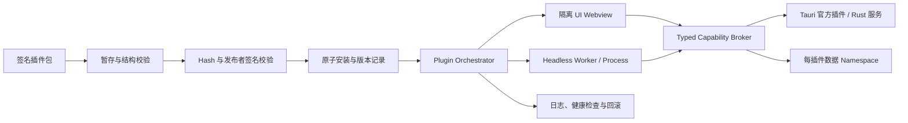

# FlowTools 生产化路线图

> 基线日期：2026-07-18
>
> 当前定位：技术预览 / 集成原型
>
> 目标定位：可签名发布、可安全扩展、可回滚的桌面工具平台

> 2026-10-04 产品决策：面向知识工作者/普通办公用户，GUI 与外部 agents
> 共用命令；支持独立 CLI、轻量后台内核、集中管理和共享二进制工具依赖。
> 低代码、内置 AI 助手与模型接入保留为未来插件。具体顺序与实现见
> [下一阶段目标与实施设计](./next-milestones.md)。G1、G2 固定验证范围已完成；G3 七项已实现为 Windows/T1 prototype，原生确认/恢复、Windows 键盘、200% 缩放与 NVDA 实际输出已有实窗证据，独立安全批准仍 pending；G4–G8 尚待实施。

本文档是 FlowTools 从 Demo 级原型走向生产版本的执行台账。它不以
“页面已存在”或“类型已定义”作为完成标准，而以真实执行、失败可恢复、
权限可强制、产物可验证和发布可回滚作为完成标准。

## 1. 使用规则

1. 本文档是生产化工作的路线图和进度来源。范围发生变化时，先更新路线图，
   再开始实现。
2. 每个里程碑都有唯一 ID、依赖、交付物、验证方式和退出标准。
3. 只有验证命令全部通过、人工验证有记录、退出标准全部满足时，状态才能从
   `in-progress` 更新为 `done`。
4. 路线图中尚不存在的命令，例如 `bun run test:security`，是对应里程碑必须
   新增的工程契约，不能通过删除验证项来宣告完成。
5. 架构或开发流程发生重大变化时，同一里程碑必须同步 `README.md`、
   `AGENTS.md`、`architecture.md`、`docs/structure.md` 和 `docs/plugin.md`。
6. 未明确认证的 ZTools 插件只能标记为 `indexed`，不能标记为 `compatible`。
7. 后续实施按 G0–G8 顺序推进；Phase 1/2/3 表示能力归属，不要求先完成整个
   Phase 1 才开始其运行授权/数据前置子项。子项按自己的依赖实施，父项只有
   全部子项与原退出标准满足时完成。不要将设计文档落库当成实施里程碑完成。

## 2. 成熟度与状态图例

### 2.1 成熟度

- `M0 Demo`：只覆盖演示路径，存在硬编码、假状态或未接通的执行链。
- `M1 Prototype`：主要模块已连接，但契约、错误处理和质量门禁不完整。
- `M2 Internal Alpha`：真实闭环可用，关键失败可恢复，适合内部日常使用。
- `M3 Public Beta`：安全、升级、诊断和发布链可验证，适合受控外部用户。
- `M4 Production`：达到稳定性、安全、兼容性和支持 SLA，可正式发布。

当前总体成熟度为 `M1 Prototype`，其中第三方插件安全、供应链和发布能力仍处于
`M0 Demo`。Phase 0 至 Phase 3 的目标分别是建立可信基线、达到内部 Alpha、
完成安全内核、进入公开 Beta；完成 Beta 验证后才能评审 `M4 Production`。

### 2.2 工作状态

- `pending`：尚未开始。
- `in-progress`：负责人已接受，正在实现，尚未满足退出标准。
- `blocked`：存在明确阻断；必须在进度台账中记录原因和解除条件。
- `done`：交付物、验证记录和退出标准均已满足，且已独立提交。

## 3. 当前基线证据

以下结论来自 2026-07-18 的只读审计和本地验证。后续修复不得删除这些失败
证据，而应通过里程碑提交让同一验证转为通过。

### 3.1 工程门禁

- `bun run lint` 失败。`packages/ui` 存在 63 个真实的
  `no-floating-promises` 问题；另有当前沙箱产生的 Tailwind/进程权限噪声。
- 根 `bun run check-types` 表面通过，但只运行 5 个 workspace。`web-vite`
  使用 `check:types`，Desktop 没有 `check-types`，因此这是漏检而非全仓通过。
- `bun run build` 在 `apps/ui-test` 失败，原因包括 TypeScript 的
  `module` / `moduleResolution` 组合和 Vite React 插件配置不匹配。
- `bun run --cwd apps/web-vite build` 存在多处真实 TypeScript 错误，包括访问
  不存在的插件字段、组件 variant 和 Vite 配置不匹配。
- Desktop Rust 的 `cargo check --locked` 通过；完整 Desktop 前端构建仍需在
  无沙箱干扰的 Windows CI 中复验。
- 根 `bun run test` 当前是 no-op，仓库没有可见的持续集成工作流。

相关入口：

- [根 workspace 脚本](../package.json)
- [Turbo 任务定义](../turbo.json)
- [Web Vite 脚本](../apps/web-vite/package.json)
- [UI Test 配置](../apps/ui-test/tsconfig.app.json)

### 3.2 真实执行与插件运行时

- CLI 的 `list` 能报告 12 个内置插件可运行，但实际执行 UUID 插件失败。
  当前发现器依赖正则扫描和源码改写，临时目录中的模块无法可靠解析依赖。
- Web 工具页仍存在延时后变换字符串的演示执行，不等价于调用插件 `run()`。
- Web 外部插件通过 Blob module 注入宿主页面运行，第三方代码与宿主共享
  DOM、网络和存储权限。
- Registry、Loader 和 Lifecycle Manager 对生命周期职责有重复；状态迁移、
  hook 失败回滚和动态命令注册尚未形成单一可信闭环。
- Watchdog 只能发出 `AbortSignal`，不能终止忽略信号、死循环或灾难性正则。

相关入口：

- [CLI 插件发现](../packages/cli/src/discovery.ts)
- [CLI 运行器](../packages/cli/src/runner.ts)
- [插件文件加载器](../packages/sdk/src/services/plugin-file-loader.ts)
- [插件加载器](../packages/sdk/src/registry/plugin-loader.ts)
- [Watchdog](../packages/sdk/src/registry/watchdog.ts)

### 3.3 Desktop、安全与数据

- Desktop 配置的 CSP 为 `null`，默认 capability 同时开放多个原生插件。
- React 插件在主 React/Tauri WebView 内运行；依赖注入不能阻止其绕过 SDK
  直接访问浏览器或 Tauri API。
- HTML bridge 存在通用 `native.invoke`、共享 raw SQL、任意路径文件能力和
  `postMessage('*')`，权限声明尚不是强制安全边界。
- 插件市场的“安装”主要更新元数据，没有下载、校验、解包、原子切换、健康
  检查和回滚。
- Debug 启动固定删除插件数据库；正式 schema migration、备份和回滚缺失。
- 设置、权限页面和多个状态仍是静态或内存态，不能视为持久化产品能力。

相关入口：

- [Tauri 配置](../apps/desktop/src-tauri/tauri.conf.json)
- [默认 capability](../apps/desktop/src-tauri/capabilities/default.json)
- [Desktop capability adapter](../apps/desktop/src/runtime/desktop-capabilities.ts)
- [HTML bridge](../apps/desktop/src/runtime/html-plugin-bridge.ts)
- [数据库初始化](../apps/desktop/src-tauri/src/db/init.rs)

### 3.4 ZTools 对标结论

ZTools 的产品闭环比当前 FlowTools 完整：它已经覆盖启动器搜索、拼音与历史、
置顶与别名、全局触发、真实插件安装更新、后台插件、独立窗口、持久会话和
跨平台构建。FlowTools 应学习这些产品能力和生态闭环。

但 ZTools 不是安全基线。其第三方 WebContents 配置中存在关闭
`contextIsolation`、`webSecurity` 和 `sandbox` 等高风险选项，插件包和更新
链也缺少足够的签名与完整性保障。因此目标是：

> 产品体验追平 ZTools；隔离、权限和供应链安全显著超过 ZTools。

当前本地 HTML Catalog 共索引 125 个插件、723 个命令，但只有一部分存在可
发布的静态入口，且 Catalog 包含开发机绝对路径。`metadata` 可读取不代表插件
可运行，API bridge 存在也不代表行为兼容。第一版不得宣称兼容全部 125 个插件。

## 4. 目标信任架构

### 4.1 信任等级

- `T0 Host Core`：Rust 宿主、签名发布代码和最小化 UI shell。拥有原生能力，
  但所有插件调用都必须经过 capability broker。
- `T1 Built-in`：随宿主编译和签名的内置 React 插件。可在主 UI 树运行，仍需
  使用标准 SDK 契约，以避免形成第二套实现。
- `T2 Third-party UI`：签名的第三方 UI 插件。每个插件在独立 Tauri webview
  或 window 中运行，拥有独立 origin、CSP、身份、存储 namespace 和能力集。
- `T3 Headless`：无 UI 的第三方工具。Desktop/CLI 默认要求受限、可终止的
  子进程，落实 OS/runtime 资源与网络限制；普通 Worker/subprocess 不等于
  sandbox。仅经单独平台评审的等价执行边界可替代，见 ADR-0001。
- `TL Legacy`：ZTools HTML 兼容层。必须置于独立隔离区，只开放经过认证的
  API；未认证插件只能进入显式的开发模式。

第三方 React 插件不能作为任意源码注入主 React 树。需要同级 UI 体验时，使用
SDK 定义的视图协议、受控组件描述或隔离 webview，而不是共享宿主 JavaScript
realm。

决策细节与当前缺口见 [ADR-0001](./adr/0001-plugin-trust-boundaries.md)、
[ADR-0002](./adr/0002-capability-and-package-policy.md) 和
[威胁模型](./security/threat-model.md)。它们是目标设计，不是 Phase 2 已实现的
证明；签名仍不把第三方升级为 T1。

### 4.2 目标数据流



### 4.3 不可破坏的架构约束

1. 默认拒绝：Manifest 未声明、用户未授权、scope 不匹配时必须在 Rust 边界
   拒绝，不能只在前端隐藏 API。
2. 不提供通用 `native.invoke`、raw SQL、任意绝对路径文件访问或无策略的全局
   `fetch`。
3. 每个插件有稳定身份、不可变版本、内容 hash、发布者身份、独立数据空间和
   独立 crash budget。
4. 插件包、应用更新和回滚包都必须通过签名与完整性校验。
5. UI 与 headless 插件均必须可停用；超时后必须可强制终止，不能依赖插件合作。
6. Plugin Orchestrator 是生命周期和命令状态的单一事实来源。Desktop、Web 和
   CLI 只能通过 adapter 使用它，不能分别维护静态 Registry。
7. 生命周期迁移必须经过显式状态机和并发锁，并具备 hook 补偿与失败回滚。
8. CSP、origin、message source 和 payload schema 必须同时校验；禁止
   `postMessage('*')` 和不受控远程内容。
9. 数据库迁移必须是版本化、幂等且可恢复的；启动时不得隐式删除用户数据。
10. 所有外部状态都要可诊断：安装、授权、执行、升级、崩溃和回滚必须产生
    脱敏、结构化事件。

### 4.4 目标插件状态机

稳定状态：

```text
discovered -> verified -> installed -> loaded -> enabled
                                      |          |
                                      v          v
                                   disabled <- deactivating

installed -> updating -> installed
任意可恢复状态 -> error -> disabled / rollback / quarantined
installed / disabled -> uninstalling -> removed
```

每次迁移必须记录插件 ID、版本、前后状态、触发源、时间、错误码和 `runId`。
并发的 load、enable、disable、update 和 uninstall 必须串行化或返回确定性冲突。

## 5. 工程与提交策略

### 5.1 一里程碑一提交

- 路线图与 `AGENTS.md` 的首次落库可使用一次引导提交，例如：
  `docs: add production roadmap`。
- 后续每个 Conventional Commit 只能完成一个里程碑；一个里程碑也不能在未
  满足验证和退出标准时标记为完成。
- 如果一个里程碑无法在一个可审查提交中完成，必须先把它拆成新的子 ID，
  再开始实现，不能用混合提交绕过范围控制。
- 完成提交必须同时更新本文末尾的进度台账、验证记录和受影响文档。
- 验证失败时不得创建“完成”提交；将状态保持为 `in-progress` 或记录为
  `blocked`。
- 提交前必须确认工作树只包含该里程碑和必要的文档同步，不得夹带格式化或
  重构无关文件。

推荐提交示例：

```text
ci: establish repository quality gates (P0.1)
fix(web): route tool runs through sdk executor (P0.2)
feat(sdk): validate versioned plugin manifests (P1.1)
feat(desktop): isolate third-party plugin webviews (P2.1)
feat(market): add transactional signed installs (P2.5)
```

### 5.2 通用完成定义

每个里程碑都必须满足：

- TypeScript strict，不新增 `any` 或未说明的 lint suppression。
- 失败路径有稳定错误码，用户输入和插件输出不出现在未脱敏日志中。
- 新协议、新状态和安全边界包含自动化验证；不只依赖手工点击。
- 对用户可见的异步行为包含 loading、成功、错误、取消或重试状态。
- 重要架构变化完成文档同步。
- Windows 验证通过；涉及跨平台发布时同时验证 macOS。

## 6. Phase 0：可信基线与去 Demo 化

目标周期：第 0–2 周。

阶段目标：停止假阳性，确保仓库报告的能力与实际能力一致。

### P0.1 建立全仓质量门禁

- 状态：`done`
- 负责人：`Codex (Build / Platform)`
- 完成日期：`2026-10-03`
- 依赖：无

P0.1 是质量基线的父里程碑。它拆分为 P0.1a–P0.1d；四个子里程碑全部
`done` 后，P0.1 才能标记完成。

#### P0.1a 统一 Workspace 任务契约

- 状态：`done`
- 负责人：`Codex (Build / Platform)`
- 开始日期：`2026-07-18`
- 完成日期：`2026-07-18`
- 依赖：无

交付物：

- SDK、UI、CLI、plugins、web-vite、desktop 和 ui-test 全部暴露名称一致的
  `lint`、`check-types`、`build` 和 `test` 脚本。
- 根 `test` 改为 Turbo 任务，不再是 no-op；`turbo.json` 声明测试任务及其依赖。
- CI 使用的 `lint` 不修改源文件；自动修复仅通过显式 `lint:fix` 暴露。
- 根任务执行图包含所有应参与的 workspace，不再因任务别名产生假阳性。

验证：

```powershell
bun run verify:workspace-tasks
bun x turbo run lint check-types test build --dry=json
```

退出标准：

- 所有 workspace 的标准脚本可被 Turbo 发现。
- 根 `test` 不包含“deprecated”或只打印信息的实现。
- 运行只读 gate 后工作树保持干净。

#### P0.1b 修复现有静态检查与构建错误

- 状态：`done`
- 负责人：`Codex (Build / Frontend)`
- 完成日期：`2026-07-18`
- 依赖：P0.1a

P0.1b 是构建修复的父里程碑，拆分如下：

##### P0.1b1 修复 UI Promise Lint

- 状态：`done`
- 负责人：`Codex`
- 完成日期：`2026-07-18`
- 范围：`packages/ui`
- 验证：`bun run --cwd packages/ui lint`、
  `bun run --cwd packages/ui check-types`
- 退出：修复所有已知 `no-floating-promises`，不使用规则 suppression，动画行为
  不变。

##### P0.1b2 修复 Web Host 构建

- 状态：`done`
- 负责人：`Codex`
- 完成日期：`2026-07-18`
- 范围：`apps/web-vite`
- 验证：`bun run --cwd apps/web-vite check-types`、
  `bun run --cwd apps/web-vite build`
- 退出：SDK 契约、HeroUI v3、TypeScript 与 Vite 配置错误清零。

##### P0.1b3 修复 UI Test Consumer 构建

- 状态：`done`
- 负责人：`Codex`
- 完成日期：`2026-07-18`
- 范围：`apps/ui-test`
- 验证：`bun run --cwd apps/ui-test lint`、
  `bun run --cwd apps/ui-test check-types`、
  `bun run --cwd apps/ui-test build`
- 退出：consumer 使用当前 Vite/TypeScript 配置从 workspace 源码成功构建。

##### P0.1b4 修复 Desktop 静态门禁

- 状态：`done`
- 负责人：`Codex`
- 完成日期：`2026-07-18`
- 范围：`apps/desktop`
- 验证：Desktop `lint`、`check-types`、`build` 和 Rust `cargo check --locked`
- 退出：移除失效 TypeScript 配置和真实 lint 错误；前端与 Rust 构建通过。

##### P0.1b5 全仓集成收口

- 状态：`done`
- 负责人：`Codex`
- 完成日期：`2026-07-18`
- 范围：根 Turbo 图及剩余跨 workspace 构建问题
- 依赖：P0.1b1–P0.1b4
- 验证：根 `lint`、`check-types`、`build`，并确认执行后工作树干净。
- 退出：P0.1b 父里程碑的全部验证命令通过。

完成内容：

- SDK 所有声明的公开子路径均生成对应 JS/DTS 产物，Desktop 使用的
  `utils/capability` 具有显式 export。
- 共享 tsdown 配置迁移到当前 `deps.*` API，并纳入 Turbo 全局输入哈希。
- 根 lint 覆盖 7 个 workspace 且达到 0 warning；剩余插件类型警告已清零。

交付物：

- 修复 `packages/ui` 当前的 Promise 处理 lint 错误。
- 修复 web-vite 的真实 TypeScript、HeroUI 和 Vite 配置错误。
- 修复 ui-test 的 TypeScript module 配置和 Vite React 插件配置。
- 确保 Desktop 前端与 Rust 分别存在可重复的静态检查和构建命令。

验证：

```powershell
bun run lint
bun run check-types
bun run build
bun run --cwd apps/web-vite build
bun run --cwd apps/desktop build
cargo check --locked --manifest-path apps/desktop/src-tauri/Cargo.toml
```

退出标准：

- 上述命令在支持环境中全部退出 0。
- 不通过禁用 strict、跳过 workspace 或扩大 lint ignore 来获得绿色结果。

#### P0.1c 恢复核心自动化测试

- 状态：`done`
- 负责人：`Codex (SDK / CLI / Desktop)`
- 开始日期：`2026-07-18`
- 完成日期：`2026-10-03`
- 依赖：P0.1a、P0.1b

P0.1c 是自动化回归基线的父里程碑，拆分如下：

##### P0.1c1 锁定 SDK 值对象与 HTML 兼容契约

- 状态：`done`
- 负责人：`Codex`
- 完成日期：`2026-07-18`
- 范围：`packages/sdk` 的 Result、`definePlugin`、capability、runtime error、
  HTML manifest 规范化和公开 package exports。
- 实施：把 SDK `test` 从 0-test no-op 改为真实 Bun 测试；覆盖成功与拒绝路径，
  且不引入第三方测试依赖。
- 验证：SDK `test`、`lint`、`check-types`、`build`；移除测试文件必须导致
  `test` 失败。

##### P0.1c2 覆盖 SDK Registry、Loader 与异步失败

- 状态：`done`
- 负责人：`Codex`
- 完成日期：`2026-07-18`
- 依赖：P0.1c1
- 范围：Plugin/Command Registry、PluginLoader、生命周期和 watchdog。
- 实施：覆盖订阅、状态事件、MRU、加载隔离、hook 幂等和错误传播；测试暴露的
  activate/deactivate 状态覆盖问题在同一里程碑修复。
- 约束：watchdog 只承诺合作式取消；不编写能够终止同步死循环的虚假测试。
- 验证：SDK `test`、`lint`、`check-types`、`build`。

##### P0.1c3 覆盖 CLI 输入、输出与 Runner 契约

- 状态：`done`
- 负责人：`Codex`
- 完成日期：`2026-07-18`
- 范围：`packages/cli` 的 schema/flag coercion、formatter、runner、timeout 和失败
  退出码。
- 实施：把库函数中的 stderr/exit 副作用收敛到 CLI 边界，提供稳定错误类型和
  可注入的执行 seam；不冻结现有源码正则发现实现。
- 验证：CLI `test`、`lint`、`check-types`、`build`，以及构建后 `--version` 和
  missing-plugin 非零退出 smoke。

##### P0.1c4 覆盖 Desktop Rust DTO 与 Repository 契约

- 状态：`done`
- 负责人：`Codex`
- 完成日期：`2026-07-18`
- 范围：plugin DTO 校验、默认值、序列化、内存 SQLite repository 往返、隔离和
  错误路径。
- 实施：Desktop `test` 运行真实 `cargo test --locked --lib`；使用 Toasty 内存
  数据库，不访问用户 app-data，不为 Tauri `State` 编写低价值 mock。
- 验证：`cargo fmt --check`、`cargo test --locked --lib`、
  `cargo clippy --all-targets -- -D warnings` 和 Desktop `test`。

##### P0.1c5 收口 Workspace 与根测试图

- 状态：`done`
- 负责人：`Codex`
- 开始日期：`2026-07-18`
- 完成日期：`2026-10-03`
- 依赖：P0.1c1–P0.1c4
- 范围：`packages/ui`、`plugins`、`apps/web-vite`、`apps/ui-test` 及根 Turbo
  `test` 图。
- 实施：为剩余 workspace 提供真实 smoke/contract 测试，稳定现有 browser
  suite，删除全部 `--pass-with-no-tests`；测试不得依赖开发服务器或用户状态。
- 收口约束：UI package 必须验证构建产物、完整公开导出与声明消费；插件测试必须
  从真实目录核对 inventory，并穿过 CLI discovery、loader、schema 与 runner；Web
  Host 必须覆盖 app/tool/非法 runtime 类型；浏览器版本必须显式锁定并由 CI 安装。
- 防回归：workspace verifier 必须拒绝未知 test runner 和任何
  `pass-with-no-tests` 变体，不能再用空测试获得绿色结果。
- 执行顺序：根测试仅依赖 `^test` 且禁用缓存；SDK/UI/plugins 合约测试自行
  构建产物，消费者等待依赖测试完成。根 `test` 和 `build` 顺序执行，避免
  `dist` 清理与下游读取竞争。Desktop 先通过 Cargo `--list` 检查非空清单。
- 缺陷修复：命令面板原执行回调从未初始化，选择命令静默无效；改为调用宿主
  CommandRegistry，回归测试先复现失败再验证修复与未初始化错误路径。
- 验证：7 个 workspace 的 `test` 均实际执行断言，根 `bun run test` 退出 0，
  删除任一测试入口会使对应任务失败。
- 验证记录（2026-10-03）：SDK 40、CLI 25、UI exports 3、plugins 16、Web 6、
  Chromium 46、Desktop inventory 2 + workspace gate 3 + Rust 10，共 151 tests；另有 UI consumer
  declarations 独立编译。根 lint（0 warnings）、check-types、test、build 和
  frozen install 通过。Bun/Vitest 无匹配测试均退出 1；Rust 空清单检查由单元
  测试验证。浏览器人工复查命令面板搜索/跳转、工具卡片路由、Base64 插件面板
  `hello → aGVsbG8=` 通过；未据此宣称全量无障碍、桌面 UI 或生产兼容认证。

交付物：

- SDK 至少覆盖 Manifest/Result 基础契约和 Registry 关键行为。
- CLI 至少覆盖参数、schema 校验、输出格式和失败退出码。
- Desktop Rust 至少覆盖 DTO 验证、repository 约束和迁移入口。
- 没有测试的 workspace 使用明确的 smoke/contract 测试，而不是 no-op 脚本。

验证：

```powershell
bun run test
cargo test --locked --manifest-path apps/desktop/src-tauri/Cargo.toml
```

退出标准：

- 测试能在引入已知错误时失败。
- SDK、CLI 与 Rust 的核心失败路径进入 PR 必跑门禁。

#### P0.1d 建立 Windows PR CI

- 状态：`done`
- 负责人：`Codex (Build / Release)`
- 开始日期：`2026-10-03`
- 完成日期：`2026-10-03`
- 依赖：P0.1b、P0.1c

P0.1d 分为仓库交付与远端验收，不把工作流文件存在当作 CI 已生效：

##### P0.1d1 交付可复现的 Windows 质量工作流

- 状态：`done`
- 负责人：`Codex`
- 开始日期：`2026-10-03`
- 完成日期：`2026-10-03`
- Commit：`ci(repo): add reproducible Windows quality gates (P0.1d1)`
- 范围：PR / push / 手动触发的 Windows workflow、锁定工具链、依赖缓存、
  统一 PowerShell 验证入口和工作流安全/门禁回归。
- 约束：Actions 固定完整 SHA、最小只读权限、不使用 `pull_request_target`，
  不允许失败继续、不缓存 JS 构建产物或 Turbo 结果。
- 实施：先构建声明消费需要的 package 产物，再执行 lint、type check、test、
  build、Rust check 和工作树漂移检查；每条原生命令的非零退出码必须终止任务。
- 干净环境修复：显式生成 Web/Desktop route trees 和 Rust bindings；绑定生成
  使用 codegen-only console binary + MockRuntime，不启动窗口或用户数据库。
  Windows binding integration test 单独嵌入 Common Controls v6 manifest，
  既覆盖生成成功/重复一致/写入失败，也避免应用资源重复。
- Windows 环境修复：Turbo 保留 strict mode，仅显式透传 `PATHEXT` 与
  build/test 的 `CARGO_TARGET_DIR`；避免原生命令发现失败，不透传宿主密钥。
- 验证：在独立干净 checkout 执行同一入口，确认所有 workspace 参与且无
  tracked/untracked 生成文件漂移；验证工作流契约和失败传播。
- 验证结果（2026-10-03）：独立 Windows worktree 连续两轮完整入口通过；
  第一轮从没有 node_modules、JS dist、host routes/bindings 的 checkout 开始，
  使用已有依赖下载、Chromium 与 Rust 编译缓存。两轮所有 JS gate 强制执行，
  frozen install、7-workspace lint（0 warnings/errors）、types、156 tests、
  build、Rust fmt/check/clippy 和最终工作树检查均成功。156 tests 包含原 151
  项，加 4 项 workflow/PowerShell 回归和 1 项 Rust binding integration test。
  Vite 大 chunk 提示仍是性能待办；本地 Windows 通过不替代 GitHub Windows
  runner 实测，不推进 P0.1d2 或生产成熟度。

##### P0.1d2 验收远端 CI 与合并保护

- 状态：`done`
- 负责人：`Repository maintainer + Codex`
- 开始日期：`2026-10-03`
- 完成日期：`2026-10-03`
- Commit：`docs(roadmap): close remote quality gate acceptance (P0.1d2)`
- 依赖：P0.1d1
- 所需授权：将提交推送到 `codex/` 分支以触发 GitHub Actions；设置合并保护
  需要另行明确授权，不能从允许本地 commit 推断。
- 授权进展：用户已允许推送 `codex/production-quality-gates` 并验收两次 CI；
  最初不包含更改仓库可见性或合并保护设置。2026-10-03 用户自行将仓库改为
  public，并明确授权配置 main 的 PR/必需 CI/严格同步/管理员约束/禁强推与
  删除规则；当时不包含创建或合并 PR、实际强推/删除验证。随后用户明确要求
  创建真实 PR 并合并该分支；允许在该 PR 上修复检查失败，不允许绕过保护。
- 首次远端发现：[run 37116034446](https://github.com/FlowToolsOrg/flowtools/actions/runs/37116034446)
  在创建 job 前失败；actionlint 1.7.12 复现 job `env` 中 `runner.temp` 上下文
  无效。将 Bun 缓存路径移到 step-level env，并新增 1 项上下文回归；原本的
  YAML 解析与两轮本地 gate 不能证明 GitHub workflow 表达式合法。
- 上下文修复 Commit：`da777b4`（`fix(ci): scope runner cache paths to workflow steps`）。
- 远端 CI 已验收（2026-10-03）：同一完整 SHA
  `da777b4b653fbdf3ee069e7f8912e03107da6a5c`，Windows `windows-2022` runner，
  run `37116277526` 的 attempts 1 和 2 连续成功：
  - [首轮 job / attempt 1](https://github.com/FlowToolsOrg/flowtools/actions/runs/37116277526/job/111183603830)：
    24m03s；Bun 依赖和 Rust 编译缓存未命中，完整 gate 用时 18m36s。
  - [复跑 job / attempt 2](https://github.com/FlowToolsOrg/flowtools/actions/runs/37116277526/job/111187425079)：
    9m10s；Bun 依赖和 Rust 编译缓存命中同一主 key，完整 gate 用时 6m39s。
  - 两轮 frozen install、7-workspace lint（0 warnings/errors）、type checks、
    157 tests、build、Rust fmt/locked check/clippy 和 always 工作树漂移检查
    均成功。157 tests = Bun 100 + Chromium 46 + Rust 11；JS/Turbo gate 日志
    均为 0 cached，不把依赖/原生编译缓存命中当作测试结果。
  - 已核对两轮完整 job 日志；Vite 大 chunk 提示仍保留为性能待办。
- 历史阻断（2026-10-03，现已解除）：私有仓库 main protection API 曾返回
  套餐限制 403。用户公开仓库后，查询转为 404（尚未保护），随后在明确授权下
  设置保护；未由 Codex 更改可见性或套餐。
- main 配置证据（2026-10-03）：REST protection PUT 成功，随后 GET 回读并
  逐项断言 `strict: true`、`enforce_admins.enabled: true`、
  `allow_force_pushes.enabled: false`、`allow_deletions.enabled: false`。
  唯一必需检查为 `Windows quality gates`，绑定实测 GitHub Actions
  `app_id: 15368`，不接受任意来源同名 status。
  PR 规则已启用，审批人数为 0（没有额外授权强制人工批准）；独立 branch
  查询返回 `protected: true`；GraphQL 独立回读同样确认 PR、strict check、
  administrator enforcement 与禁强推/删除。没有创建 bypass 名单或修改 main
  的 commit。
- 验证：连续两次 GitHub Windows run 通过，记录 run URL、SHA 与 gate 日志；
  仓库管理员把固定质量 job 设置为 required status check 并验证失败阻止合并。
- 真实 PR 失败阻断证据（2026-10-03）：[PR #2](https://github.com/FlowToolsOrg/flowtools/pull/2)
  的 head 为 `a3ae502515a266902c31fe5a77c33591f16eff88`；同 SHA push run
  `37123132478` 成功，但 [PR run 37123492550](https://github.com/FlowToolsOrg/flowtools/actions/runs/37123492550)
  失败，GitHub 返回 `mergeable: MERGEABLE`、`mergeStateStatus: BLOCKED`。
  没有冲突而 required check 失败，实际阻止合并；未尝试管理员 bypass 或修改规则。
- 失败根因与修复：Web manifest 契约原先把 12 次真实动态加载串行放进一个
  默认 5 秒用例，runner 上 5318.83ms 超时；不是 PowerShell wrapper 自身缺陷。
  改为逐插件命名用例，真实冷加载/批量注册限定 30 秒，其他用例保留默认预算；
  不 mock 构建入口、不跳过断言、不重试，也不把该预算宣称为启动性能指标。
  Web 测试由 6 项变为 17 项，原 12 个插件元数据断言完整保留。
- 定向验证：17 项 Web 契约、Web lint/types 与 `docs:check` 已通过；临时 preload
  注入 5500ms 冷加载延时后用例 6124ms 成功，注入 version 不匹配和 loader 异常
  分别得到退出码 1，验证预算调整没有吞掉真正失败。探针未进入产品或 CI 配置，
  验证后已删除。七 workspace lint（0 warnings/errors）、types、175 tests、
  build 与 `docs:check` 均通过；Turbo 为 0 cached，175 = Bun 118 + Chromium 46
  - Rust 11。没有 UI/runtime 行为改动，不以本轮测试替代新增人工验收。
- 修复与恢复验收：Commit `c2180f87ae9539e6ca8469f8d2faf33015238280`
  （`fix(test): bound cold plugin contract imports per case`）；本地从干净工作树
  再执行完整 `scripts/check-ci.ps1` 通过，含 frozen install、175 tests、
  Rust fmt/check/clippy 与最终 tracked/untracked 漂移检查。
  同 SHA 两个独立 Windows runner 连续成功，已核对完整日志：
  - [push run 37124504624](https://github.com/FlowToolsOrg/flowtools/actions/runs/37124504624/job/111206974908)：
    5m23s；Web 17 tests 实际用时 6.10s，超过原 5 秒总预算但按逐插件预算通过。
  - [PR run 37124507414](https://github.com/FlowToolsOrg/flowtools/actions/runs/37124507414/job/111206983687)：
    9m44s；Bun/Rust 缓存未命中，Web 17 tests 用时 3.76s。
  - 两轮 7-workspace lint（0 warnings/errors）、types、175 tests、build、
    Rust fmt/locked check/clippy 和 always 工作树检查均通过；JS gate 0 cached。
    175 = Bun 118 + Chromium 46 + Rust 11；没有删减失败测试或启用自动重试。
  - PR 从原失败 head 的 `BLOCKED` 恢复为修复 head 的 `CLEAN`，始终
    `MERGEABLE`；保护规则回读仍为 PR-required、strict、enforce_admins、
    Actions `app_id: 15368`、禁强推/删除，未绕过保护或直接写 main。
- 结论：远端重复运行、真实失败阻断和修复恢复已独立验收，P0.1d2、P0.1d 与
  父 P0.1 标记 `done`。本项仅关闭工程质量基线，不提升生产成熟度或关闭安全
  风险。任何后续提交（含这份验收记录）仍须等待其新 head 的必需检查通过后
  才能合并；此记录不预先声称该后续提交或 PR 已经合并。
- 退出标准：远端运行与合并保护均有真实证据后，P0.1d 与父 P0.1 才能标记 done。

交付物：

- Windows CI 从干净 checkout 执行 frozen install、lint、type check、test、build
  和 `cargo check`。
- 使用 Bun、Rust 与依赖缓存，但缓存不能掩盖缺失产物或 lockfile 漂移。
- 任一 gate 失败都会使工作流失败；配置 required check 后才会阻止合并。

验证：

```powershell
pwsh -NoProfile -File scripts/check-ci.ps1
```

退出标准：

- 连续两次 CI 运行结果一致。
- CI 完成后工作树无生成文件漂移。
- 工作流日志能明确显示每个 workspace 的参与情况。

交付物：

- 统一所有 workspace 的 `lint`、`check-types`、`build` 和 `test` 任务名。
- 根任务覆盖 SDK、UI、CLI、plugins、web-vite、desktop 和 ui-test。
- 修复当前 lint、TypeScript、Vite 和构建错误；CI 中 lint 不允许自动改文件。
- 恢复有意义的测试入口，至少覆盖核心 SDK、CLI 和 Desktop Rust。
- 新增 Windows PR CI：install、lint、type check、test、build、`cargo check`。

验证：

```powershell
bun install --frozen-lockfile
bun run --cwd apps/ui-test test:install-browser
bun run build:packages
bun run generate:hosts
bun run lint
bun run check-types
bun run test
bun run build
bun run --cwd apps/web-vite build
bun run --cwd apps/desktop build
cargo check --locked --manifest-path apps/desktop/src-tauri/Cargo.toml
```

退出标准：

- 干净 checkout 上所有命令退出码为 0。
- Turbo 输出包含所有声明了对应任务的 workspace，不存在命名漏检。
- PR 中任一 gate 失败都会阻止合并。
- 连续两次 CI 运行结果一致，运行后工作树保持干净。

### P0.2 接通真实插件执行链

- 状态：`done`
- 负责人：`Codex (SDK / Host)`
- 开始日期：`2026-10-03`
- 完成日期：`2026-10-03`
- 依赖：P0.1

按以下顺序独立验收和提交；父项只能在三个子项全部完成后收口：

#### P0.2a 统一 SDK 执行结果与失败边界

- 状态：`done`
- 完成日期：`2026-10-03`
- 范围：SDK app/tool 的实际 `run()`、inputSchema 默认值与验证、版本/耗时/
  输入摘要、稳定错误码、取消与有限超时。
- 验收：先写失败回归，再实现；成功、schema 错误、身份不符、异常、预取消、
  执行中取消、超时、迟到结果与 timer/listener 清理均有确定性测试。
- 边界：取消可使 Host 不再接收迟到结果并通知 cooperative plugin；不宣称能
  终止同 realm 同步死循环或撤回插件已发生的副作用。
- 交付：`packages/sdk/src/execution/executor.ts` 与公开 SDK export，21 个新增
  回归；校验期间取消先出现失败测试，再补 listener 注册后的 abort 状态检查。
- 验证：SDK lint、check-types、build、全部 61 个 test 通过；纯 SDK 无 UI 变化，
  不产生三端运行或人工 UI 已通过的结论，P0.2b/c 仍待完成。

#### P0.2b 接通三端运行与真实历史

- 状态：`done`
- 完成日期：`2026-10-03`
- 依赖：P0.2a
- 范围：CLI 使用 SDK executor；Web 与 Desktop 提供真实 JSON/schema 运行、
  取消与错误显示；保留 app panel；历史仅来自实际 execution envelope，迁移或
  排除旧的未验证记录，不持久化原始敏感输入。
- 验收：三端同一确定性输入结果一致；错误/取消不会变为 success；CLI 子进程
  输出和退出码回归，Host 行为回归与人工路由/插件渲染验证。

该子项继续按可独立审查的范围拆分，先完成并提交 b1，再开始 b2：

- **P0.2b1 CLI adapter**：SDK context/executor、JSON envelope 与非零失败退出码；
  `done`（2026-10-03）；SDK 无 React execution 子入口，实际 run/defaults/校验/
  取消/超时、稳定 JSON failures 与 text formatter。CLI context 无额外 timer，
  storage SDK 对齐，保留合法已有键文件并拒绝路径键；不是生产权限 broker。
  验证：SDK lint/types/build/62 tests、CLI lint/types/build/33 tests、plugins
  lint/types/build/20 tests；真实 compiled CLI 子进程覆盖成功/校验失败/非法 timeout/
  text，序列化失败明确 OUTPUT_INVALID；无 UI 改动，人工 UI 在 b2 验收。
- **P0.2b2 Web/Desktop 与历史**：共享运行 UI、JSON/schema、取消/失败、真实历史、
  跨宿主回归和人工路由/插件渲染；`done`（2026-10-03）。Web 删除伪延时/大写结果
  与假版本时间线；两端保留 app panel，app/tool 都调用共享 SDK executor。
  新历史格式最多 200 条 metadata-only 尝试，无原始 input/output/message；旧 key
  保留但不导入，损坏/矛盾记录拒绝，写失败提示。共享 UI 覆盖实际异常、取消、
  迟到结果、卸载 abort 与 OUTPUT_INVALID，序列化失败不会显示 success。
  验证：根 docs/lint/types/test/build（7/7 workspace、无缓存）；SDK 67 tests、
  Chromium 50 tests；Windows Web production preview 与独立标识的实际 Tauri
  WebView/原生 IPC，Base64 相同结果、schema/JSON 拒绝、键盘运行、脱敏历史
  刷新/清空、受控网络任务取消全部通过，截图已检查。
  [复现、截图及未验证平台](./validation/p0-execution-hosts.md)。这是 prototype
  执行基线，不等于第三方隔离/权限安全、签名安装或完整辅助技术认证。

#### P0.2c 十二插件 Smoke 与跨端验收

- 状态：`done`
- 开始日期：`2026-10-03`
- 完成日期：`2026-10-03`
- 依赖：P0.2b
- 范围：共享 12 个内置插件真实实现 fixture；网络/存储使用明确受控 capability
  adapter，不访问公网或用户数据库，也不替换插件 `run()`。
- 检查发现：网站延迟 run/panel 直接 fetch，无法使用受控 SDK request；Todo
  run 写 storage key 而 panel 读 app store，且缺少 capability 时仍伪报 added。
  在本项中修正并补拒绝/状态一致性回归；不隐式迁移或删除旧 Todo 数据。
- 验收：`bun run smoke:plugins` 与根 lint/types/test/build；覆盖 schema 错误、
  实际插件异常、取消和三端 envelope；记录人工验证范围与未验证平台。
- 交付：共享 fixture 恰好覆盖 CLI discovery 的全部 12 个 compiled entry；SDK
  runner 实际调用，每项 success/defaults、schema 拒绝和预取消均验证，拒绝后
  request/storage 无新增副作用。Todo 损坏数据与缺少网络能力是实际插件异常。
- 回归：先有 3 个真实失败，再修正 request 与 app store 路径；Todo CLI 合法
  key 不迁移、不删除，校验损坏数据后拒绝覆盖；同 realm 隔离仍未实现。
- 验证：smoke 15 tests、plugins 全部 39 tests；三端缺失 request 均为同一
  EXECUTION_FAILED；根 docs/lint/types/test/build 全部 7/7 无缓存通过。
  Web production preview / 独立 Tauri 实例重新验证 Base64、拒绝、历史与 SDK
  request 取消；Todo JSON 添加项立即出现在真实面板，截图已检查。见
  [宿主验收范围](./validation/p0-execution-hosts.md)。P0.3 未完成，整体仍 prototype。

交付物：

- 删除 Web 工具页中的演示延时、字符串变换和硬编码运行结果。
- Web、Desktop 和 CLI 都通过 SDK executor 调用真实 `run()`。
- Run history 只记录实际尝试的版本、输入类型/大小摘要、耗时、结果类型和错误码，
  不持久化原始输入、输出或异常 message。
- 为 12 个内置插件建立无 UI smoke fixture，确保 `list` 与 `run` 一致。
- 运行失败向用户返回稳定错误，而不是静默 `process.exit(1)`。

验证：

```powershell
bun run smoke:plugins
bun run packages/cli/src/cli.ts list --format json
bun run packages/cli/src/cli.ts run plugin-uuid-generator `
  --count 2 --format json
bun run --cwd apps/web-vite build
bun run --cwd apps/desktop build
```

人工验证：

- 在 Web 和 Desktop 运行同一个确定性 fixture，确认结果 envelope 一致。
- 触发 schema 错误、插件异常和取消，确认三端都展示真实失败状态。

退出标准：

- 12 个内置插件的 smoke fixture 全部调用真实实现。
- `list` 标记为 runnable 的插件必须可执行；否则必须返回不可运行原因。
- 仓库中不存在用于冒充插件执行结果的延时或硬编码 success path。

### P0.3 建立诚实的功能与兼容状态

- 状态：`done`（2026-10-04；P0.3c 原生人工复验按维护者要求豁免）
- 负责人：`Codex (Product / Plugin Platform)`
- 开始日期：`2026-10-03`
- 依赖：P0.1

按以下三个子项独立实施；P0.2 的执行基线完成后再开始实现：

#### P0.3a 统一成熟度与 Catalog 证据

- 状态：`done`（2026-10-04）
- 范围：`prototype` / `experimental` / `beta` / `production` 一套成熟度；
  `indexed` / `entry-resolved` / `api-verified` / `production-certified` 为
  独立兼容证据，缺失验证不得默认升级。
- 验收：SDK schema/types、内置 metadata/manifests、CLI/Host UI 与生成 Catalog
  一致；Catalog 不含开发机绝对路径，资源以 package identity/相对入口描述；
  非法路径、假认证与 fixture 缺失都会使 Catalog gate 失败。

为避免把契约、生成产物和 UI 混入一次大提交，本项细化为顺序独立验收：

- **P0.3a1 SDK / built-in / CLI 成熟度契约**：`done`（2026-10-04），共享 maturity
  schema/types，缺失值默认 prototype；独立 compatibility evidence 名称，不以
  它代替 maturity。12 个内置 meta、两端 manifest 和 CLI list/info 一致；
  schema、真实加载元数据、CLI JSON/text 回归与对应 lint/types/tests/build。
  验收：根 docs/lint/types/test/build 七 workspace 全通过（强制无缓存）；SDK
  69、CLI 33、plugins 41、Web 19、Desktop 20 + Rust 11、Chromium 50 tests。
  生成器统一格式并提供只读 `--check`，两端排序后的 manifest 零漂移；实际 CLI
  list/info JSON/text 验证通过。此项无 UI 行为变更，不升级兼容性或安全结论。
- **P0.3a2 Portable Catalog 与证据 gate**：`done`（2026-10-04），Catalog schema、相对
  package/entry、稳定身份与范围明确的证据；扫描不等于执行或 API 认证。
  `verify:plugin-catalog` 拒绝本机路径、入口逃逸、假认证、缺失证据 fixture；
  生成器 fixture + 两份真实目录一致性 + Desktop build。
  验收：两次真实扫描字节一致并符合 formatter；125 项均为 prototype，47 项
  entry-resolved（仅文件存在/hash）、78 项 indexed。路径/编码/设备名/符号链接
  越界、伪造认证/fixture hash、缺失 fixture 与目录不一致拒绝回归通过。SDK
  72、Desktop 24 + Rust 11、Chromium 50 tests，根七 workspace 全 gate 通过；
  Desktop 使用共享 schema 与显式 DEV checkout root，不再从发布目录取本机路径。
  不认证资源依赖、runtime/API/平台或签名；12 项 SEC 风险仍 open。
- **P0.3a3 UI 成熟度/兼容证据展示**：`done`（2026-10-04），共享 UI status 与 Web/Desktop
  从实际 meta/catalog 读标签，删除硬编码 stable；状态/证据互不升级，UI 回归、
  真实路由截图/键盘验收与根 gate。a1/a2/a3 全部完成后关闭 P0.3a。
  2026-10-04 当前证据：共享 UI 新增 9 项浏览器回归，Chromium 共 59 tests；
  根七 workspace 全门禁、专用 Tauri native build 通过。Web Dashboard/插件清单
  的 12 项实际 metadata、Base64 JSON/键盘/错误/历史、network 取消和 Todo 共享
  store 已复验，见 [宿主记录](./validation/p0-execution-hosts.md)。
  维护者在开发模式完成六项手工清单；第一版独立包的初始 NotFound 已修复，
  两项真实 Tauri MockRuntime URL 回归在旧配置失败、修复后通过。第二版专用
  identity 的独立包已由维护者实窗确认正常，市场/实际 Base64 成功截图已归档。
  根 gate 强制执行、零缓存；Desktop 25 Bun + 13 Rust、Chromium 59 tests。
  a1/a2/a3 全部完成，关闭 P0.3a；不认证第三方执行、安全审查或其他平台，
  所有插件仍 prototype。生产入口与诚实市场标签留在 P0.3b/c。

#### P0.3b 生产入口默认拒绝未认证外部代码

- 状态：`done`
- 依赖：P0.3a
- 范围：生产构建不暴露源码转译/导入、remote HTML 和 Legacy 自动执行；开发
  入口只在显式开发环境可见并有未签名警告。未实现签名准入前不允许以布尔
  certified 标记开启第三方生产执行；执行与导入两个边界都必须拒绝。
- 验收：生产/开发模式矩阵、直接绕过 UI 的调用、持久恢复、native/HTML runner
  和最终构建产物的负面测试；检查 production bundle 无源码 loader 或本机路径。
- 边界：这是 Phase 0 的停用/准入 gate，不代替 Phase 2 的 OS 隔离、grant 或
  每次原生操作授权；相关 SEC 风险只能更新缓解证据，不能全部关闭。

顺序细化为四个独立提交；前项验收并提交后再开始后项：

- **P0.3b1 SDK / Web 源码入口**：`done`（2026-10-04）。公共 SDK 文件加载器默认拒绝，
  源码转译与 import-map 移出普通 SDK 导出；危险开发实现只由 DEV 构建且显式
  `VITE_ENABLE_UNSAFE_PLUGIN_PREVIEW=1` 加载，并展示未签名、同 realm 风险。
  Web service 在读文件/写存储/加载代码之前拒绝，生产不恢复旧 IndexedDB 源码，
  保留原记录用于后续明确恢复；开发也不自动恢复。覆盖 API 绕过、模式矩阵、
  数据保留、实际内置运行与 Web production bundle 中开发实现缺席。
  验收：初始 10 项拒绝回归在旧实现失败，修复后通过；SDK 六模式/缺少环境与
  绕过构造器调用 TS-private 方法均拒绝；开发源码不能自报 production 标签。
  根七 workspace 全 gate 强制执行、零缓存，SDK 86 / Web 22 / Chromium 59；
  十二 compiled smoke 15 项与真实 Web 执行流程通过。实际 production/default
  dev/opt-in dev 的 UI、键盘与旧 IndexedDB 保留验收通过；生产构建带 opt-in=1
  仍与普通 production artifact 字节一致。截图与边界见
  [源码入口记录](./validation/p0-web-source-gate.md)。此项不关闭 CLI/Desktop gate
  或 SEC-002，也不构成独立安全 Reviewer 批准。
- **P0.3b2 CLI 固定 compiled inventory**：`done`（2026-10-04）。只执行随仓库构建的内置
  inventory；取消 TSX 源码导入、正则 headless rewrite 和任意 ID 路径 fallback。
  未知/路径 ID 与缺失 compiled artifact 在 import 前失败；真实十二插件 smoke、
  CLI list/info/run 和 compiled CLI 子进程回归。
  验收：旧版 9 项回归中 8 项失败；修复后 CLI 48 项（含 15 项固定产物/拒绝回归）
  全部通过。七 workspace lint/types/test/build 强制重跑通过；实际十二 compiled
  smoke 15 项通过，CLI text 与 help 实际调用复核。三份清单由同一生成器同步，
  formatter API 消除三次冷启动导致的 Windows 超时，不增加 30 秒测试预算。
  此项只是 T1 构建一致性，不认证可写 compiled artifact、publisher 或 TOCTOU；
  SEC-001/002 仍 open。完整证据见 [CLI 验收](./validation/p0-cli-compiled-inventory.md)。
- **P0.3b3 Desktop HTML / Legacy gate**：`done`。生产不启动外部 HTML/remote/
  preload，不因 Catalog、持久 metadata 或伪认证放行；开发预览要求显式 DEV
  opt-in 与警告，runner/bridge 在副作用前独立拒绝。覆盖路由绕过、持久恢复与
  bridge 拒绝，内置 React/SDK 行为不变；实窗验收仍使用专用测试身份。
  实现：activation 前默认拒绝；危险 runner/bridge 分离为 DEV 动态模块，普通
  bridge deny-only；开发也禁用 raw invoke/SQL/FS/opener，fetch 失败不回退 src。
  旧实现 8 拒绝回归失败，修复后普通入口 8 与实际构建矩阵 6 已通过；当前
  全根 gate / Desktop 39+13 / 十二实际 smoke 15 已通过，24 个 production
  opt-in + canary 产物逐字节一致、三条实际前端路由拒绝通过。新专用原生包
  独立 r3 人工清单已回报通过，运行路径/身份核实，最终 Desktop 39+13 与
  cargo fmt 复核通过；见 [Desktop gate](./validation/p0-desktop-external-gate.md)。
- **P0.3b4 发布产物与跨入口验收**：`done`。将实际 Web/Desktop production
  artifact 检查加入可复现门禁，证明没有危险 loader、开发路径/URL 或认证布尔
  开关；全根 gate 和模式/拒绝矩阵记录。b1/b2/b3/b4 全部完成才关闭 P0.3b。
  已实现固定树/实际 byte/hash、已知危险指纹与 certification AST 拒绝，child
  opt-in/path/URL/synthetic-key probes 重建全部 45 文件逐字节一致；17 artifact
  与 6 CI contracts 通过。post-build fatal gate 与最终 drift check 保留。
  2026-10-04 合并 commit 966878d 的 Windows CI 完整门禁与最终 clean checkout 无漂移通过；见
  [产物 gate](./validation/p0-production-artifacts.md)。

#### P0.3c 诚实市场状态与 P0 总验收

- 状态：`done`
- 依赖：P0.3b
- 范围：市场目录、元数据保存、开发预览与真实安装分开；没有包安装链时按钮
  不宣称安装成功；权限中心不宣称已具备 sandbox/grant。
- 验收：UI/CLI/Catalog 状态一致、拒绝理由可见、取消与错误人工验证；六份
  核心文档及威胁现状同步；完整根 gate 和 production bundle 检查通过后，
  P0.2/P0.3 与 Phase 0 才能收口，成熟度仍按证据判定。

交付物：

- 为功能和插件统一 `prototype`、`experimental`、`beta`、`production` 成熟度；
  兼容验证证据独立记录，不把 `verified` 当作成熟度或安全认证。
- 生产构建关闭任意源码导入、remote HTML 和未隔离的 Legacy 自动启动。
- HTML Catalog 使用可发布相对资源或 package identity，不再保存开发机绝对路径。
- Catalog 区分 `indexed`、`entry-resolved`、`api-verified` 和
  `production-certified`。
- 市场按钮在真实安装链完成前显示“不可安装”或“开发预览”，不能只写数据库
  后宣称已安装。

验证：

```powershell
bun run inspect:html-plugins
bun run verify:plugin-catalog
bun run --cwd apps/desktop build
```

退出标准：

- 发布产物中没有本机盘符、checkout 路径或指向源码态 Vite 入口的 URL。
- 未认证插件无法在 production mode 自动执行。
- UI、CLI 与 Catalog 对同一插件的状态描述一致。

### P0.4 固化威胁模型与架构决策

- 状态：`done`
- 负责人：`Codex (Design delivery)`；实现与发布风险由对应模块 Maintainer 承接
- 依赖：无；必须在 Phase 0 结束前完成

2026-10-03 拆分为两个独立提交的子里程碑；本项只交付设计与评审契约，
不代表 Phase 2 安全控制已经实现。P0.1 的合并保护由 P0.1d2 独立验收，
不由这份安全设计文档的完成状态推断。

#### P0.4a 信任边界 ADR 与可追踪威胁模型

- 状态：`done`
- 依赖：无
- 交付：`docs/adr/0001-plugin-trust-boundaries.md`、
  `docs/adr/0002-capability-and-package-policy.md` 和
  `docs/security/threat-model.md`；同步六份核心文档。
- 范围：明确 T0/T1/T2/T3/TL 的运行位置、身份来源、能力边界和非目标；按
  实际源码记录插件包、加载、IPC、文件、网络、数据库、授权、更新、日志与
  拒绝服务入口的现状、owner、缓解措施、验收 fixture 和残余风险。
- 验证：人工逐项交叉检查源码证据与 Phase 1–3 的实现依赖；
  `bunx oxfmt --check <本项文档>`、`bun run lint`、`git diff --check`。
- 退出：风险无空白 owner/验证项；设计决策与未实现控制清晰分离；不宣称
  125 个目录插件兼容、签名即可信、Worker 即 OS sandbox 或单 React 树隔离。
- 2026-10-03 验证：两份 ADR、12 项 open 威胁与六份文档同步；已逐项核对
  文件 loader、CLI context/runner、Desktop adapter/HTML runner、Tauri
  config/build/capability、DB init、Catalog 与 Release 入口，并核对官方 Tauri
  安全机制。80 个文档本地链接、9 份文档格式、`git diff --check` 通过；
  根 lint 强制执行 7/7、0 warnings/errors。没有关闭安全风险或改变 runtime。

#### P0.4b 文档质量门与安全变更评审契约

- 状态：`done`
- 依赖：P0.4a
- 交付：`bun run docs:check`、缺失文件/链接/风险字段的回归测试、Windows
  共用 CI 入口中的文档 gate，以及 `.github/pull_request_template.md`。
- 范围：新增 capability/bridge API 的 PR 必须列明威胁 ID、授权 scope、身份
  校验、拒绝路径测试、撤销/恢复与安全 reviewer；不修改仓库保护设置。
- 验证：`bun run docs:check`、文档 checker 回归、根 lint/types/test/build；
  人工审阅 PR 模板。模板与文档检查不等于已启用强制 reviewer/合并保护。
- 退出：删去风险 owner、残余风险或有效证据链接会使 gate 失败；父项只有在
  P0.4a/b 均独立验证提交后才可标记 `done`。
- 2026-10-03 验证：`docs:check` 通过（10 份文档、12 必需威胁 ID）；7 个
  新回归覆盖缺失/重复 ID、空白或占位字段、失效源码链接、编码路径越界、
  缺失 ADR/信任等级与 PR 安全字段。根 lint（含 checker 类型感知检查）、
  check-types、test、build 全部 7/7 成功，Turbo gate 未使用缓存。
  全仓 164 tests = Bun 107 + Chromium 46 + Rust 11；格式与 diff 检查通过。
  已人工逐项审阅 PR 安全清单与实际入口；未改变 UI/runtime，不代替第三方
  攻击测试或独立安全 reviewer sign-off。构建的大 chunk 提示保留为性能待办。
- 文档检查限制：只检查指定文档、内联本地链接路径与规定字段，不验证远端
  URL、Markdown anchor、源码缓解正确性、审阅批准或仓库合并保护。该项完成
  不关闭 SEC-001–SEC-012，不升级任何生产成熟度；P0.1d2 的保护验收证据
  单独记录，不能用本项文档 gate 代替。

交付物：

- 建立 Host、Built-in、Third-party UI、Headless 和 Legacy 的信任边界 ADR。
- 建立插件包、IPC、文件、网络、数据库、更新和日志的威胁模型。
- 记录不支持的能力和显式非目标，包括不在 v1 宣称兼容 125 个插件。
- 将本文目标状态同步到架构、插件和开发流程文档。

验证：

```powershell
bun run docs:check
bun run lint
```

退出标准：

- 每个高风险入口都有 owner、缓解措施、验证方式和残余风险。
- T1、T2、T3、TL 的运行位置和能力边界没有模糊项。
- 新增 capability 或 bridge API 的 PR 模板要求安全评审。

Phase 0 总退出标准：P0.1–P0.4 全部 `done`；仓库全绿；生产构建不再运行
未认证第三方代码；README 对产品成熟度没有超出实际能力的表述。

## 7. Phase 1：可靠 SDK、生命周期与 CLI 内核

### 后续顺序与子里程碑

现有 ID 保留，新增 P1.6（服务依赖）与 P2.8（共享工具链）。原目标周期为历史
估算；本次增加独立运行服务、数据 ownership 迁移与工具供应链后，实际周期须
按人员和平台验证重新估算。正式实施先关闭 P0.3b/P0.3c 台账尾项，不升级成熟度。

实施顺序：G1 命令契约 -> G2 生命周期/无界面内核 -> G3 授权/共享数据/CLI ->
G4 服务依赖 -> G5 签名安装与隔离 -> G6 工具链 -> G7 办公闭环 -> G8 发布。
对应模块、协议、错误码、数据/任务恢复和拒绝 fixtures 在
[实施设计](./next-milestones.md) 中定义；以下全部为待交付子项。

| 子 ID | 状态        | 前置                | 聚焦交付物与验收                                                                   |
| ----- | ----------- | ------------------- | ---------------------------------------------------------------------------------- |
| P1.1a | done        | P0.3c、P0.4         | 序列化 Manifest、多操作输入/输出 Schema、冷启动/effects/依赖声明；非法包执行前拒绝 |
| P1.1b | done        | P1.1a               | UI/commands 分包、十二插件兼容适配；无 React/GUI/source 消费实际命令               |
| P1.1c | done        | P1.1b               | describe/commands/flags 同源生成；编译 CLI 的机器发现与拒绝回归                    |
| P1.2a | done        | P1.1                | 单一状态机、锁和 hook 补偿；100 并发操作不重复激活                                 |
| P1.2b | done        | P1.2a               | 命令状态投影、进程/视图资源 ownership；更新/卸载无孤儿 handler                     |
| P1.3a | done        | P1.2                | Runtime core/binary、用户级 IPC、T1 临时 profile 与 job 协议；不接用户数据/第三方  |
| P1.5a | done        | P1.3a               | versioned DTO、拒绝码、脱敏事件与兼容/失联诊断                                     |
| P2.3a | done        | P1.3a、P1.5a        | T1 内存策略 broker、Host 绑定身份/operation/scope/epoch/预算；敏感 IO 仍拒绝       |
| P2.6a | done        | P2.3a               | 移除 Debug reset、迁移/备份、Runtime 单写者与异步 data/revision；保留旧数据        |
| P2.4a | done        | P2.3a、P2.6a        | CLI-only init/策略管理、持久 grants、冷启动/后台/effects、撤销 epoch；无默认放行   |
| P1.3b | implemented | P2.4a、P2.6a        | 实际执行、durable receipt/同 key 恢复、幂等/取消；未知状态不重试非幂等副作用       |
| P1.4a | implemented | P1.3b               | CLI-only runtime/runner 分发、受控冷启动；未安装 GUI、50 并发启动验收              |
| P1.4b | implemented | P1.4a               | GUI/CLI 同任务和数据，jobs status/watch/cancel、完整 text/JSON/退出码回归          |
| P1.5b | implemented | P1.4b               | run/调用链诊断与隐私红线；实际异常/撤销/恢复可诊断                                 |
| P1.6a | pending     | P1.1、P1.3b         | T1/fixture 的 plan-only DAG/lock、服务接口和工具声明；缺失/冲突/循环拒绝           |
| P1.6b | pending     | P1.6a、P2.4a        | Host RPC/委托 scope、排空后切服务版本、租约/反向依赖；前置服务不能代理越权         |
| P2.5a | pending     | P1.6                | plugin/tool 签名、trust root、撤销/离线/回滚协议及 fixtures；冻结后方能实现准入    |
| P2.5b | pending     | P2.5a、P2.3a        | staging/journal、签名准入、artifact 安装与恢复；安装不等于允许执行                 |
| P2.3b | pending     | P2.1、P2.2、P2.3a   | 将验证后 T2/T3/TL 会话接入真实 broker；直接 API/IPC 越权拒绝                       |
| P2.4b | pending     | P2.3b、P2.4a        | 第三方授权 UI、更新差异、冷启动/调度拒绝与活跃撤销                                 |
| P2.6b | pending     | P2.3b、P2.6a        | 第三方 namespace、升级/卸载、导入导出和恢复；跨插件读写拒绝                        |
| P2.8a | pending     | P2.5、P1.6          | 工具包目录/侧载准入、多版本只读共享、locks/leases/journal                          |
| P2.8b | pending     | P2.8a、P2.2、P2.3b  | FFmpeg typed adapter、实际平台访问约束、进程树/预算/取消                           |
| P2.8c | pending     | P2.8b、P2.4b、P2.6b | 两插件共享、原子更新指针、回滚/撤销、lease-aware GC 与崩溃恢复                     |
| P3.1a | pending     | P1.4、P2.3          | 托盘/热键/单实例、轻量驻留与可选自启动；GUI 不决定内核存活                         |
| P3.1b | pending     | P3.1a、P1.3b、P2.4  | Host 调度/通知、时区/休眠/重复策略；授权到期或撤销不执行                           |
| P3.4a | pending     | P2.7、P3.1、P3.2    | 文件/媒体/日程三闭环与实际 UI/CLI E2E，发布成熟度仍按范围证据                      |
| P3.4b | pending     | P3.4a、P3.3         | 扩大插件认证与 Legacy 迁移，每项平台/API/资源矩阵实际通过                          |

P1.1/1.2/1.3/1.4/1.5、P2.3/2.4/2.5/2.6、P3.1/3.4 父项分别由上述同前缀
子项和原验收共同收口。P2.1/P2.2 的平台验证先并行评估，生产执行在 G5 全部
相关 gate 完成前继续拒绝；不将受管 T1 runner 或工具签名当作 T3 sandbox。

目标周期：第 3–6 周。

阶段目标：形成三端共用、可验证且失败可恢复的插件执行内核。

### P1.1 发布 Manifest v1 运行时契约

- 状态：`done`
- 负责人：`Codex`
- 完成日期：2026-10-04；a/b/c 分别验证并独立提交
- 依赖：P0.1、P0.4

交付物：

- 使用 Zod 定义 versioned Manifest v1，并在所有入口执行运行时验证。
- 字段包含 ID、版本、类型、入口、SDK/Host 范围、平台/架构、权限与 scopes、
  package 文件清单、内容 hash、发布者和签名元数据。
- 默认拒绝未知关键字段、非法 ID、非法 semver、重复 command ID 和不兼容版本。
- 为旧 manifest 提供显式迁移器，不允许静默猜测生产字段。

验证：

```powershell
bun run --cwd packages/sdk test
bun run verify:manifests
bun run check-types
```

退出标准：

- 所有 plugin ingress 在加载代码前验证同一 Manifest schema。
- 正常、边界、未知字段、路径穿越和版本不兼容 fixture 均有测试。
- 无效插件不会进入 `installed` 或 `loaded` 状态。

当前范围为固定十二 T1 的同源契约与拒绝 fixture，普通外部入口仍提前拒绝；
DEV Legacy preview 保持独立 unsafe 语义。浏览器不宣称验证 staging 文件字节，
第三方签名/授权/隔离属于后续门禁。见 [G1 验收](./validation/g1-command-contract.md)。

### P1.2 实现单一生命周期状态机

- 状态：`done`（P1.2a/b）
- 负责人：`Codex`
- 完成日期：2026-10-04；见 [G2 验收](./validation/g2-runtime.md)
- 依赖：P1.1

交付物：

- 合并 Registry、Loader 和 Lifecycle Manager 的重叠职责。
- 定义合法状态迁移、事务边界、并发锁、hook 顺序和补偿行为。
- load、enable、disable、reload、update、uninstall 均幂等或返回确定冲突。
- hook 失败保留 error 状态和原因，不被后续 transition 覆盖。
- CommandRegistry 随插件状态动态注册和注销命令。

验证：

```powershell
bun run --cwd packages/sdk test
bun run test:lifecycle
bun run check-types
```

退出标准：

- 状态迁移表的每条合法和非法边都有自动化测试。
- 100 次并发 enable/disable fixture 不产生重复 hook 或孤儿命令。
- reload 和 uninstall 后没有订阅、timer、view 或 command 泄漏。

### P1.3 建立三端统一 Execution Service

- 状态：`pending`
- 负责人：`TBD (SDK / Hosts)`
- 依赖：P1.2

交付物：

- Web、Desktop 和 CLI 共用一个与宿主无关的 execution contract。
- 每次运行生成 `runId`，输入在内存校验；历史仅记录安全形状摘要、插件版本、
  deadline、取消原因和稳定状态。实际结果即时返回；可恢复 job payload 进入
  独立受控 workspace，不能将输入/输出正文或异常 message 写入普通历史。
- Host capability 通过 adapter 注入，但 permission decision 使用统一策略接口。
- 执行历史使用同一 envelope，禁止 host 自行制造伪结果。

验证：

```powershell
bun run test:execution-contract
bun run smoke:plugins
bun run check-types
bun run build
```

退出标准：

- 相同 fixture 在三端产生 schema 等价的 success/error envelope。
- input validation 在调用插件之前完成。
- 取消和 deadline 只有一个权威来源，不存在未清理的重复 timer。

### P1.4 重建 CLI 插件发现与运行

- 状态：`pending`
- 负责人：`TBD (CLI)`
- 依赖：P1.1、P1.3

交付物：

- CLI 从经过构建的插件包和 Manifest 发现插件，不再正则解析或改写 TSX 源码。
- package resolution、source map、稳定 app-data 存储和错误输出可预测。
- CLI 根据授权策略提供 capabilities；不能固定把 app 插件视为全部可运行。
- JSON 模式在 stdout 只输出 envelope，诊断进入 stderr。
- 为后续 headless 隔离预留 runner interface。

验证：

```powershell
bun run --cwd packages/cli test
bun run packages/cli/src/cli.ts list --format json
bun run packages/cli/src/cli.ts info plugin-uuid-generator
bun run packages/cli/src/cli.ts run plugin-uuid-generator `
  --count 2 --format json
```

退出标准：

- CLI 从任意工作目录执行均能解析已安装插件和依赖。
- 不依赖源码文本形态；重命名局部变量不会影响 runnable 判断。
- 成功、schema 错误、加载错误、超时和信号退出码有文档和测试。

### P1.5 建立诊断与错误契约

- 状态：`pending`
- 负责人：`TBD (Runtime / Observability)`
- 依赖：P1.3

交付物：

- 定义稳定错误码：manifest、permission、load、execution、timeout、storage、
  network、install、update 和 internal。
- 错误跨 Rust IPC 时转换为受控 DTO，不向 UI 暴露数据库或文件系统内部信息。
- 日志默认脱敏输入、token、剪贴板、文件内容和插件输出。
- Error Boundary 记录 `runId` 和 plugin identity，并触发真实 reload/cleanup。

验证：

```powershell
bun run test:error-contract
cargo test --manifest-path apps/desktop/src-tauri/Cargo.toml
bun run smoke:plugins
```

退出标准：

- 每类公开错误码有 fixture、用户文案和可操作诊断。
- 日志红线测试证明 secret 和原始敏感内容不会泄漏。
- 用户可导出诊断摘要而不导出插件私有数据。

Phase 1 内核退出标准：P1.1–P1.5 全部 `done`；三端真实执行契约一致；Lifecycle
测试覆盖所有迁移；CLI 独立于 GUI 稳定运行，授权与数据前置子项通过；达到
`M2 Internal Alpha` 的 T1 内核标准，仍不开放未认证第三方代码。

### P1.6 插件依赖锁与服务调用

- 状态：`pending`
- Owner：SDK / Runtime；Repository Maintainer 指定实施责任人
- 依赖：P1.1、P1.3b、P2.4a
- 子项：P1.6a、P1.6b；对应 G4
- 交付：区分构建代码、运行服务与工具依赖；服务单 profile 单版本、工具多版本；
  Host 生成确定 lock、DAG/版本冲突检查、反向依赖和版本租约；服务经 Host RPC，
  root caller/parentRunId/委托 scope 不丢失，前置插件不得扩大调用者授权。
- 验证：新增 `test:dependencies` 作为本项交付，实际 A -> B -> C 的正常调用、
  缺失/循环/冲突/平台不符、越权、取消继承与并发卸载 fixtures；根标准门禁。
- 退出：T1/fixtures 的 plan-only 解析与激活通过，不下载/安装未准入第三方；
  服务先排空后切版本，不允许新旧双写；旧锁保留供恢复，工具任务保持旧 lease；
  provider 错误与资源泄漏可诊断。跨包安装事务由 P2.5 签名准入后另行验收。

Phase 1 总收口要求以上内核退出标准与 P1.6 全部通过，才能推进 G5 的第三方包。

## 8. Phase 2：隔离、权限、供应链与数据安全

目标周期：第 7–12 周。

阶段目标：让第三方插件成为默认拒绝、可终止、可审计、可回滚的受控代码。

### P2.1 隔离第三方 UI 插件

- 状态：`pending`
- 负责人：`TBD (Desktop / Security)`
- 依赖：P1.1、P1.2

交付物：

- 每个 T2/TL 插件使用独立 Tauri webview/window、唯一 label 和独立 origin。
- 启用严格 CSP；移除 `allow-same-origin + allow-scripts` 的危险组合和任意
  remote fallback。
- `postMessage` 同时验证 origin、source、plugin identity、message schema 和
  request nonce。
- 第三方 React 代码不再注入主 React/Tauri realm。
- 每个 webview 只关联最小 capability，不继承 main window 的权限集合。

验证：

```powershell
bun run test:plugin-webview
bun run test:security
bun run --cwd apps/desktop build
cargo test --manifest-path apps/desktop/src-tauri/Cargo.toml
```

退出标准：

- 恶意 fixture 无法读取宿主 DOM、主窗口 localStorage 或其他插件数据。
- 伪造 origin、plugin ID、nonce 和 response source 的消息全部被拒绝。
- 生产配置中没有 `csp: null`，插件 webview 没有宽泛默认 capability。

### P2.2 隔离并可终止 Headless 插件

- 状态：`pending`
- 负责人：`TBD (Runtime / Desktop)`
- 依赖：P1.3、P1.5

交付物：

- T3 插件运行于 Worker、受限子进程或等价可终止边界。
- 设置 wall-clock、CPU、内存、输出大小、网络和并发预算。
- 支持 cooperative cancel、grace period 和强制终止。
- 插件崩溃、死循环或内存超限不能终止宿主进程。

验证：

```powershell
bun run test:headless-isolation
bun run test:security
bun run smoke:plugins
```

退出标准：

- 忽略 `AbortSignal` 的死循环在 deadline + 500ms 内被终止。
- 超量输出和内存 fixture 被拒绝，宿主保持可用。
- worker/process 生命周期没有孤儿进程或未清理临时目录。

### P2.3 实现 Typed Capability Broker

- 状态：`pending`
- 负责人：`TBD (Rust / SDK / Security)`
- 依赖：P2.1、P2.2

交付物：

- Rust 边界根据 plugin identity、manifest declaration、persisted grant 和 scope
  做最终授权。
- 用窄接口替换通用 native invoke、raw SQL、任意路径 FS 和无策略 fetch。
- 文件 scope 来源于用户选择器或明确目录授权；网络 scope 限定 scheme、host、
  port 和重定向策略。
- 数据 capability 自动绑定插件 namespace，不接受调用方指定其他插件 ID。
- 优先使用官方 Tauri plugins，并为每项命令配置最小 capability。

验证：

```powershell
cargo test --manifest-path apps/desktop/src-tauri/Cargo.toml
bun run test:capabilities
bun run test:security
```

退出标准：

- 未声明、未授权、越 scope 和跨 namespace 调用全部在 Rust 边界拒绝。
- 代码库中不存在可供第三方调用的通用 `native.invoke` 或 raw SQL API。
- capability decision 产生脱敏审计事件。

### P2.4 落地权限授权、撤销与审计

- 状态：`pending`
- 负责人：`TBD (Desktop / Product)`
- 依赖：P2.3

交付物：

- 首次敏感调用或安装前展示 permission diff、用途和 scope。
- grant 绑定 plugin ID、版本范围、权限、scope、授予来源和时间。
- 设置中心显示每插件实际权限，可撤销、缩小 scope 和清空数据。
- 插件升级新增或扩大权限时重新询问，拒绝后保持上一可用版本。
- 提供只读权限审计记录，不记录敏感 payload。

验证：

```powershell
bun run test:permissions
bun run --cwd apps/desktop build
cargo test --manifest-path apps/desktop/src-tauri/Cargo.toml
```

人工验证：安装、首次授权、拒绝、撤销、版本新增权限和降级回滚。

退出标准：

- 权限 UI 展示值与 Rust 实际 decision 一致。
- 撤销在当前会话内即时生效，重启后仍保持。
- 任何 UI 绕过都不能改变 broker 的拒绝结果。

### P2.5 实现事务化、签名插件安装

- 状态：`pending`
- 负责人：`TBD (Plugin Platform / Security)`
- 依赖：P1.1、P2.3

交付物：

- 下载进入 staging，并设置总大小、单文件大小、文件数和超时上限。
- 解包前验证路径、禁止 Zip Slip、symlink 越界和特殊文件。
- 校验文件清单、SHA-256 和受信发布者签名。
- 安装采用原子 rename/swap；健康检查失败自动恢复 last-known-good。
- 支持取消、重试、隔离 quarantine、版本保留和卸载清理。
- 数据库记录来源、manifest hash、package hash、publisher、grants、安装路径、
  last-known-good 和失败次数。

验证：

```powershell
bun run test:plugin-package
bun run test:security
cargo test --manifest-path apps/desktop/src-tauri/Cargo.toml
```

退出标准：

- 篡改、截断、错误签名、路径穿越和 zip bomb fixture 全部被拒绝。
- 安装中断不会留下可加载的半安装版本。
- 更新后健康检查失败能自动恢复，并保留可诊断原因。

### P2.6 建立迁移、数据隔离与恢复

- 状态：`pending`
- 负责人：`TBD (Data / Desktop)`
- 依赖：P1.2、P2.3

交付物：

- 删除 debug 启动删库行为，建立 versioned、幂等 migration runner。
- Core metadata、grants、run history 和插件数据使用明确 schema ownership。
- 每插件 KV/DB namespace 在 broker 内绑定，防止跨插件查询。
- 支持升级前备份、迁移失败恢复、插件数据导出和卸载清理策略。
- 定义 N-1 到 N 的兼容窗口和 downgrade 行为。

验证：

```powershell
cargo test --manifest-path apps/desktop/src-tauri/Cargo.toml
bun run test:migrations
bun run test:data-isolation
```

退出标准：

- 空库、N-1 数据库、部分迁移和失败重试 fixture 均可预测。
- 跨插件读写测试全部拒绝。
- Debug、release 和升级路径都不会隐式删除用户数据。

### P2.7 建立安全回归门禁

- 状态：`pending`
- 负责人：`TBD (Security / Build)`
- 依赖：P2.1–P2.6、P2.8

交付物：

- 为 Manifest、IPC、路径、归档、权限、数据库、网络和更新建立恶意 fixture。
- CI 增加依赖审计、secret scan、Rust audit 和安全 contract tests。
- 建立 capability 变更、安全例外和第三方依赖的评审清单。
- 对关键 parser 和 IPC payload 添加 fuzz/property tests。

验证：

```powershell
bun run test:security
bun run audit:dependencies
cargo audit --manifest-path apps/desktop/src-tauri/Cargo.toml
bun run build
```

退出标准：

- 威胁模型中的高风险场景都有自动化回归测试。
- production 配置中不存在空 CSP、插件宽泛 default capability 或未签名安装。
- 安全 gate 在 PR 和 release 分支均不可跳过。

### P2.8 共享二进制工具链（Phase 2 新增）

- 状态：`pending`
- Owner：Runtime / Rust / Security；Repository Maintainer 指定实施责任人
- 依赖：P1.6、P2.2、P2.3、P2.4、P2.5、P2.6
- 子项：P2.8a、P2.8b、P2.8c；对应 G6
- 交付：工具包的 publisher/version/target/build flavor/hash/来源/许可证准入；
  集中只读 artifact、多版本共享、leases、安装 journal、typed 媒体操作与平台
  进程树/文件/网络/预算约束；版本切换、撤销、回滚和根集合 GC。
- 验证：新增 `test:toolchain` 作为本项交付；两个真实媒体插件共享 FFmpeg，
  篡改/不兼容/raw argv/额外文件与网络、cwd/PATH 伪造 DLL/辅助程序、并发安装、
  超时/后代、更新/撤销/GC/崩溃恢复 fixtures；实际媒体结果可播放，根门禁与人工验收。
- 退出：共享文件不共享授权；侧载走正常准入；取消无孤儿进程；更新不覆写活跃
  版本，排队与可恢复任务也持有 lease；未通过访问隔离的平台拒绝执行。
  Job Object/签名/参数限制不单独证明 sandbox。

P2.7 的新增运行范围包含 P1.6/P2.8：共享工具与服务委托拒绝矩阵通过后，才可
关闭对应威胁项。

Phase 2 总退出标准：P2.1–P2.8 全部 `done`；第三方代码默认拒绝且可强制
终止；权限在 Rust 边界执行；包和数据可校验、迁移与回滚；包括授权/数据
基础子项和共享工具链，不因旧总清单仅到 P2.7 而漏检新增执行范围。

## 9. Phase 3：产品闭环、生态认证与公开 Beta

目标周期：第 13–24 周。

阶段目标：在安全内核上完成 ZTools 级产品闭环，并具备受控公开发布能力。

### P3.1 完成 Desktop 宿主产品能力

- 状态：`pending`
- 负责人：`TBD (Desktop)`
- 依赖：P0.1、P1.4、P2.3、P2.4

交付物：

- 使用正式 product name、identifier、版本和数据目录。
- 实现全局热键、托盘、单实例、窗口恢复、多屏定位和可选开机启动。
- 热键冲突、权限拒绝和插件崩溃不阻塞主窗口恢复。
- 设置真正持久化，并支持重置和导出诊断。
- P3.1a/1b 分别交付后台宿主/桌面入口与授权调度/提醒；GUI 关闭不阻断已接受
  job，时区、休眠恢复、重复通知与撤销后的调度明确验证。

验证：

```powershell
bun run test:desktop-shell
bun run --cwd apps/desktop build
cargo test --manifest-path apps/desktop/src-tauri/Cargo.toml
```

退出标准：

- Windows 重启、热键冲突、多屏切换和异常退出恢复清单通过。
- 单实例不会损坏状态，第二实例请求能转发到已有窗口。

### P3.2 完成生产级启动器与搜索

- 状态：`pending`
- 负责人：`TBD (Search / UI)`
- 依赖：P1.2、P3.1

交付物：

- 支持拼音、模糊、正则、别名、关键词和可解释排序。
- 支持历史、置顶和使用频率，但提供清空和隐私设置。
- 支持选中文本、剪贴板、文件和图片等受控触发上下文。
- 索引更新与插件生命周期一致，禁用/卸载后命令立即消失。
- 建立 10k commands 的性能和内存 benchmark。

验证：

```powershell
bun run test:search
bun run benchmark:launcher
bun run --cwd apps/desktop build
```

退出标准：

- 10k 命令搜索 p95 小于 50ms。
- 热唤起 p95 小于 150ms，目标硬件冷启动 p95 小于 1.5s。
- 拼音、IME、路径、emoji 和长文本 fixture 结果稳定且可复现。

### P3.3 打通真实插件市场闭环

- 状态：`pending`
- 负责人：`TBD (Marketplace / Plugin Platform)`
- 依赖：P2.4、P2.5、P2.6

交付物：

- 市场索引带签名、缓存、过期策略和来源身份。
- 详情页展示发布者、版本、平台、权限、变更、包大小和兼容性。
- 安装、更新、取消、重试、回滚、禁用和卸载接通真实 package service。
- 更新前展示权限 diff；卸载支持保留或删除数据。
- 网络离线、索引过期和源不可用时展示可解释的降级状态。

验证：

```powershell
bun run test:marketplace
bun run test:plugin-package
bun run --cwd apps/desktop build
```

退出标准：

- 正常、断网、取消、错误签名、升级失败和回滚流程全部通过。
- 100 次安装/更新 fixture 成功率不低于 99%，且无半安装状态。
- UI 安装状态与磁盘、数据库和 Orchestrator 状态一致。

### P3.4 认证首批生产插件

- 状态：`pending`
- 负责人：`TBD (Plugin Ecosystem)`
- 依赖：P2.7、P3.3

交付物：

- 按价值和风险选择首批不超过 20 个插件，避免一次兼容 125 个。
- P3.4a 先完成文件整理、共享 FFmpeg 媒体处理、本地日程三条办公闭环；
  P3.4b 在真实市场后扩大认证。优先 React 迁移，Legacy 仅逐项认证，数量不替代质量。
- 每个插件有 owner、Manifest、权限审查、fixture、性能预算和兼容等级。
- Bridge API 逐项认证语义；silent no-op 必须改为明确 unsupported error。
- 无法安全映射的 Legacy 插件重写为 T1/T2/T3 插件或保持不兼容。
- 发布公开兼容矩阵和已知限制。

验证：

```powershell
bun run verify:compatibility
bun run smoke:certified-plugins
bun run test:security
```

退出标准：

- 所有 certified 插件在支持平台完成安装、执行、更新、禁用和卸载验证。
- 不存在把 `indexed` 或 `metadata` 冒充为 `compatible` 的 UI/文档。
- 插件升级可在兼容矩阵中追溯验证结果。

### P3.5 建立签名应用发布与更新链

- 状态：`pending`
- 负责人：`TBD (Release / Security)`
- 依赖：P2.5、P2.7、P3.1

交付物：

- Windows 产物签名；macOS 产物签名和 notarization。
- Tauri updater 使用独立更新签名、渠道元数据和 last-known-good 回滚。
- CI 生成校验和、SBOM、构建 provenance 和 release notes。
- 建立 stable、beta、internal 渠道和分阶段 rollout/暂停机制。
- 发布密钥在受控 CI secret/HSM 中管理，并有轮换和泄露响应手册。

验证：

```powershell
bun run release:verify
bun run test:updater
bun run audit:dependencies
```

退出标准：

- Windows 与 macOS 干净环境能验证签名并完成安装、升级和回滚。
- 篡改应用或 update metadata 必定被拒绝。
- Release artifact 可对应到 commit、SBOM、provenance 和验证记录。

### P3.6 建立运行可观测性与故障恢复

- 状态：`pending`
- 负责人：`TBD (Observability / Support)`
- 依赖：P1.5、P2.7

交付物：

- 记录脱敏的启动、执行、权限、安装、更新、崩溃和回滚指标。
- 插件 crash loop 自动禁用或 quarantine，不拖垮宿主。
- 提供本地诊断页和用户主动导出的支持包。
- Telemetry 默认值、收集字段、保留时间和退出机制有隐私文档。
- 建立 crash、数据迁移失败、更新失败和市场故障 runbook。

验证：

```powershell
bun run test:recovery
bun run test:redaction
bun run --cwd apps/desktop build
```

退出标准：

- 注入插件崩溃、数据库失败和更新失败后，宿主可重启并给出恢复路径。
- 支持包通过 redaction fixture，不包含 token、原始输入或插件私有数据。
- 关键告警有 owner、阈值和 runbook。

### P3.7 完成公开 Beta 准入

- 状态：`pending`
- 负责人：`TBD (Product / Release)`
- 依赖：P3.1–P3.6

交付物：

- 完成至少 7 天内部 dogfood 和 30 天受控 Beta。
- 建立 crash-free、执行成功率、启动与搜索性能、安装成功率指标看板。
- 完成升级/降级、备份恢复、密钥轮换和发行回滚演练。
- 完成用户文档、开发者文档、隐私说明、支持流程和已知限制。
- 建立 GA 风险清单，单独评审是否进入 `M4 Production`。

验证：

```powershell
bun run lint
bun run check-types
bun run test
bun run test:security
bun run build
bun run release:verify
```

退出标准：

- 连续 30 天无未解决的 P0/P1 缺陷。
- Host crash-free session 不低于 99.5%，插件执行成功率不低于 99.5%。
- 市场安装/更新成功率不低于 99%，核心性能满足 P3.2 预算。
- 安全评审、隐私评审、回滚演练和支持交接均有签字记录。

Phase 3 总退出标准：P3.1–P3.7 全部 `done`；应用和插件包可验证签名；首批
插件经过认证；公开 Beta 指标满足门槛。进入 GA 必须另行评审，不能因完成代码
自动宣告 Production。

## 10. v1 显式非目标

本轮明确纳入独立 CLI、无界面后台内核、服务依赖与受管侧载工具包；
共享文件、Host 服务租约与用户授权按 ADR 和实施设计落地，不开放任意系统执行。

- 不允许任意第三方 React/TSX 在主窗口 JavaScript realm 执行。
- 不开放通用 native invoke、raw SQL、任意路径 FS 或无域名策略的网络能力。
- 不在验证前宣称兼容全部 ZTools 插件。
- 不在 Desktop 安全内核稳定前追求 Web/Desktop 全能力一致。
- 不在真实安装、签名、升级和回滚完成前扩展开放市场。
- 不用更多 Demo 插件数量代替核心运行时、权限和发布质量。
- 不实现低代码编辑器、内置 agent、云同步或远程服务器；保留正常插件扩展契约。
- 不开放任意 shell/executable path/raw argv、未经准入工具或插件自建常驻进程。

## 11. 进度台账

所有实现项初始状态均为 `pending`。开始里程碑时填写 owner 和开始日期；完成时
在同一里程碑提交中填写 commit、验证摘要和完成日期。

### Phase 0

| ID     | 状态 | 负责人     | 依赖          | Commit / 验证记录                                                                                                 |
| ------ | ---- | ---------- | ------------- | ----------------------------------------------------------------------------------------------------------------- |
| P0.1   | done | Codex      | -             | P0.1a–P0.1d 全部完成；175 tests、真实 PR 失败阻断与恢复已验收                                                     |
| P0.1a  | done | Codex      | -             | `chore(repo): standardize workspace quality tasks (P0.1a)`；workspace verifier + Turbo dry graph 通过             |
| P0.1b  | done | Codex      | P0.1a         | `fix(repo): close build integration gates (P0.1b5)`；P0.1b1–P0.1b5 全部通过                                       |
| P0.1b1 | done | Codex      | P0.1a         | `fix(ui): handle icon animation promises (P0.1b1)`；lint + check-types 通过                                       |
| P0.1b2 | done | Codex      | P0.1a         | `fix(web): restore host quality gates (P0.1b2)`；lint + check-types + build 通过                                  |
| P0.1b3 | done | Codex      | P0.1a         | `fix(ui-test): restore consumer build gates (P0.1b3)`；lint + check-types + build 通过                            |
| P0.1b4 | done | Codex      | P0.1a         | `fix(desktop): restore static quality gates (P0.1b4)`；lint + check-types + build + cargo check 通过              |
| P0.1b5 | done | Codex      | P0.1b1–P0.1b4 | `fix(repo): close build integration gates (P0.1b5)`；根 lint + check-types + build 通过                           |
| P0.1c  | done | Codex      | P0.1a, P0.1b  | P0.1c1–P0.1c5 完成；7 workspace 自动化基线通过                                                                    |
| P0.1c1 | done | Codex      | P0.1b         | `test(sdk): lock core value contracts (P0.1c1)`；19 tests + 8 package exports 通过                                |
| P0.1c2 | done | Codex      | P0.1c1        | `fix(sdk): enforce lifecycle failure contracts (P0.1c2)`；40 tests 覆盖状态、加载与 watchdog                      |
| P0.1c3 | done | Codex      | P0.1b         | `fix(cli): harden input and runner contracts (P0.1c3)`；25 tests + binary smoke 通过                              |
| P0.1c4 | done | Codex      | P0.1b         | `fix(desktop): enforce plugin persistence contracts (P0.1c4)`；10 Rust tests + clippy 通过                        |
| P0.1c5 | done | Codex      | P0.1c1–P0.1c4 | `test(repo): close workspace regression gates (P0.1c5)`；151 tests + declarations + 人工 Web 复查通过             |
| P0.1d  | done | Codex      | P0.1b, P0.1c  | P0.1d1/d2 完成；Windows CI、保护配置、真实失败与恢复通过                                                          |
| P0.1d1 | done | Codex      | P0.1b, P0.1c  | `ci(repo): add reproducible Windows quality gates (P0.1d1)`；两轮本地完整门禁、156 tests、无生成漂移              |
| P0.1d2 | done | Maintainer | P0.1d1        | `docs(roadmap): close remote quality gate acceptance (P0.1d2)`；PR #2 BLOCKED → CLEAN、c2180f8 两轮 175 tests     |
| P0.2   | done | Codex      | P0.1          | 2026-10-03；a/b/c 全部完成，三端实际执行、脱敏历史与十二插件 smoke 验收                                           |
| P0.2a  | done | Codex      | P0.1          | 2026-10-03；共享 SDK executor、21 新回归；SDK lint/types/build 与 61 tests 通过                                   |
| P0.2b  | done | Codex      | P0.2a         | b1/b2 done；三端共享实际执行与 versioned 元数据-only 历史                                                         |
| P0.2b1 | done | Codex      | P0.2a         | 2026-10-03；SDK 62 / CLI 33 / plugins 20 tests；compiled CLI 子进程回归与 lint/types/build 通过                   |
| P0.2b2 | done | Codex      | P0.2b1        | 2026-10-03；根七 workspace 全 gate；SDK 67/Chromium 50 tests；真实 Web/Tauri 验收与截图                           |
| P0.2c  | done | Codex      | P0.2b         | 2026-10-03；smoke 15 / plugins 39 tests；根七 workspace 全 gate，真实 Web/Tauri Todo/network 验收                 |
| P0.3   | done | Codex      | P0.1          | 2026-10-04；a/b/c 全部完成；根门禁与 production artifact 通过                                                     |
| P0.3a  | done | Codex      | P0.2          | 2026-10-04；a1/a2/a3 完成，契约、Catalog、两端实际 UI 分别验收                                                    |
| P0.3a1 | done | Codex      | P0.2          | 2026-10-04；根七 workspace 全 gate，SDK 69 / plugins 41；两端 manifest 只读漂移检查通过                           |
| P0.3a2 | done | Codex      | P0.3a1        | 2026-10-04；根七 workspace 全 gate，SDK 72 / Desktop 24 + Rust 11；125 相对目录、47 文件证据与拒绝 fixture        |
| P0.3a3 | done | Codex      | P0.3a2        | 2026-10-04；根 gate / Chromium 59 / Desktop 25 + Rust 13；Web 实验与维护者独立 r2 包实窗确认、截图归档            |
| P0.3b  | done | Codex      | P0.3a         | b1/b2/b3/b4 全部完成；966878d 的远端完整 Windows gate 通过                                                        |
| P0.3b1 | done | Codex      | P0.3a         | 2026-10-04；根 gate / SDK 86 / Web 22；三种实际 Web 模式、旧源码保留、production opt-in artifact 一致通过         |
| P0.3b2 | done | Codex      | P0.3b1        | 2026-10-04；CLI 48 / 七 workspace 全 gate / 十二真实 compiled smoke 15 / 三份清单检查通过                         |
| P0.3b3 | done | Codex      | P0.3b2        | 默认拒绝/DEV 动态分离/危险方法禁用已实现；全根/24 artifacts/三条前端拒绝/独立 r3 人工清单/最终 Desktop 39+13 通过 |
| P0.3b4 | done | Codex      | P0.3b3        | 2026-10-04；23 artifact/CI 契约；Windows CI 37189304639 完整门禁与最终无漂移通过                                  |
| P0.3c  | done | Codex      | P0.3b         | 2026-10-04；诚实市场/权限状态、七 workspace gate、Chromium 前端复核；原生人工复验按用户要求豁免                   |
| P0.4   | done | Codex      | -             | P0.4a/b 完成；仅设计与评审契约，12 项安全风险保持 open                                                            |
| P0.4a  | done | Codex      | -             | `docs(security): define plugin trust and threat baseline (P0.4a)`；12 open 风险、80 链接、lint 7/7                |
| P0.4b  | done | Codex      | P0.4a         | `ci(docs): enforce security design and review contracts (P0.4b)`；docs gate、164 tests、七 workspace 全门禁       |

### Phase 1

| ID   | 状态    | 负责人        | 依赖               | Commit / 验证记录               |
| ---- | ------- | ------------- | ------------------ | ------------------------------- |
| P1.1 | done    | Codex         | P0.1, P0.4         | a/b/c 完成；G1 验收见文档       |
| P1.2 | pending | TBD           | P1.1               | -                               |
| P1.3 | pending | TBD           | P1.2               | -                               |
| P1.4 | pending | TBD           | P1.1, P1.3         | -                               |
| P1.5 | pending | TBD           | P1.3               | -                               |
| P1.6 | pending | SDK / Runtime | P1.1、P1.3b、P2.4a | G4 设计完成；实施与验证 pending |

### Phase 2

| ID   | 状态    | 负责人                    | 依赖            | Commit / 验证记录               |
| ---- | ------- | ------------------------- | --------------- | ------------------------------- |
| P2.1 | pending | TBD                       | P1.1, P1.2      | -                               |
| P2.2 | pending | TBD                       | P1.3, P1.5      | -                               |
| P2.3 | pending | TBD                       | P2.1, P2.2      | -                               |
| P2.4 | pending | TBD                       | P2.3            | -                               |
| P2.5 | pending | TBD                       | P1.1, P2.3      | -                               |
| P2.6 | pending | TBD                       | P1.2, P2.3      | -                               |
| P2.7 | pending | TBD                       | P2.1-P2.6、P2.8 | -                               |
| P2.8 | pending | Runtime / Rust / Security | P1.6、P2.2-P2.6 | G6 设计完成；实施与验证 pending |

### Phase 3

| ID   | 状态    | 负责人 | 依赖                   | Commit / 验证记录 |
| ---- | ------- | ------ | ---------------------- | ----------------- |
| P3.1 | pending | TBD    | P0.1、P1.4、P2.3、P2.4 | -                 |
| P3.2 | pending | TBD    | P1.2, P3.1             | -                 |
| P3.3 | pending | TBD    | P2.4, P2.5, P2.6       | -                 |
| P3.4 | pending | TBD    | P2.7, P3.3             | -                 |
| P3.5 | pending | TBD    | P2.5, P2.7, P3.1       | -                 |
| P3.6 | pending | TBD    | P1.5, P2.7             | -                 |
| P3.7 | pending | TBD    | P3.1-P3.6              | -                 |

## 12. 里程碑记录模板

复制以下模板到相关 PR、issue 或进度记录中：

```text
Milestone: P?.?
Status: pending | in-progress | blocked | done
Owner: TBD
Started: YYYY-MM-DD
Completed: YYYY-MM-DD
Commit: <sha>

Scope:
- ...

Verification:
- <command>: pass/fail
- <manual flow>: pass/fail

Evidence:
- CI URL / screenshot / benchmark / security report

Known residual risk:
- ...

Docs synced:
- README.md
- AGENTS.md
- architecture.md
- docs/structure.md
- docs/plugin.md
```

G0 收口：2026-10-04，P0.1–P0.4 均完成。P0.3c 证据与人工豁免范围见
[市场状态验收](./validation/p0-market-state.md)。prototype 和 open 安全风险保持不变。

P1.1a：2026-10-04，Owner Codex；序列化 Manifest/有限 Schema/输出与 package
拒绝契约完成，SDK 125 tests；父项等待 b/c 接实际入口。见 [契约证据](./manifest-v1.md)。

P1.1b：2026-10-04，Owner Codex；十二实际 UI/command 入口、命令级输出校验、
固定 CLI Manifest/hash 导入前拒绝与无 React/GUI/source 的 Node 消费验证完成。
完整 smoke 保留；Todo 没有新增数据副本。见 [契约证据](./manifest-v1.md)。

P1.1c：2026-10-04，Owner Codex；commands/describe/help/flags/生成参考同源，
固定 compiled CLI JSON/batch/拒绝、三端实际 T1 接入完成。完整根门禁通过，
本机资源限制使用单任务并发；449 项测试与真实 Web/Desktop 前端复验通过。
原生 metadata IPC 本轮为 fixture，不声称新的原生实窗验收。P1.1 父项完成。
见 [G1 验收](./validation/g1-command-contract.md)。

### G2 P1.3a implementation evidence

2026-10-04: independent Rust core/binary, generated TS client, fixed compiled T1
runner and validation-only native Desktop adapter are implemented. Actual Node
and Windows WebView2 clients query the same successful runId. See
[G2 acceptance](./validation/g2-runtime.md). P1.3 parent remains pending until
G3 P1.3b durable/granted execution; P1.5a diagnostic acceptance is next. All
maturity labels stay prototype, independent security Reviewer remains pending,
and SEC risks remain open. No production DB migration or grant system is claimed.

### G2 P1.5a implementation evidence

2026-10-05: protocol/client version constants, types/schema/complete metadata and
wire golden fixtures are generated from Rust and checked read-only before CI lint.
Manifest fixture files use controlled LF text; actual runtime package integrity
retains raw build file hashes. 18 refusal codes have fixture and actionable user
wording. Diagnostic events and
exports omit private input/output/exception messages. Real managed children cover
package mismatch, deadline kill/wait and actual oversized Base64 output; native
GUI/Node share results and show JOB_NOT_FOUND diagnostics. G2 is complete for
Windows validation/T1; P1.3/P1.5 parents remain pending for G3 durable/granted
production execution and extended diagnostics. See [G2 evidence](./validation/g2-runtime.md).
All maturity labels remain prototype; no independent security approval is claimed.

Validation startup now requires a supported metadata-only native probe and exact
compiled identity/origin/title before any GUI/Host launch. Explicit validation
also rejects incorrect identity before native plugin/DB initialization. This
repairs the reproduced stale-artifact incident recorded in G2 acceptance; ordinary
Debug DB reset remains an open risk, with no claim of user-data recovery.

### Project PR delivery authorization

G2 CI follow-up: a clean Windows checkout exposed missing Runtime client build
prerequisites and CRLF/LF stat drift in three generated artifacts. Bootstrap now
includes the client, validation imports declared package exports, and explicit
LF Git attributes align checkout/codegen. CI regressions retain fatal lint and
content-drift rejection; this does not advance maturity or close security risks.
The clean run also exposed missing `^build` on package-specific uncached native
tasks; they now retain runner/core prerequisites, verified with Turbo's actual
dry-run dependency graph.
The same overrides explicitly retain `CARGO_TARGET_DIR` passthrough, without
loosening strict environment mode or enabling native task caching.

2026-10-05: the maintainer authorized automatic feature-branch pushes and PR
creation for completed project tasks. Follow [AGENTS.md](../AGENTS.md), retain
one focused commit per completed milestone, report applicable checks and pending
acceptance/review, and return the PR link without repeated push/PR approval.
This does not authorize merging, deployment, repository settings changes or
bypassing quality gates, and does not change roadmap acceptance criteria.

### G3 P2.3a implementation evidence

2026-10-05: T0-owned T1 policy broker and opaque managed-runner sessions are
implemented for the Windows validation Runtime. Declaration, exact package/caller
identity, manifest and grant scopes, epoch, expiry and per-run budget are checked
before adapter entry. Rejected sensitive jobs leave no job/payload/key records;
actual Node/named-pipe regression retains real compiled Base64 execution.
See [P2.3a acceptance](./validation/g3-capability-broker.md).

This completes the foundational policy subitem only. Approvals remain in-memory
Rust Host APIs; persistent grants, user-data migration, actual sensitive IO and
ordinary CLI/GUI Runtime execution are subsequent G3 work. Existing Desktop/Web
adapters remain unchanged. All maturity labels stay prototype, independent
security Reviewer is pending and SEC risks remain open.

## G3 P2.6a shared data foundation

Runtime owns one SQLite writer with versioned migrations, backup/recovery,
plugin namespaces, revision/CAS and atomic transactions. The asynchronous
`@flowtools/sdk/data` API and Runtime client share that writer; they expose no
raw SQL, namespace or file path. Legacy Todo sources require explicit validated
import and remain preserved. Desktop Debug startup no longer deletes its DB;
corrupt/unsupported data fails closed. Dedicated native validation connects the
actual WebView and CLI to the same data. Normal user UI integration, durable
grants/jobs and independent distribution remain subsequent G3 subitems.

Evidence: [P2.6a scope and validation](./validation/g3-shared-data.md).

## G3 P2.4a persistent grants and CLI management

The single Runtime DB persists version/hash-bound grants, revocation epochs,
bootstrap policy and bounded metadata-only policy audit. CLI-only interactive
init or explicit policy import uses a Host-bound management role; management
mode cannot run plugins. Private Windows profiles and inherited credentials
require the current-user protected ACL. Package changes/rollback never restore
old grants. Independent distribution and ordinary GUI/CLI execution integration
remain the next G3 subitems; maturity stays prototype.

Evidence: [P2.4a validation and boundaries](./validation/g3-persistent-grants.md).

### G3 P1.3b durable execution

Windows managed T1 jobs now commit accepted metadata before receipt and preserve
caller-bound idempotency across restart. Actual Todo uses Host-owned async data
and broker-checked CAS; raw task payloads use separate DPAPI private storage.
Interrupted non-idempotent writes require review. [Evidence](validation/g3-durable-jobs.md).
Independent CLI distribution and GUI integration remain P1.4a/P1.4b; all maturity
labels stay prototype and independent security review remains pending.

### G3 P1.4a standalone CLI

Windows x64 CLI-only bundle and bounded, authenticated cold-start coordination
are implemented for the fixed T1 inventory. See [standalone CLI evidence](validation/g3-standalone-cli.md).
The package pins relative compiled artifacts and supports explicit GUI-free init,
runtime start/status/stop and granted bundle execution. Source CLI/GUI integration
and operational diagnostics remain P1.4b/P1.5b. Maturity remains prototype;
signed releases, third-party sandbox and independent security review are pending.

### G3 P1.4b shared Host clients

Desktop and source/standalone CLI execute through the same authenticated T1 Host.
`jobs submit/list/status/watch/cancel/lookup` expose durable receipts and bounded
metadata; listings exclude results. Same-user CLI/Desktop sessions can cancel
one another's tasks; validation callers and T0 management roles retain their
separate rejection rules. Lost acknowledgements query the original key, never
create a new effect. The wire client is now exactly 0.2.0; 0.1.0 clients fail the
handshake before business IO. Protocol major and SQLite schema are unchanged.

The source Desktop prototype pins the build-owned Runtime binary and verifies
it before native bootstrap. Its main native window and configured DEV origin
own sessions; credentials/endpoint/executable selectors never enter JavaScript.
Release Desktop distribution remains a later platform gate. Initialization,
grants, cold-start changes and full stop require an actual native confirmation;
revocation is immediate. The GUI shows active task count before full stop.
Closing GUI disconnects foreground work while explicitly granted background
work belongs to Runtime. Native Todo uses async revisions/CAS and no client
persistent store; original local prototype data remains for deliberate import.

See [shared client evidence](validation/g3-shared-clients.md). All scopes stay
prototype. Windows native consent and recovery UI fixes have actual
[acceptance evidence](validation/g3-desktop-acceptance-fixes.md);
independent security review remains pending.

### G3 P1.5b diagnostics and offline recovery

Fixed Windows T1 runs now expose `jobs diagnose <runId>` and a native Desktop
metadata summary/export. Identity, package/dependency lock, grant epoch, state,
sequence, time and stable failure code are allowlisted; inputs, outputs, paths,
credentials and arbitrary exception messages are excluded. Wire client is exactly
0.3.0; older clients fail before business IO. Protocol major and DB schema stay 1/2.

Offline `runtime storage list/create/restore <backup-id>/retry` reserves the same
current-user profile and first native pipe before SQLite IO. Restore/retry require
CLI `--confirm` or actual native confirmation. Logical UUIDs select same-profile
backups; clients cannot choose backup paths. Pending recovery blocks Host startup.
Restoration stages SQLite data, revokes grants, disables cold start, interrupts
unfinished jobs and quarantines original DB/private payloads. Retry continues the
same journal; it never replays business work. Old result metadata remains queryable
through diagnosis, while quarantined outputs expire; new runs retain normal results.
Missing post-backup keys return ACCEPTANCE_UNKNOWN and require explicit review.

See [diagnostic/recovery evidence](validation/g3-diagnostics-recovery.md). Scope remains prototype. Independent
security review, full blind-user workflow and other platform acceptance are pending;
these checks do not authorize production.

2026-10-07 [terminal verification](validation/g3-terminal-validation.md) adds
deterministic stop-receipt/cancellation regressions and a fresh Native GUI/CLI
harness pass. Actual Windows keyboard focus/native consent, 200% zoom/reflow and
NVDA Speech Viewer output were subsequently verified. Independent security
approval remains pending; human listening, a full blind-user workflow and other
platforms are not certified. G3 stays Windows/T1 prototype; no parent milestone,
risk or maturity gate is advanced.

## E：宿主扩展平行线（2026-10-08）

维护者接受 [E01–E10 业务清单](./host-extensions.md)，用于 SDK 贡献契约、
主题、统一文本接口、设置以及后续 Provider/上下文/资源/布局扩展。
G0–G8 原顺序和完成条件不变；G4–G7 由另一位协作者实施，真实服务、包准入、
资源与页面接入按各自 gate 协作，不从 E 线重复建设 Runtime 基础。

| 子项                               | 状态                   | 当前范围与退出条件                                                                                                                                          |
| ---------------------------------- | ---------------------- | ----------------------------------------------------------------------------------------------------------------------------------------------------------- |
| E01a 数据贡献目录基础              | done                   | 严格 formatVersion 1 的 theme/locale/settings JSON、Host owner、原子替换、代际清理、稳定快照与生命周期投影；clean Windows CI 全链通过；固定 T1 工程范围完成 |
| E01 完整贡献管理                   | pending（E01a 为前置） | 后续菜单/视图等贡献；增加已支持贡献无需改宿主业务代码                                                                                                       |
| 第一批 E02/E03/E04 与 E10 基础规则 | pending                | 独立验证面上的主题、内置中英和插件翻译、Schema 设置；失败/停用回退                                                                                          |
| 第二批 E05/E06/E08                 | pending                | Provider 选择、上下文动作、按需激活；复用 G4 服务机制                                                                                                       |
| 第三批 E07/E09 与完整 E10          | pending                | 真实资源交接、受控界面插槽、兼容诊断；协调 G5–G7                                                                                                            |

E01a 不修改 Manifest v1 或 Runtime wire，不应用主题/翻译/设置，不新增
持久化、加载或授权。E01a 完成也不完成 E01/E02/E03/E04 或提升 maturity。
[验收记录](./validation/e01-contributions.md) 记录 SDK 自动化与 clean Windows CI
全链通过；E01 父项和 E02–E10 仍 pending，SEC-002/003/007/010
仍 open，独立安全 Reviewer/日期/批准结论仍 pending。

E02 分项：E02a 主题数据内核工程范围完成，见 [独立验收](./validation/e02-theme-contracts.md)；
E02b HeroUI 映射与独立验证面 pending，G7 真实页面接入另行协调。
E02a 的 tokens 校验、默认补齐、显式选择、覆盖和撤下回退不完成 E02 父项；
不增加 CSS、持久化、包加载或权限能力，不提升 maturity。
