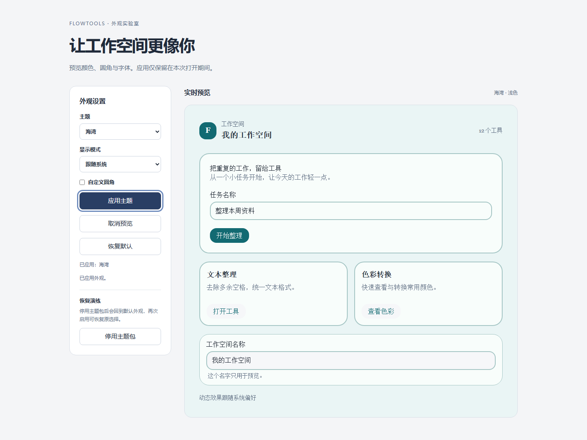
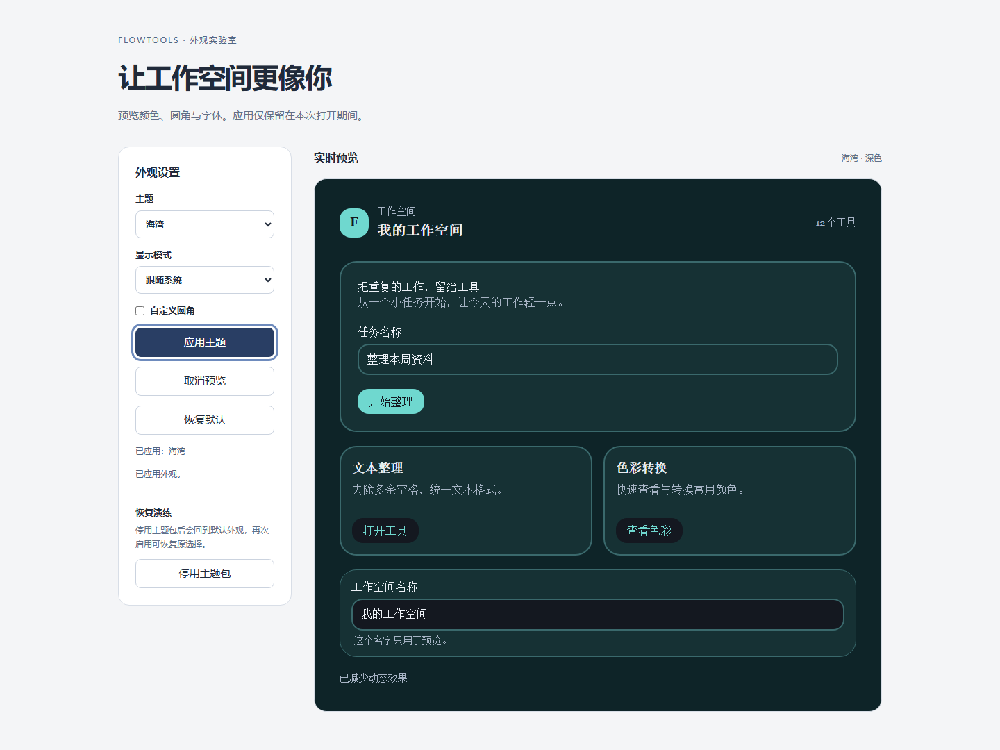
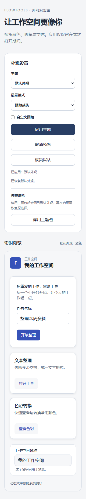

# E02b：HeroUI 主题适配与独立预览

- 日期：2026-10-09。
- 状态：done；声明的共享子树/独立预览工程范围通过 clean Windows CI。
- 范围：固定 T1、prototype；共享 `AppearanceScope` 与 UI 测试应用。
- 独立安全 Reviewer / 日期 / 结论：pending / pending / 未批准。
- 前置：[E01a](./e01-contributions.md)、[E02a](./e02-theme-contracts.md)。

## 实现与使用

Host 通过 `@flowtools/ui` 的 `AppearanceScope` 呈现解析后的主题，并在 Tailwind /
HeroUI 后显式导入 `@flowtools/ui/appearance.css`。该静态资产随 UI 包分发，
组件不在插件侧 `@flowtools/ui/plugin` 导出。Host 的类名与子树由 Host 编写，
贡献资源不能携带 CSS、URL、选择器或 DOM 指令。

```tsx
import { AppearanceScope } from '@flowtools/ui'
import '@flowtools/ui/appearance.css'

// appearance comes from createAppearanceResolver(hostDefaults)(request).
;<AppearanceScope appearance={appearance} label="Workspace">
  {children}
</AppearanceScope>
```

适配器重新校验 tokens，只生成固定变量名；数值 sRGB/OKLCH 转成颜色，字体和阴影
使用本地固定映射。除了基础语义变量，也在作用域内重绑 HeroUI 读取的 Tailwind
颜色、字号、圆角别名，避免继承根层已计算值。Card 面板与 Button/field 控件使用
不同圆角，非透明 Card 使用面板边框宽度。减少动画规则作用于子树和伪元素。
不修改 document root、全局主题、外部 DOM、目录、磁盘或 Runtime。

独立入口：运行 `bun run --cwd apps/ui-test dev`，访问
`http://localhost:5174/?appearance-validation=1`。验证应用显式扫描共享 UI 源码的
Tailwind 类；页面包含可信编译 fixture 的海湾/墨线/坏主题、浅深色和系统模式，
预览/应用/取消/恢复默认、圆角个人覆盖以及贡献目录停用/重新启用。
控制与恢复入口在主题子树外；页面说明选择只保留本次打开期间。

## 实际验证

- UI 包构建、声明消费、公开导出与静态 CSS 分发契约：4 tests / 421 assertions。
- 聚焦 Chromium：6 tests 通过，含媒体偏好通知与显式模式/减少动画优先级。
  检查真实 HeroUI 和共享 wrapper 的最终计算颜色、面板/控件圆角、边框、字号、
  字体、阴影、减少动画、恢复控制隔离、输入交互，以及伪造 CSS/数值拒绝。
  颜色断言等待真实过渡结束，保留组件动画，不扩大测试超时或删减断言。
- 使用同一固定 Playwright Chromium 147.0.7727.15 对实际页面入口补充检查：
  原生浏览器媒体偏好切换、Tab/Enter 与可见焦点、撤下/恢复/重置、320px 无水平
  溢出、720px 重排；无 pageerror。截图经过人工查看，见下方 fixture 截图。
  本地运行记录在忽略路径 `execution-validation/appearance/evidence.json`。
- 干净提交执行 `pwsh -NoProfile -File scripts/check-ci.ps1`：退出 0。
  全仓 docs/lint/types/test/build、生成漂移、生产产物、Rust fmt/locked check/clippy
  与最终 clean-worktree gate 通过。SDK 231 tests / 1104 assertions，UI 包
  4 tests / 421 assertions，Chromium 27 文件 / 72 tests，Desktop 88 tests。
  固定静态类的 lint 正反例在根目录和消费工作区均通过，未知类仍被拒绝。
  Web 22 / Desktop 24 产物在子进程 opt-in 下字节相同。
  本地忽略日志：`execution-validation/logs/e02b-ci.log`。
  完整 gate 后仅更新验收事实并复跑 docs gate，代码与完整 gate 版本一致。
- 远程 CI 必须以本子项实际 head 为准；E02a 9ba06bd 的成功不能代替本项。

## 截图与验收边界







完成范围只包含该共享子树及独立验证页。未接入真实 Web/Desktop 页面、
持久偏好或第三方安装；固定高度、显式字重/行高、组件专属 variant、任意布局、
未展示控件和挂在作用域外的 portal 需要分别接入与验收。覆盖层 tokens 已映射，
不宣称浮层挂载、焦点管理或所有组件均已验证。没有 NVDA、人工听觉、完整盲用、
其他平台或原生启动验收；720px 重排不是浏览器缩放的完整验收。
应用内浏览器桥接不可用，视觉证据来自项目固定 Chromium；键盘动作由自动化执行。

## 安全与恢复

SEC-002/003/007/010 保持 open；ADR-0001/0002 信任和包准入边界不变。
贡献 owner/选择仍由 Host 管理，目录停用通知触发重新解析，保留请求 key 并回默认，
重新启用后恢复。坏主题不能覆盖恢复控制。此处没有持久数据、迁移或磁盘恢复。

无 native command、Tauri permission、CSP、remote URL、file/network/data scope、
grant、IPC 或加载变化。已验证 theme 数据拒绝与作用域隔离；T1 同 realm 可绕过
JavaScript 接口，此组件不是第三方 CSS 隔离或沙箱。Host 必须保持权限、身份与
恢复界面的可信含义，真实宿主策略与第三方准入仍由 G4–G7 对应 gate 承担。
本项不升级父 E02、production 成熟度或安全批准。
