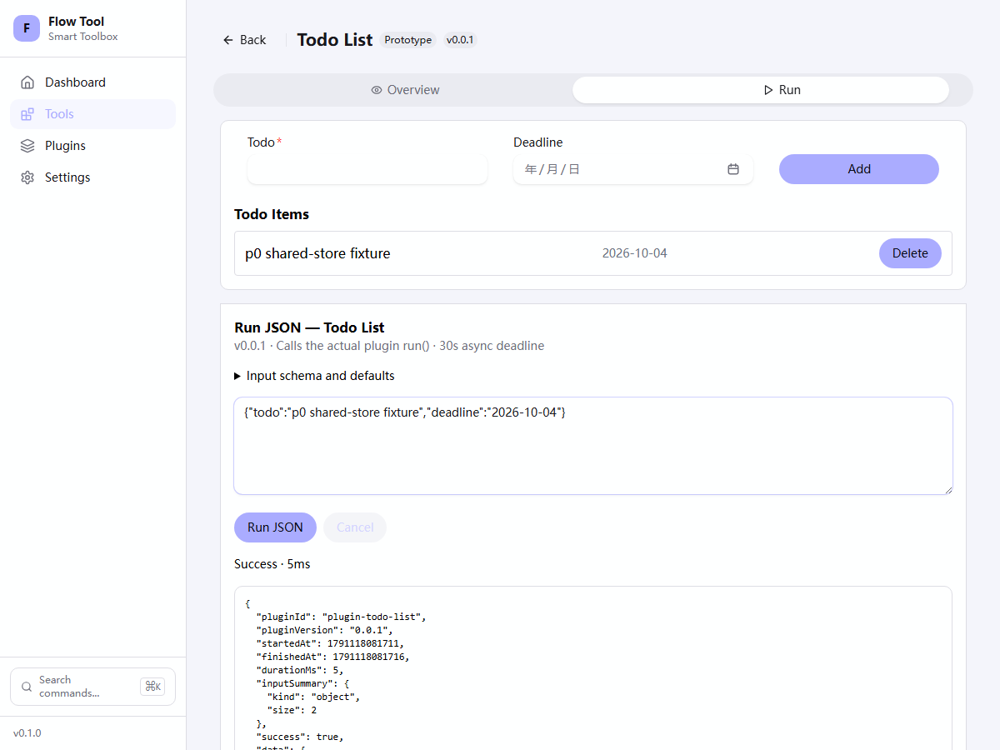
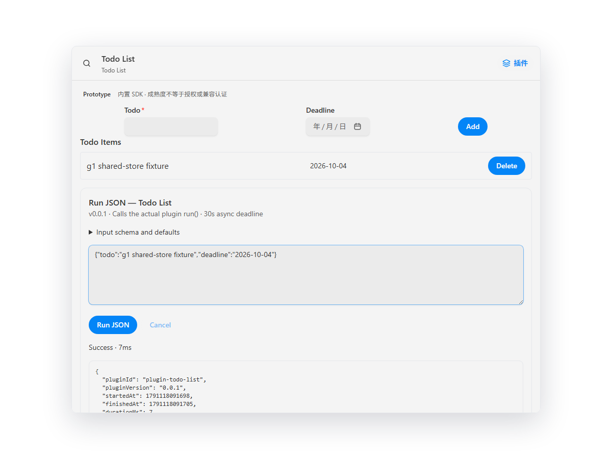

# G1 / P1.1a–c command contract acceptance

日期：2026-10-04；实施与工程验收：Codex。a/b/c 按依赖顺序独立验证和提交。
P1.1a commit `4165def`，P1.1b commit `c86aa80`；P1.1c 由本记录所在提交交付。
这不是独立安全 Reviewer 批准；SEC-001/002/005/010 仍 open，成熟度仍 prototype。

## 已交付范围

- 纯 JSON Manifest v1、有限操作 Schema、运行时 input/output validator、资源预算，
  明确旧插件适配；非法契约在固定入口加载前拒绝。
- 十二实际 T1 插件的 UI/commands 独立构建；Node 消费目录没有 React、GUI 或源码，
  真实 handler 的正常输入、错误输入、输出与取消通过。Todo 保持同一 host store。
- CLI commands/describe/help/flags 与生成参考同源；保留 list/info/run 用途，
  版本化 JSON、批处理和严格错误规范见 [CLI v1](../cli-contract-v1.md)。
- 三端固定 T1 loader/inventory 使用同一 Manifest；CLI 额外验证实际文件 hash。
  浏览器 callback 由构建绑定，只检查契约和身份，不声称验证 staging 文件字节。
- compiled CLI 回归验证 agent 只读 describe 即可准备输入、布尔 false、数值负数、
  数组、required/default、未知字段/参数及错误退出。默认值展开后超预算在 import
  前拒绝；执行批次中间的真实异常返回失败，后续项仍正常调用实际 Base64 handler。

## 自动化门禁

最终命令均通过；根测试与构建顺序执行，七 workspace 强制执行，零缓存：

```powershell
bun run docs:check
bun run verify:plugin-catalog
bun run lint --force --concurrency=1
bun run check-types --force --concurrency=1
bun run test --force --concurrency=1
bun run build --force --concurrency=1
bun run verify:manifests
bun run verify:command-docs
bun run verify:production-entrypoints
bun run scripts/generate-manifests.ts --check
```

| Runner                      | 实际通过数 |
| --------------------------- | ---------: |
| SDK                         |        135 |
| CLI                         |         93 |
| UI package                  |          3 |
| Plugins                     |         47 |
| Web                         |         23 |
| Desktop TS / scripts        |         76 |
| Desktop Rust                |         13 |
| Chromium UI（全部 25 文件） |         59 |
| 合计                        |        449 |

实际十二 package Manifest/hash 门禁通过。生产入口检查覆盖 Web 22、Desktop 25
个产物，普通生产构建与子进程 unsafe opt-in/canary 构建字节一致；已知危险代码、
certification switches 与 canary 未进入产物。这不是签名、沙箱或第三方兼容认证。

初次并行 lint 发生 Node/Go 内存分配失败，作为失败保留；收窄生成 JSON 的类型，
补齐有界 SDK catalog parser，关闭本次预览后以单任务并发完成所有根检查。
首次 browser gate 并行加载时连接断开；全部文件串行运行通过。项目 browser
配置现固定 `fileParallelism:false`，不跳过/重试测试，不替换固定 Chromium；
CI contract 覆盖该约束。Turbo build outputs 同时包含 dist/.generated，避免本地
cache 恢复遗漏 compiled catalog；Windows CI 仍强制构建，严格环境和失败规则保留。
原始失败与最终日志在忽略目录 `execution-validation/g1c/`。

## 实际页面复验

Web 使用 production preview、项目固定 Playwright Chromium 和现有 Node harness：

```powershell
bun run --cwd apps/web-vite preview --host 127.0.0.1 --port 4179 --strictPort
$env:FLOWTOOLS_VALIDATION_HOSTS = 'web'
$env:FLOWTOOLS_VALIDATION_WEB_URL = 'http://127.0.0.1:4179'
node apps/ui-test/scripts/validate-execution-hosts.ts
```

Dashboard/插件清单十二 Prototype、真实 Base64、JSON/schema 错误、键盘运行、
metadata-only history/刷新/清空、受控 `.invalid` request 取消、Todo JSON 与真实
面板同步全部通过；receipt 明确 hosts=web。

Desktop 本轮在本地前端验收 launcher、市场保存配置/启用/运行路由、真实 Base64、
Tab/Enter、unknown field INPUT_INVALID 和真实 Todo panel/store 同步；console
无错误。插件 metadata IPC 仅使用 disposable fixture，未访问用户数据库，
不推断原生 IPC、独立安装包、OS 外壳焦点或新的原生实窗验收通过。受控脚本与
receipt 位于 `execution-validation/g1c/check-desktop.mjs` / `desktop-receipt.json`。
现有原生 harness 按当前 UI 更新为“保存配置/启用并打开”，保留 identity/loopback
保护。G0 原生人工豁免单独见 [G0 记录](./p0-market-state.md)。

已检查下列真实截图：共享 Todo 状态可见，运行区域和状态可读；长输出由滚动访问。
本轮没有 UI 视觉设计变更；截图和键盘检查不认证 NVDA 或其他平台。




G1 完成，下一阶段 G2 尚未开始。Host/runtime-client、持久 grants、独立 CLI、
durable jobs、服务/tool locks、第三方签名安装与隔离仍按后续里程碑实施。
