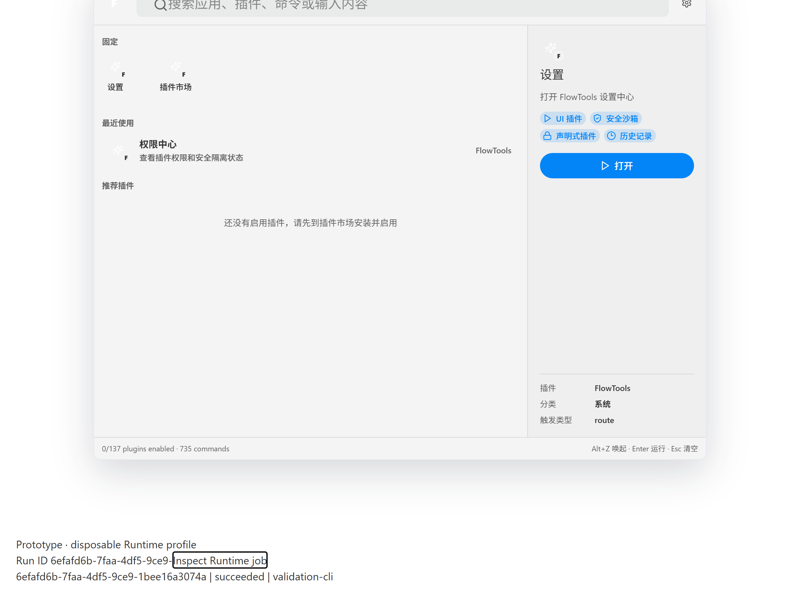

# G2 lifecycle and headless runtime acceptance

日期：2026-10-04；工程实施与验证：Codex。每子项独立验证并提交。
成熟度保持 prototype；独立安全 Reviewer 尚未批准；SEC 风险不关闭。

## P1.2a

统一 Registry/Loader/LifecycleManager，保留当前状态词表。每插件队列跨
loader 实例共享；不同插件不共用锁。onLoad -> onActivate -> onDeactivate ->
onUnload；失败撤下可用状态并补偿，原始异常与清理异常分别保存。
失败后普通 enable/load 不自动重试，明确 unload/reload 后恢复。
清理失败阻止 removal；已排队加载期间同步 unregister 也拒绝。

回归包括 36 个状态边、100 并发 enable/disable、manager 混用、禁用重启、
原始错误、补偿错误、显式恢复和排队删除竞争。定向 53 tests 通过。
根 docs:check、lint/check-types（七 workspace，force/concurrency=1）、SDK build + 全量 175 tests、Web 23 tests 通过。
本项没有视觉或路由变更；P1.2b 再验证实际启停命令界面。

本项没有新增 capability、网络、文件、grant 或持久化入口。状态锁仅用于
可信 T1 的一致性，不是第三方隔离；用户 DB 不变。既有 unsafe development
卸载改为经过相同 cleanup，DEV + exact opt-in 默认拒绝规则保留。

## P1.2b

命令随启停状态投影，未满足依赖不激活；缓存 handler 绑定递增 generation，
即使 import 复用同一个 JS 对象，reload/update 后旧 handler 也拒绝。
withPlugin 将真实运行和生命周期更新串行化，排空已接收调用后替换/卸载。
启用 UI module 不自动创建子进程；isRunning 只反映明确 owned runner。
load/activation/view/runner scopes 逆序清理资源；清理失败保留 ownership 并
阻止移除，明确恢复时重试。此为合作 T1 cleanup，不是 OS sandbox/硬停止。

SDK build + 180 tests、Web 24 tests 通过；包括实际子进程终止、timer/订阅/
view 资源回收、旧 handler 拒绝、在途 update 和失败恢复。Web GUI 使用当前
registry plugin，不再直接执行 UI 捕获的旧引用。P1.2a commit 为 61f4f2c。

使用全新 Chromium profile 在真实 Web /plugins 页面停用 Base64，菜单从
12 到 11 且不再显示该命令；启用后菜单恢复，选择命令抵达真实工具 route 和
React panel。截图已检查，Prototype 标签与页面可读。内置 Browser pipe 不可用，
使用项目固定 Playwright Chromium；本轮没有 native Desktop 或 NVDA 验收。
Web lint/types 与浏览器并行时内存分配失败；关闭本任务浏览器/server 后串行重跑。

本项改动 T1 生命周期与 Web 执行边界；SEC-002/010 仍 open。没有新增原生
capability/持久授权/用户数据存储。独立安全 Reviewer 未批准。
P1.3a 见下节，P1.5a pending。

## P1.3a

独立 Rust workspace 提供 runtime-core 和 flowtools-runtime（无 Tauri 依赖）；
TS runtime-client 的 DTO/JSON Schema 由 Rust Specta/Schemars 生成。Catalog
使用 TS 已验证完整 Manifest 的固定 build artifact；Rust 再验证 input/defaults/
output/effects，runner 核对同一 package digest 并调用实际 compiled Base64。
未知 ID 在 IO 前拒绝，不接受 executable/path/raw argv。Bootstrap artifact
路径/hash 仅在忽略的本地 build 配置，未进入 portable catalog。普通启动拒绝
SETUP_REQUIRED；只允许显式 disposable validation profile 和两类 Host token。

当前用户 protected ACL 的 Windows named pipe 拒绝 remote clients、重复首实例；
请求长度 1MiB、connection/session proof、client version/instance 检查，最多
16 pipe instances、128 jobs、4 workers。超期/取消杀死并等待 owned child，正常
退出排空 workers；纯 T1 每任务目录与干净 env，不继承 token/secret。
纯命令无需持久 grant；所有 effects/permissions 非空命令 APPROVAL_REQUIRED。
这些不是 sandbox、真实权限 broker 或任意外部包准入。Installed/enabled/running
分别报告；UI module 不要求 resident runner。任务/回执/事件只在内存，重启不
恢复业务，不接真实 SQLite/store；G3 才迁移 ownership 和 durable jobs。

Rust core 6 tests、named pipe 原生测试、runner 的实际调用/包变化拒绝及 Node
客户端回归通过。Bun Windows net.Socket 在双 pipe 切换后遗漏响应；保留所有
断言改用实际 Node 子进程，不用放宽等待或重试掩盖。测试覆盖同 runId/同 key、
实际结果、schema/副作用拒绝、跨 caller 取消拒绝、取消终态和显式后台断线续跑。
Serde flatten + deny_unknown_fields 使原生终态反序列化失败，已修复并加入
success/failure 的真实往返回归，重新验收 Desktop 通过。

实际 Windows WebView2 测试 identity 为 com.flowtools.g2-validation-20261004；
配置 tauri.runtime-validation.conf.json、全新 WebView profile、隐藏窗口，仅
child env 设置 loopback CDP 9224，核对实际 listener 127.0.0.1。先确认初始
launcher 在 /，再启用 DEV fixture；原生 adapter 校验真实 identifier/window/
origin/opt-in，JS 无法选择 endpoint 或 caller token。Node CLI submit 后 native
GUI 键盘 Enter 查询同一 runId，显示 succeeded/validation-cli；截图已检查。
结束已关闭本任务窗口、Runtime、Vite，1420/9224 不再监听。

复现：build:packages -> runtime-core generate -> plugin-runner build -> runtime
build -> runtime-client build；使用 TAURI_CONFIG 为上述专用配置的 cargo build
--bin desktop，Vite DEV 前端启动后用 Node 运行
apps/ui-test/scripts/validate-runtime-hosts.ts。Harness 校验专用 identifier/
artifact，绝不启动默认 Debug。仅测试 fixture 数据；没有用户数据库删除/迁移。

全部仍 prototype；没有独立安全 Reviewer 批准、NVDA、前台 OS 窗口、Unix、
签名分发或生产无人值守验收。P1.5a 继续单独实现兼容/失联/隐私 golden gates。

P1.3a 提交前 docs/workspace/actionlint 通过；十一 workspace lint/types 通过，
唯一 harness 类型警告修复后定向 lint 清零。Desktop 76 tests + 14 Rust tests、
独立 Rust 7 tests、runner 1 test、client 2 tests 和实际 native harness 通过。
Rust 两个 workspace 的 fmt/clippy -D warnings 通过。全仓 test/build 与生产产物
gate 在 P1.5a 完成后顺序复验，不把当前定向检查表述为全仓 test/build。

## P1.5a

P1.3a commit 为 dcc80ed。P1.5a 使用同一 Rust 类型导出 version constants、
TypeScript、JSON Schema 和全部十二个完整 Manifest/18 错误响应 golden；Rust
与 TS 都校验同一 fixture、schema 与 canonical SHA-256。read-only
verify:runtime-contracts 在 CI generate:hosts 后、lint 前执行；生成文本只允许
checkout CRLF/LF 规范化，不掩盖字段或语义漂移。Types 不是手写 DTO 镜像。

Manifest golden 保留真实十二插件的完整元数据，files 使用固定 LF fixture
文本和 SHA-256；它不代表可执行包。Rust 恢复 build-owned files 后逐字段匹配
实际清单，TS 同时校验完整 Manifest、fixture 文件字节与 canonical digest。
真实 Runtime/runner 仍使用实际构建文件的原始 size/hash，篡改即拒绝。
首次全仓 test 发现 sourcemap 嵌入 LF/CRLF 源码导致 golden 漂移；以上分离
消除 checkout 换行依赖，没有归一化真实包 hash 或移除漂移断言。

每种公开错误提供受控文案与下一步操作；response version/requestId/method、
formatVersion/终态/result identity/时间一致性均拒绝不匹配。请求超限在 IO 前
拒绝；原生 bridge 的稳定拒绝码保留。submit 失联明确 acceptanceUnknown，
不自动重试；重连核对 instance，原始 key/package/input/background/deadline
不可变。当前没有 durable crash 恢复，旧实例任务无恢复证据，返回
INSTANCE_MISMATCH/JOB_NOT_FOUND，不能伪造 interrupted 或 success。

真实 Node raw pipe 复验错协议、超限 header 和 identity injection；实际
foreground 断开取消、background 断开继续、跨 caller 取消拒绝通过。真实
Base64 超预算输出返回 OUTPUT_INVALID；受管 child 包摘要改变返回
EXECUTION_FAILED，极短 deadline 返回 TIMEOUT，均经过实际 child wait/reap。
事件仅含 runId/state/sequence，diagnostic export 仅有版本/code/summary/action/
acceptanceUnknown；token/input/output/路径/异常 canaries 均不进入诊断。
Native bridge 增加与实际 configured origin 的精确匹配，错误本地端口也拒绝。

最终 native harness 重建同一 G2 fixture identity，以新的 WebView profile、
loopback-only child CDP 再验证初始 launcher、同一真实成功 runId、Enter
键盘触发及 JOB_NOT_FOUND 可操作文案。结束关闭本任务 native/Runtime/Vite。
截图更新为 2026-10-05 最终复验，实际 runId 为
6efafd6b-7faa-4df5-9ce9-1bee16a3074a。receipt 留在忽略的
execution-validation/g2，不包含 tokens 或 raw payload。仍未认证 NVDA、
其他 OS、前台窗口、签名发行、安全 Reviewer 或 G3 生产 grants/持久恢复。

2026-10-05 最终全仓门禁：冻结依赖、docs/workspace/catalog contracts 通过；
十一 workspace lint（零警告/错误）、types、test、build 全部通过。
test 与 build 顺序执行，未使用 Turbo 测试缓存。SDK 180、CLI 93、UI 3、
plugins 47、Web 24、runner 1、runtime-client 6、Desktop 80 项 Bun tests；
UI-test 固定 Chromium 的 25 files / 59 tests；独立 Runtime/core 10 和
Desktop 15 项 Rust tests。真实十二插件 smoke 包含在 plugins gate。
生产入口门禁对 Web/Desktop 实际产物和 opt-in/canary 重建完成字节一致检查，
DEV 验证面板及已知 unsafe fingerprints 未进入生产产物。
Desktop Rust fmt/check/clippy -D warnings、actionlint、完整 Manifest、命令文档
和生成文件只读复核均通过。

补验事故：全仓 Cargo integration tests 重建了默认桌面二进制，harness 原先只
检查产物包含验证 identifier，错误配置也含同一拒绝逻辑常量，因而检查无效。
2026-10-04 23:33 的补验误启动默认 Debug；会话校验拒绝，但默认 app.sqlite
在初始化时触发了已有的删除重建逻辑。没有本次任务前的数据快照，不能证明
旧数据恢复。维护者明确无需保留数据；没有复制、读出记录或恢复原库。

已增加 metadata-only preflight：先验证新探针 marker，再读取实际编译配置的
identifier/dev origin/title，全部匹配后才启动 fixture Host/Desktop。旧二进制
没有探针时执行前拒绝；不能用源码字符串出现作为身份依据。原生显式验证模式
另在任何 Builder/plugin/数据库初始化前拒绝错误 identifier。普通 Debug 的
历史重置行为没有更改，仍是已知 SEC 风险，不授权默认用户身份用于验收。
重新加载真实原生面板时，测试 Host 正常关闭后的握手错误保留
RUNTIME_DISCONNECTED 和可操作文案。

最终真实 preflight 先拒绝 Cargo 重建的默认配置，发生在任何 Host/GUI 创建
之前；再以专用 TAURI_CONFIG 重新编译的二进制通过实际配置 probe。
新的 native harness 通过共享实际成功任务、JOB_NOT_FOUND 文案与 Host 正常
关停后 reload 的握手失联检查；结束确认 1420/9224 不再监听。

P1.5a 单独提交，G2 固定 Windows/T1 验证范围 done；P1.3/P1.5 父项和
Phase 1 继续 pending。根 CI 脚本的检查在有意未提交实现期间逐项执行，
提交后另核对 clean worktree；没有宣称远程 CI 或 required checks 已验收。
