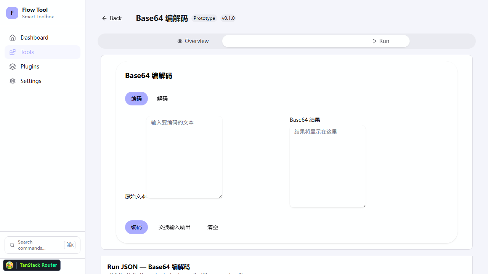

# G2 lifecycle and headless runtime acceptance

日期：2026-10-04；工程实施与验证：Codex。每子项独立验证并提交。
成熟度保持 prototype；独立安全 Reviewer 尚未批准；SEC 风险不关闭。

## P1.2a

统一 Registry/Loader/LifecycleManager，保留当前状态词表。每插件队列跨
loader 实例共享；不同插件不共用锁。onLoad -> onActivate -> onDeactivate ->
onUnload；失败撤下可用状态并补偿，原始异常与清理异常分别保存。
失败后普通 enable/load 不自动重试，明确 unload/reload 后恢复。
清理失败阻止 removal；已排队加载期间同步 unregister 也拒绝。

回归包括 36 个状态边、100 并发 enable/disable、manager 混用、禁用重启、
原始错误、补偿错误、显式恢复和排队删除竞争。定向 53 tests 通过。
根 docs:check、lint/check-types（七 workspace，force/concurrency=1）、SDK build + 全量 175 tests、Web 23 tests 通过。
本项没有视觉或路由变更；P1.2b 再验证实际启停命令界面。

本项没有新增 capability、网络、文件、grant 或持久化入口。状态锁仅用于
可信 T1 的一致性，不是第三方隔离；用户 DB 不变。既有 unsafe development
卸载改为经过相同 cleanup，DEV + exact opt-in 默认拒绝规则保留。

## P1.2b

命令随启停状态投影，未满足依赖不激活；缓存 handler 绑定递增 generation，
即使 import 复用同一个 JS 对象，reload/update 后旧 handler 也拒绝。
withPlugin 将真实运行和生命周期更新串行化，排空已接收调用后替换/卸载。
启用 UI module 不自动创建子进程；isRunning 只反映明确 owned runner。
load/activation/view/runner scopes 逆序清理资源；清理失败保留 ownership 并
阻止移除，明确恢复时重试。此为合作 T1 cleanup，不是 OS sandbox/硬停止。

SDK build + 180 tests、Web 24 tests 通过；包括实际子进程终止、timer/订阅/
view 资源回收、旧 handler 拒绝、在途 update 和失败恢复。Web GUI 使用当前
registry plugin，不再直接执行 UI 捕获的旧引用。P1.2a commit 为 61f4f2c。

使用全新 Chromium profile 在真实 Web /plugins 页面停用 Base64，菜单从
12 到 11 且不再显示该命令；启用后菜单恢复，选择命令抵达真实工具 route 和
React panel。截图已检查，Prototype 标签与页面可读。内置 Browser pipe 不可用，
使用项目固定 Playwright Chromium；本轮没有 native Desktop 或 NVDA 验收。
Web lint/types 与浏览器并行时内存分配失败；关闭本任务浏览器/server 后串行重跑。

本项改动 T1 生命周期与 Web 执行边界；SEC-002/010 仍 open。没有新增原生
capability/持久授权/用户数据存储。独立安全 Reviewer 未批准。
P1.3a、P1.5a pending。
