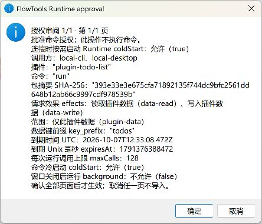
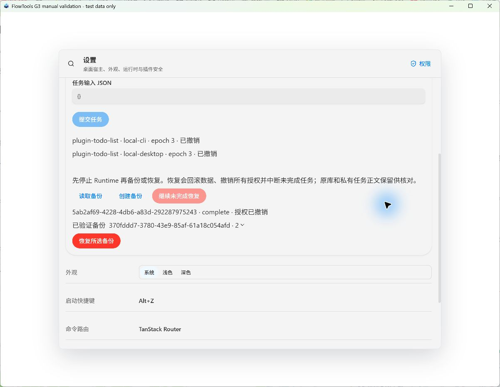

# G3 Desktop acceptance fixes

2026-10-06, fixed Windows/T1 prototype scope. These fixes address three defects
found during actual Computer Use acceptance. They do not advance maturity or
close the parent G3 security and accessibility gates.

## Defects and changes

1. A successful cold-start helper exited while its background Host retained the
   stderr pipe. Desktop waited for EOF until its 45-second timeout, although the
   Host was already available. Success now requires the first output line and
   helper exit; stderr is read only on failure within the same deadline. A real
   disposable-profile Rust regression failed on the previous implementation,
   then passed in about two seconds with the Host still running. It also checks
   `COLD_START_DENIED` and stops its owned Host before asserting.
2. Native consent displayed an unreadable JSON line and unrelated stop/restore
   consequences. It now uses labelled, wrapped fields with explicit caller,
   package digest, effects, scopes, UTC expiry, budgets, cold-start and background
   permission. Identical GUI/CLI grants share one review; different scopes or
   flags do not merge. Long reviews use bounded pages, all confirmed before a
   single import; cancelling any page changes nothing. Initialization, stop,
   backup creation, restore and retry have separate consequence text.
3. Restore/retry left cached granted permissions visible after Host revocation.
   Completion now invalidates the runtime view and reads actual T0 policy
   records, without starting a business session. Failure hides stale permissions,
   old completion receipts and the selected backup until reread. Consent
   cancellation preserves verified state. A failed permission reread retains the
   actual completed receipt with an explicit unverified-authority message.
   Management timeouts describe uncertain connection/operation state and request
   reread; business task errors retain job/idempotency guidance. Writes are never
   automatically repeated.

## Automated regression evidence

- Four Rust consent tests cover field completeness, operation-specific text,
  control-character quoting, paginated long scopes, distinct background flags,
  invalid format and refusal of unexpected business calls.
- Six pinned-Chromium UI tests render the real `ManagedRuntimePanel` and shared
  components with controlled native transport responses. Restore and retry show
  fresh revoked epochs; cancellation preserves state; failures clear stale
  grants/receipts; permission-read failure preserves completed recovery; connection
  timeout neither claims a job deadline nor repeats management operations.
- Desktop lint/type checks and native clippy passed. These targeted regressions
  supplement the repository's full Windows CI gates.

## Actual Windows acceptance

Computer Use controlled the rebuilt visible dedicated validation window, with its
exact compiled test identity, a fresh disposable Runtime profile and fixture data.
Production configuration and user databases were not used. CLI reads corroborated
native results; grants were approved by clicking native dialogs.

| Flow                                           | Observed result                                                                                                                                                        |
| ---------------------------------------------- | ---------------------------------------------------------------------------------------------------------------------------------------------------------------------- |
| Initialization cancel / confirm                | Cancellation created no profile; confirmation initialized without grants or jobs.                                                                                      |
| Todo grant review / cancel                     | All fields readable in one dialog; cancellation left permissions empty.                                                                                                |
| First confirmed grant and cold start           | Connected on the next inspection, within 6.5 seconds of confirmation; GUI/CLI same instance, zero jobs, no `TIMEOUT`. This is an observation bound, not a startup SLA. |
| Background permission change                   | Dialog showed `background=true`; cancel preserved epoch 1/false, confirm produced epoch 2/true for both callers.                                                       |
| Stop and create backup                         | Correct operation-specific text; stop released the writer; one usable schema-2 backup created.                                                                         |
| Restore cancel / confirm                       | Cancel preserved permissions; confirm completed and GUI/CLI both showed actual epoch 3 with `grant=null`, disabled task submission and retry.                          |
| Restore with a read-only no-delete file handle | Actual `STORAGE_FAILED`, old granted rows and prior complete receipt removed; unverified permission message displayed. Reread showed a new `prepared` journal.         |
| Retry cancel / confirm after releasing handle  | Cancel preserved the prepared journal; confirm completed that same recovery ID. Fresh revoked records matched CLI, retry/submission disabled.                          |

Screenshots inspected during acceptance and retained for PR review:

The owned file handle, validation window and Vite server were closed. Offline
storage inspection confirmed the writer released and recovery complete. Local
checklists, evidence JSON and test paths remain ignored; maintainer ticks were
preserved and are not submitted.

## Security and remaining acceptance

Threat IDs: SEC-002, SEC-003, SEC-004, SEC-006, SEC-009, SEC-010, SEC-013, SEC-015.
ADR-0001/0002 designs and existing default denials remain unchanged. The formatter
is internal to T0 Rust; it adds no command, permission, scope, CSP or remote URL.
Existing DEV/main-origin guards, payload budgets, typed operation allowlists and
Host-owned identity/policy enforcement continue to apply. The recovery UI reads
real policy epochs rather than guessing them or constructing a second store.

Independent security reviewer/date/conclusion: pending, no approval claimed.
NVDA, complete keyboard/zoom acceptance, other platforms and signed distribution
remain separate work owned by the Repository Maintainer. Passing these checks
does not enable third-party execution, certify an OS sandbox or authorize production.
