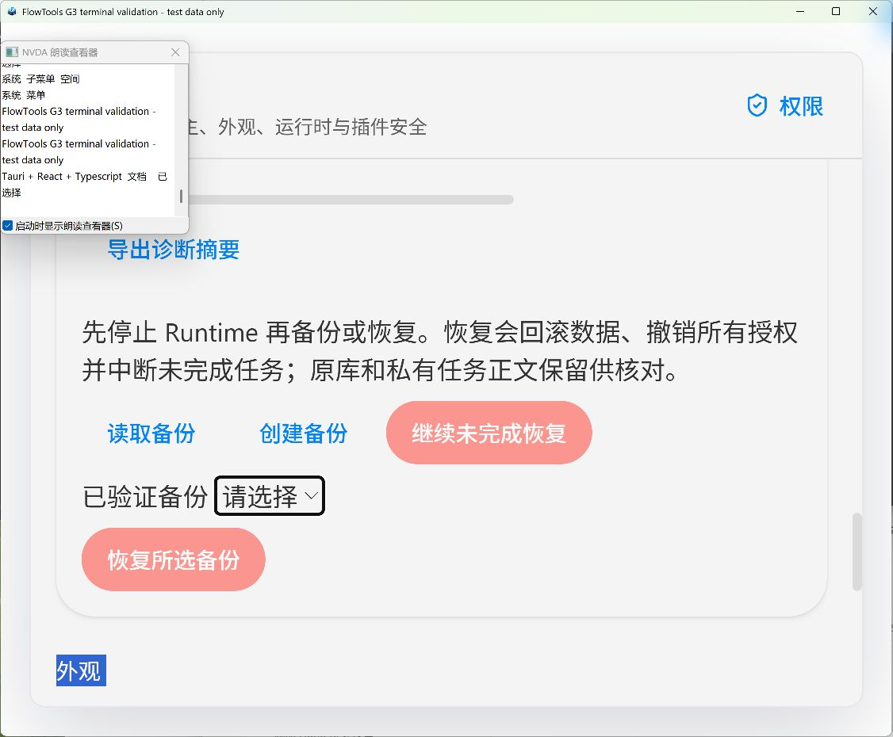
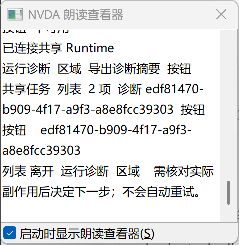

# G3 terminal verification

2026-10-07. Scope: Windows/current-user/fixed-T1 prototype. Code review here was
performed by Codex; it is not an independent security approval or production gate.

## Repairs and executed checks

- [Stop receipt/cancellation repair](g3-runtime-stop-receipt.md): a real remote
  failure led to two deterministic regressions, each failing before its repair.
  Host now cancels business work before waiting for the authenticated stop receipt
  to be consumed. A SQLite cancellation-write failure also reproduced a live
  execution check; the stopping flag now independently denies launches/effects
  without fabricating a persisted cancellation. All 39 core and eight Host Rust
  tests passed, and clippy passed.
- Desktop's main window and both isolated validation configurations now enable
  Tauri `zoomHotkeysEnabled`. The installed Tauri/Wry default was false, disabling
  user zoom shortcuts. The configuration/identity contract and dedicated native
  compilation passed. Actual keyboard zoom/reflow was subsequently checked at
  200% in the isolated native window, including a 1126 × 930 window size.
- Rebuilt Runtime and the dedicated compiled identity, then ran the existing
  `node apps/ui-test/scripts/validate-managed-hosts.ts` against a fresh private
  profile. Initial launcher, keyboard Todo Add, shared revision 4, preservation
  of unknown Todo fields, shared job inventory, actual diagnostic JSON download,
  online `STORE_BUSY`, matching offline schema-2 backup and business-channel
  `SESSION_INVALID` all passed. A real background run completed after GUI exit.
  Diagnostic screenshot was inspected; raw receipt/screenshots remain ignored.
- The eight real CLI execution contracts and strict stop hook passed. The full
  clean Windows quality script and current-head remote results are recorded in
  the PR; older green runs do not prove the current revision.
- Final Native revalidation found an IPv6-only `::1` CDP listener while the
  harness attached only to IPv4. The harness now probes both literal loopback
  addresses within the same 25-second budget, refuses redirects and checks every
  actual listener before attaching to the endpoint that replied. Three regression
  tests reject wildcard/public/mixed listeners and unrelated endpoints. No
  production debugging configuration or startup budget was added.

The Native harness supplies explicit T0 fixture policy. It does not click native
consent and does not certify a complete keyboard or screen-reader interaction.
The earlier actual native confirmation/cancellation and recovery-failure/retry
checks are recorded in [Desktop acceptance fixes](g3-desktop-acceptance-fixes.md).

## Actual keyboard, zoom and NVDA checks

Computer Use was restored and the maintainer unlocked Windows. The checks used
the dedicated visible validation identity, a fresh fixture profile and signed
NVDA 2026.2 portable with add-ons disabled and a private configuration. No user
database, production identity or persistent remote debugging was used.

- Tab and Shift+Tab reached the command selector, background checkbox, JSON
  input, task submission, diagnosis/export, backup selector and recovery actions.
  Focus rings remained visible. The command list expanded/collapsed by keyboard;
  the checkbox announced checked/unchecked and disabled controls were skipped.
- Native initialization, grant, stop, backup, restore and retry dialogs received
  keyboard focus. Confirmation/cancellation returned to the invoking page control.
  NVDA's actual Speech Viewer output included the dialog title, readable scope and
  consequences, confirmation/cancel buttons and resulting status changes.
- Ctrl+plus reached 110%, 125%, 150%, 175% and 200%, announced by NVDA. At 200%,
  Chinese recovery consequences wrapped and the export/backup/restore controls
  remained reachable. Long diagnostic JSON had horizontal and vertical scrolling.
  Resizing from 1202 × 930 to 1126 × 930 retained these controls; Ctrl+0 restored
  the original zoom. This is not a mobile-width or other-platform claim.
- A real Todo task succeeded and its diagnosis was actually exported. The JSON
  contained only allowlisted run metadata. The earlier failed fixture task retained
  `EXECUTION_FAILED` and `requiresReview: true`. After keyboard focus was moved
  through diagnosis/export, NVDA browse reading announced the warning to check
  actual side effects and that no automatic retry would occur.
- NVDA read the shared Runtime, shared Todo data, run diagnosis and backup/recovery
  regions, input/combobox/checkbox/button names and statuses. Keyboard Todo Add
  changed the shared Runtime revision from 1 to 2 and announced the new revision.
- Online backup reading returned `STORE_BUSY`. After an acknowledged stop and
  actual Host exit, offline reading and schema-2 backup creation succeeded. A
  temporary read-only, no-delete file handle caused real `STORAGE_FAILED`; the UI
  cleared stale grants and exposed the pending journal. Cancelling retry preserved
  its recovery ID; confirming after releasing the handle completed the same journal,
  reread revoked grants and did not replay business work. NVDA announced failure,
  retry consequences and completion. A new explicit grant was required afterward.

The first visible launch accidentally selected an old local Runtime binary because
the test build omitted `CARGO_TARGET_DIR`. Its failed task remains in the evidence.
The test configuration was corrected, rebuilt and identity checked before the
successful run; this setup failure was not hidden as a successful attempt.

NVDA evidence is actual Speech Viewer output observed during real UI actions, not
UIA names or synthetic speech. It does not certify human listening, voice quality,
an entire blind-user workflow or all NVDA shortcut combinations. Temporary private
reading-key mappings were tried because the automation interface did not correctly
send Insert chords; the final side-effect warning was read with ordinary browse
Down keys after Tab/Shift+Tab positioned focus. No NVDA add-on or application
accessibility shim was installed.

## Security engineering review

Review baseline: `c8b692b`, window zoom configuration and the fail-stop checks
in this change.
Reviewer: Codex, 2026-10-07. Conclusion: the scoped stop repair preserves the
examined authorization/data boundaries; the findings above have regressions.
Independent reviewer/date/conclusion: pending, no approval claimed.

Cancellation-storage failure can leave durable job states unchanged. The stopping
receipt acknowledges process stop, not a fabricated durable cancellation. The
new fault regression proves same-process effect denial; persisted states need
inspection before restart/recovery. Crash/power-loss cancellation durability is
not certified by this check.

| Boundary                                | Source and rejection evidence                                                                                                                                                                                                                                                                                                                                                       | Limit                                                                                       |
| --------------------------------------- | ----------------------------------------------------------------------------------------------------------------------------------------------------------------------------------------------------------------------------------------------------------------------------------------------------------------------------------------------------------------------------------- | ------------------------------------------------------------------------------------------- |
| Host identity and management separation | [Core dispatch](../../packages/runtime-core/src/runtime.rs) binds caller to the authenticated connection; [native bridge](../../apps/desktop/src-tauri/src/managed_runtime.rs) checks Debug/main/dev origin and fixed build-owned binary. Real Native business-channel management refusal passed.                                                                                   | Current-user T0/T1 prototype; same-account compromise is outside the claimed boundary.      |
| Effects, scope and revocation           | [Broker](../../packages/runtime-core/src/broker.rs) requires manifest AND grant scopes, exact identity/package, epoch, expiry and per-run call budget. Existing tests reject identity/SQL/path/executable injection, over-scope calls and stale sessions. [Policy](../../packages/runtime-core/src/policy.rs) validates before transactional import and revokes on catalog changes. | File/tool descriptors are not IO adapters; origin matching is not DNS/redirect enforcement. |
| Stop and effect commit                  | [Core](../../packages/runtime-core/src/runtime.rs) cancels before the receipt; Todo commit runs fresh checks inside the Host lock. New tests reject an unauthorized stop without cancellation, prevent queued launch and leave data revision zero after authorized stop. [Server](../../apps/runtime/src/server.rs) bounds receipt/peer waiting and worker drain.                   | Crashes/OS termination can lose receipts; explicit reread remains necessary.                |
| Private payload and diagnosis           | [Private jobs](../../packages/runtime-core/src/private_jobs.rs) use Windows DPAPI with run/kind binding and digest checks; [profile](../../apps/runtime/src/profile.rs) verifies the current-user private ACL. Core diagnosis explicitly selects metadata fields. Real JSON export equals the displayed metadata and excludes fixture inputs/results.                               | ACL/DPAPI do not isolate an attacker already controlling the same account.                  |
| Data, single writer and recovery        | [Data store](../../packages/runtime-core/src/data.rs) uses Host-derived namespace, parameterized SQL, revisions, quotas and transactional writes; [recovery](../../packages/runtime-core/src/recovery.rs) validates UUID/digest/journal, preserves originals, revokes grants, disables cold start and prevents replay. Existing real lock/failure/retry fixtures remain required.   | Backup/restore is same-profile and Windows only; unknown side effects require review.       |
| External entrypoints                    | Existing service-level default-denial/build-mode tests and actual artifact scans remain required in full CI. This change adds no native command, Tauri permission, CSP, remote URL, file/network/data scope, executable selector or third-party entry.                                                                                                                              | Signed distribution and T2/T3/TL isolation remain later milestones.                         |

ADR-0001/0002 and SEC-002/003/004/006/009/010/013/015 remain open. This review adds
evidence, without accepting production risk or advancing maturity.

## Outstanding acceptance

An actual independent reviewer must record their name, date, reviewed revision,
scope and conclusion. CI and Codex self-review cannot supply that approval. PR
remains Draft while this required approval is incomplete. Other platforms, signed
distribution and production readiness are not part of this Windows/T1 result.
The maintainer's local checklist and checkmarks remain ignored and unmodified.
