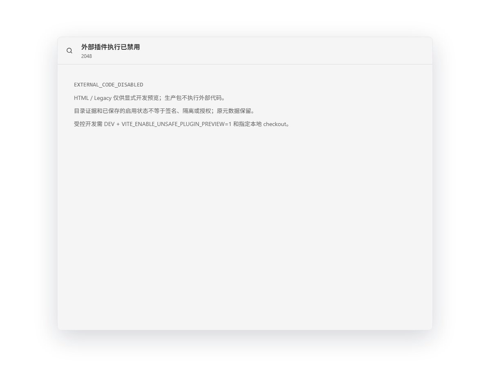
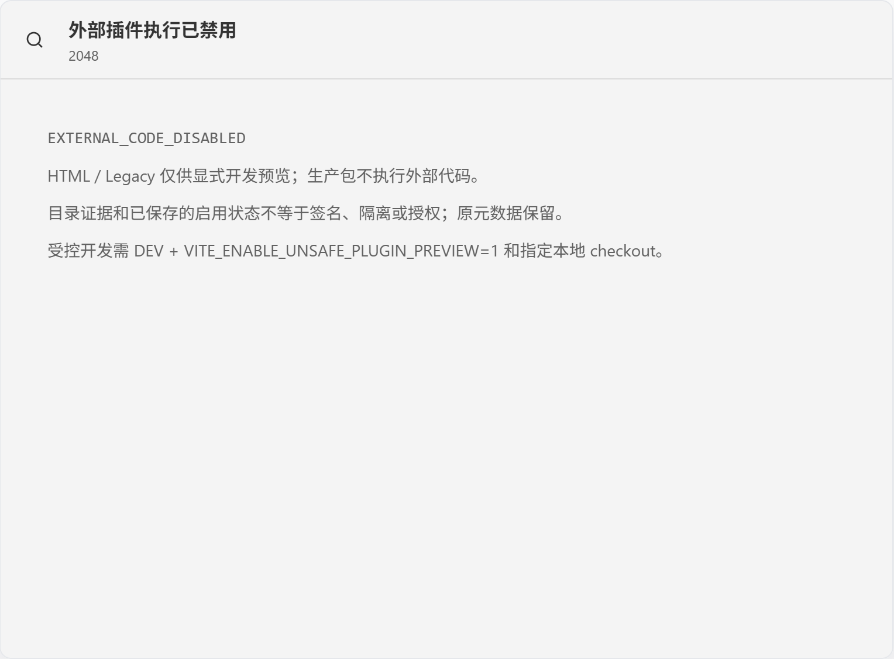
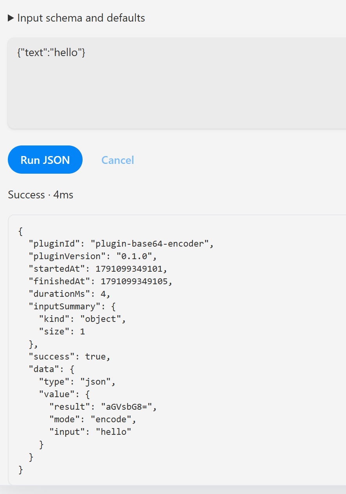

# P0.3b3 Desktop HTML / Legacy 入口验收

- 日期：2026-10-04；基线为 P0.3b2 bc514ff 后的实现。
- 状态：done；实现、完整 gate、production frontend 与专用原生包人工验收通过。
- 范围：默认停用外部执行与显式危险开发预览；不是 signing / sandbox / grant。

## 已有证据

普通 bridge 的 8 项回归均在旧实现失败：脚本、HTML/preload 注入以及 UI、clipboard、
native、FS、SQL 请求不受默认拒绝。修复后全部通过，拒绝在 command/payload
读取或能力调用之前。开发实现的六个真实模块构建覆盖 production、production
opt-in、default dev、flag 0、boolean flag 和 DEV + 精确字符串 1；仅最后开放。
即使开放，raw native/SQL/FS/opener 七方法在读取 payload 前拒绝。

完整 Desktop 测试曾稳定暴露 Bun 1.3.14 Windows 编译器生命周期问题：同进程
导入 SDK/React 后连续 Bun.build 会报依赖文件 Unexpected reading file，单独跑
矩阵不暴露。六个实际编译改用独立编译进程，未跳过断言、重试或替换插件；
Desktop Bun 全套 39 tests / 254 assertions 随后通过。编译子进程不是插件 sandbox。

主 App 不静态导入危险 runner/bridge；DEV 之外动态 import 被构建剔除。
HTML route 在 activation/fetch/iframe 前拒绝，Catalog 与已保存 enabled metadata
不放行、不删除。开发 UI 显示未签名、同 realm 与无用户授权警告；成熟度固定
Prototype。frame fetch 失败不回退直接 remote src，卸载 abort 并抑制过期回复。
完整根 docs/catalog/三份清单/lint/types/test/build 门禁通过；七 workspace 的
Turbo lint/types/test/build 均强制执行、零缓存。Desktop Bun 39 / Rust 13、
SDK 86、CLI 48、plugins 41、Web 22 与共享 UI Chromium 59 tests 通过；
另跑十二实际 compiled 插件 smoke，15 tests / 107 assertions 通过。

实际 Desktop production build 加上 opt-in=1 与
`VITE_HTML_PLUGIN_ROOT=X:/flowtools-production-leak-canary` 后，全部 24 文件
SHA-256 与普通生产构建逐字节一致。扫描未发现 bridge 脚本、开发模块、
/@fs 路径或 canary；父进程环境恢复，不持久设置开关。chunk 大小与编译
性能警告仍是性能债务，不代表生产成熟度。

Node + 项目固定 Playwright 1.59.1 的临时 Chromium 检查实际 production
frontend：直接进入 2048（entry-resolved/preload）、anywhere（native-bridge）
和 ai-helper（indexed/preload）三条真实目录路由，附加伪 development/
certified/granted query 和 browser claims，初次进入与刷新均显示
EXTERNAL_CODE_DISABLED。没有 iframe、外部请求、/@fs 或 preload 请求；
30 个请求均为本地前端静态资源，pageerror 为 0。没有 mock native IPC；
浏览器 claims 不是 Rust 持久 metadata，其复核留给以下原生人工步骤。
截图已检查，文字清晰，未裁切。上述不是原生 IPC、用户数据或独立安全验收。



## 验收状态

1. 新专用身份原生包：内置 Base64 实际执行、HTML 默认拒绝，维护者已回报通过。
2. 已保存并启用的 HTML metadata 刷新后仍不能放行，专用包补验已回报通过。
3. 最终 Desktop 39 Bun / 13 Rust 与格式复核通过；P0.3b3 单独提交后再开始 b4。

不可复用 r2 旧包作为本项证据；它是 P0.3a3 验收，未包含本项策略。
不要启动默认 Debug 对用户数据库验收；现有 DB reset 风险 SEC-006 仍 open。
使用新的独立测试身份/可丢弃数据，测试包不增加 remote debugging。

## 本轮专用原生包（已构建，补验已回报通过）

仅用于可丢弃测试数据。2026-10-04 13:40:24 +08 的 `--debug --no-bundle`
真实 Tauri 构建通过；身份 `com.flowtools.external-gate-20261004-r3` 已在编译
二进制中检查，首次启动前其 Roaming/Local 数据不存在。忽略目录中的独立覆盖
配置仅改测试身份与可见窗口，根路径带 marker，不改 CSP/capability/CDP。
不是代码签名或 release 安装包；Debug 启动重置问题仍存在。

```powershell
bun run --cwd apps/desktop tauri build --debug --no-bundle `
  --config D:/code/projects/flowtools/execution-validation/manual-desktop-external-gate-20261004-r3/tauri.conf.json
& 'D:\code\projects\flowtools\execution-validation\manual-desktop-external-gate-20261004-r3\desktop.exe'
```

复制后已比对原始 exe 与验收 exe 的 SHA-256，均为
`08260C0111FA8CFF4BA641B7973D75D4DB3E4492DEF41DAA1A89D86B696C4337`。
Codex 未重启或关闭用户旧窗口，也没有自动启动新原生窗口。

窗口标题应为 `FlowTools external gate validation - test data only`。请检查：

1. 初始页正常；市场中内置 Base64 用当前 metadata 按钮进入 SDK 面板，输入
   `{"text":"hello"}`，Run JSON 实际 Success，结果 `aGVsbG8=`。
2. 市场找 HTML `2048`。当前“安装”只保存测试 metadata，第二次启用/启动
   后必须显示“外部插件执行已禁用”与 EXTERNAL_CODE_DISABLED；不能出现游戏。
   按 Ctrl+R 刷新，再回市场打开，仍拒绝。启用状态不授予外部执行。

只测试该受控 metadata 流程，不运行真实第三方代码。不要重新启动 Debug 来
测试数据库持久性，启动 reset 尚未修复。按钮的安装/授权措辞收口属于 P0.3c，
目前不把 metadata 操作声称为真实包安装；测试 grant/sandbox/signature 未实现。
不要求重复 P0.3a3 的完整视觉清单。请回报这两项通过/失败与拒绝页截图。

### 2026-10-04 15:35 维护者回报（开发模式证据）

维护者回报“一切正常”并提供两张截图：2048 页面显示
EXTERNAL_CODE_DISABLED，没有游戏；内置 Base64 的 hello 实际返回
aGVsbG8=，Success / 4ms。原图不修改保留如下。刷新后的拒绝来自清单回报，
不能只从静态截图推断。此回报不是独立安全 Reviewer 批准。

核查时仍运行 `bun dev:desktop`，其 desktop.exe 位于 src-tauri/target/debug；
该开发进程在 15:35:07 启动，截图在 15:35:27 / 15:35:57 保存。r3 独立
验收身份的 Roaming/Local 数据目录仍不存在；因此当时记录为开发模式功能通过，
不把截图升级为独立生产包验收。r3 复制包 SHA-256 仍与上述记录一致。

最终复核的 Desktop Bun 39 tests 已通过，但 Rust inventory 编译被正在运行的
target/debug/desktop.exe 占用阻止（os error 5）。此前完整根门禁的 Rust 13
通过记录保留；这次占用不解释为新的 Rust 断言失败，也不跳过最终复核。
已要求停止开发实例、直接使用独立 r3 exe 补验；不终止用户进程，不修改源码
触发默认 Debug 重启或数据库 reset。当时 P0.3b3 仍 in-progress；后续补验见下节。




### 独立 r3 原生包补验（2026-10-04，通过）

收到“正常一切正常，继续推进”的清单回报。核查当前 desktop.exe 确实来自
`execution-validation/manual-desktop-external-gate-20261004-r3/`，专用 identity
的 Roaming/Local 数据目录均已创建，没有 bun dev:desktop / tauri dev 实例。
复制包 digest 与上述 SHA-256 一致；不再把开发截图当作独立包截图。

维护者回报独立包首页、Base64 实际 hello 成功、2048 保存/启用测试 metadata
后启动及刷新仍拒绝均正常。本次没有附新的独立包截图；功能与刷新来自明确
人工清单回报，Codex 没有自动操作原生窗口。开发截图仅作开发证据保留。
原生包路径与运行身份已分别核实；不是签名 release、用户数据迁移、NVDA、
其他平台或独立安全 Reviewer 验收。

开发实例关闭后，最后一次 Desktop 全套 39 Bun / 254 assertions、Rust inventory
13 及实际 10 lib + 3 bindings 测试全部通过，cargo fmt --check 通过；没有
再遇到 exe 占用。结合此前完整根门禁与实际产物/前端矩阵，P0.3b3 收口。
P0.3b4/c 尚待完成，整体仍 prototype，SEC-001/002/003/006 等风险保持 open。

## 风险、撤销与恢复

普通 bridge 永久拒绝，无 caller mode/certified/granted 开关。开发许可来自 Host
构建；关闭 opt-in 并重启开发服务即可停用后续预览。没有持久 grant、第三方隔离、
原生 broker 或签名安装；开发同 realm 可绕过 bridge，自带 preload 仍是不可信代码。
仅控制已声明桥接方法，不保证恶意 JS 停止或无法接触 Host 原生能力。
原元数据、旧源码与历史未删除或迁移；拒绝策略不关闭 SEC-001/002/003 等风险。
CSP、T1 adapter 与 Rust commands 的风险仍待后续阶段，未声称本项通过独立安全评审。
