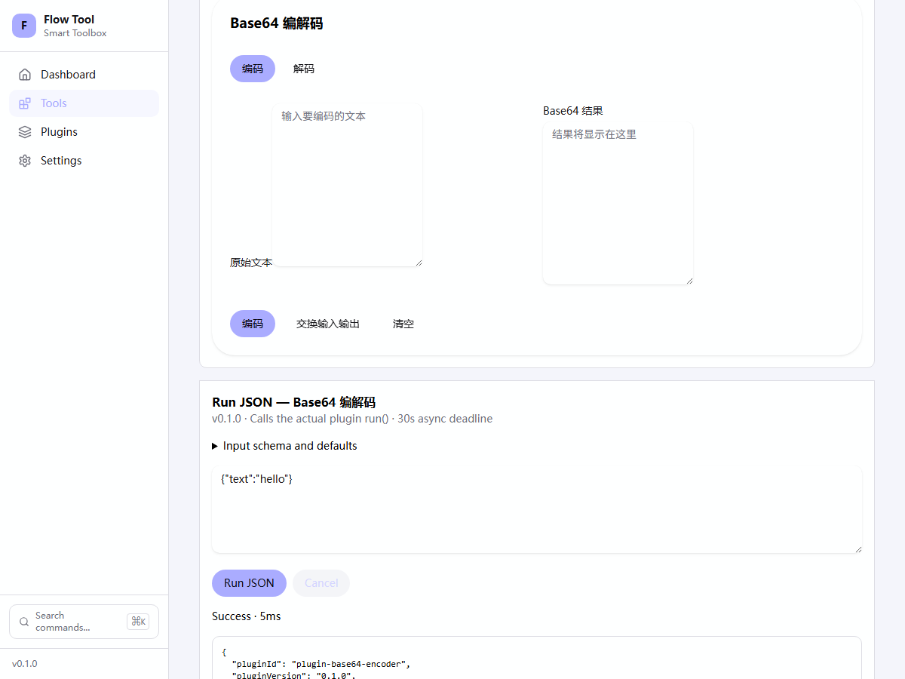
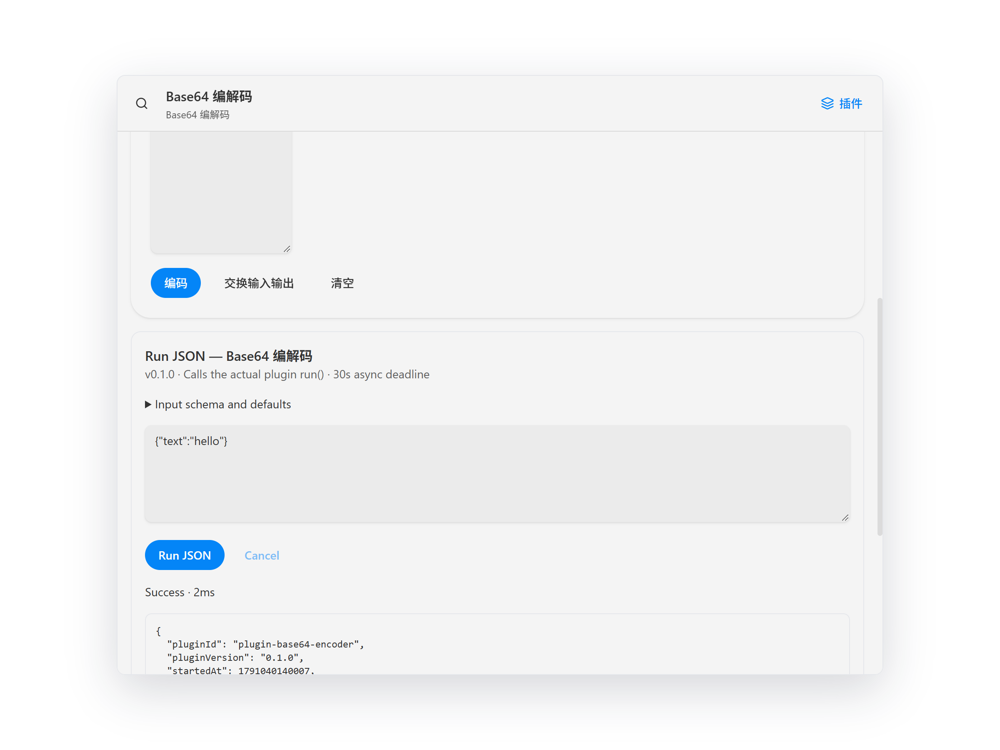
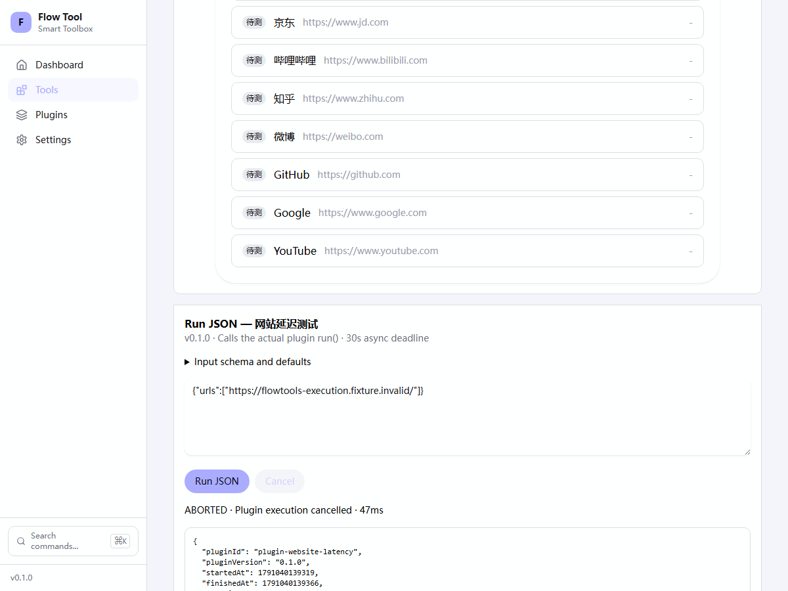
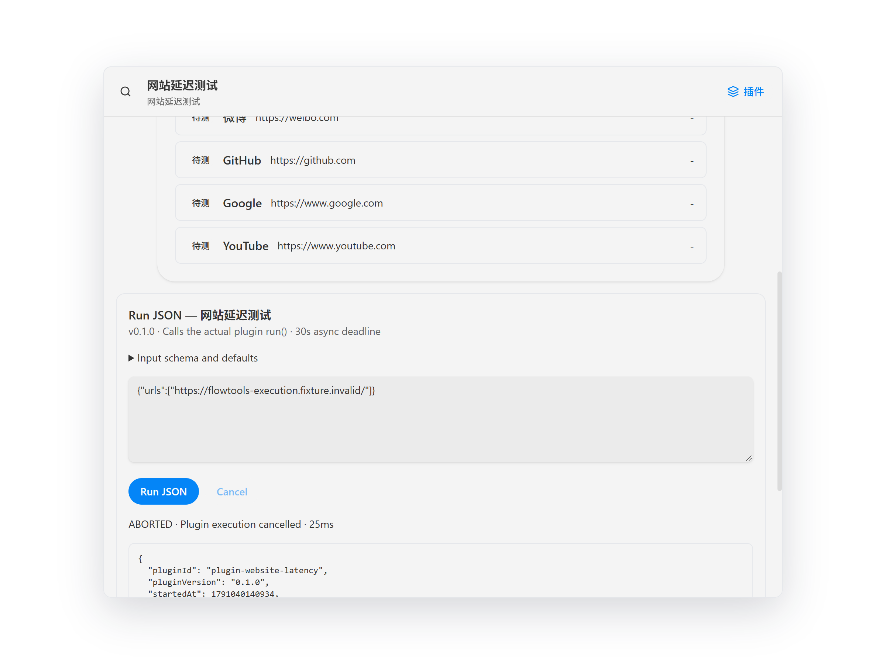
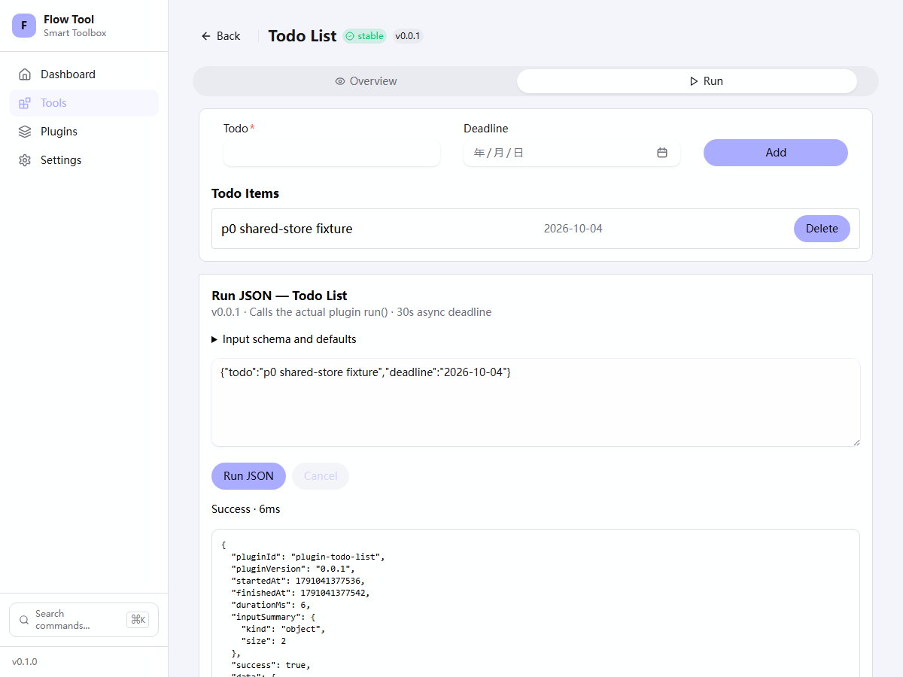
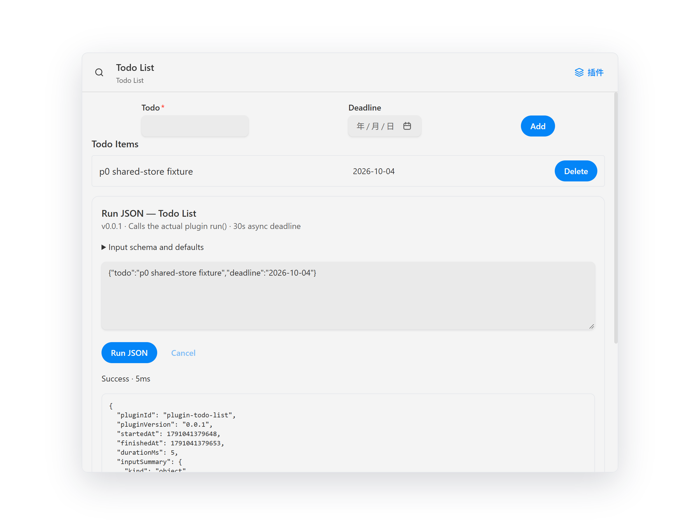
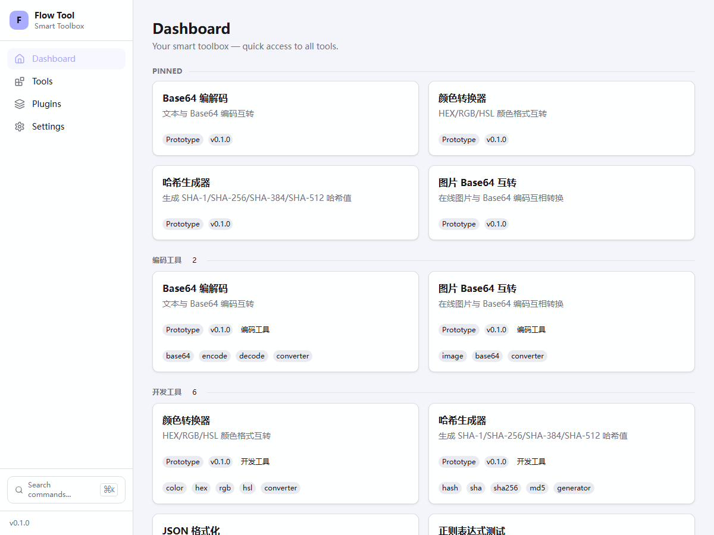
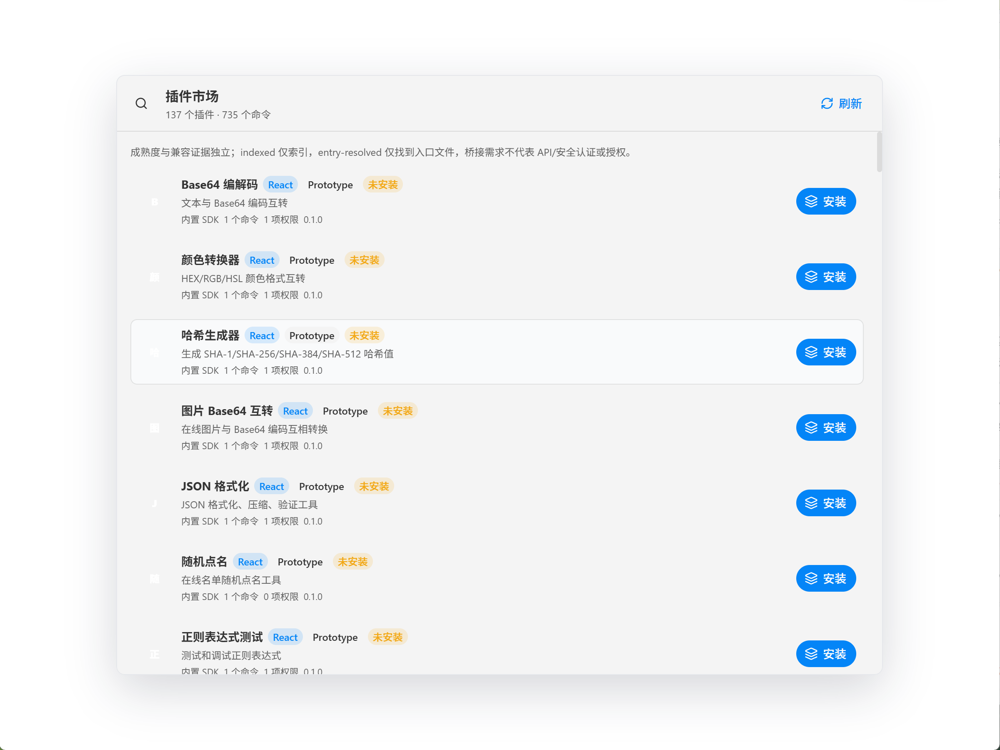
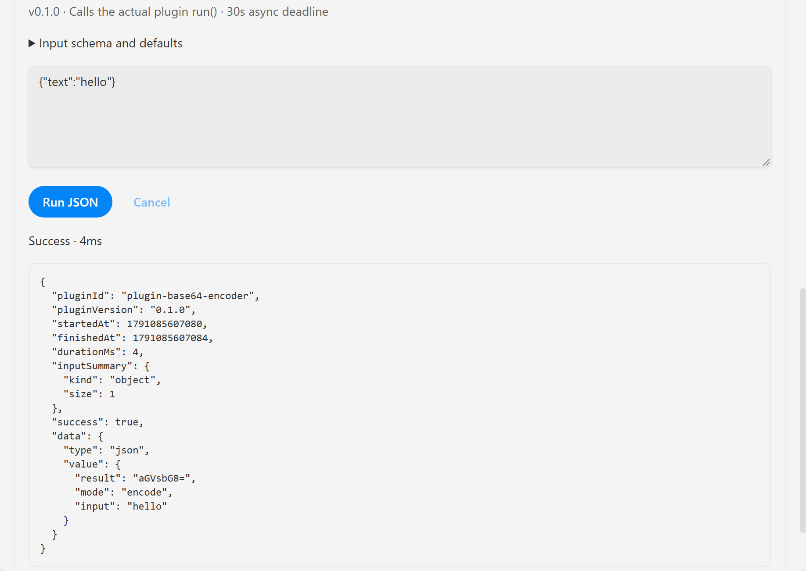

# P0.2b2 / P0.2c Windows 宿主验收

日期：2026-10-03。验证者：Codex；这是工程验收记录，不是独立安全 Reviewer 批准。

## 实际验证

- Web：Vite production preview，Chromium 1200×900，真实 bootstrap/registry/router。
- Desktop：Tauri 2.11.3 Debug app、实际 Windows WebView2 与 Rust 插件元数据 IPC。
  独立测试 identifier `com.flowtools.execution-validation-20261003`，隐藏窗口，
  单独 WebView profile；没有启动默认用户应用或访问用户数据库。
- 两端实际 Base64 `run({text:'hello'})` 都返回 v0.1.0 / `aGVsbG8=` / mode encode。
  耗时来自各自实际运行，不要求两个宿主的时间戳相同。
- JSON 输入、Tab 到 Run JSON、Enter 运行；schema 错误和损坏 JSON 都拒绝。
- 三次尝试的 metadata-only 历史落库、刷新恢复、清空通过；无原始输入、输出、
  错误 message。旧历史 key 未改动。
- 实际网站延迟插件执行中 Cancel 得到 ABORTED，控件恢复可用。
  请求只使用保留 `.invalid` fixture，并由 Playwright 拦截挂起，没有访问公网。
- 已人工检查以下截图：共享运行区域可见、控件无重叠、结果/取消状态可读；
  app panel 保留，长页面/原生容器通过滚动访问，不要求单屏显示全部输出。
- Chromium consumer 回归另测实际抛出异常、不可序列化输出、取消迟到结果与卸载
  abort；异常 fixture 不是替换内置 run() 的虚假成功。
- P0.2c 在修改后重新构建并复验以上两端流程；网站延迟走 SDK request，仍能
  实际取消。两端 Todo JSON 加入 `p0 shared-store fixture` 后，真实 app panel
  立即显示相同待办与 deadline，证明不是仅在 JSON 输出中声称添加。
- 十二插件 smoke 真实 compiled run/defaults、schema/预取消无副作用、实际 Todo
  损坏数据异常通过。CLI/Web/Desktop 的实际缺失 network 异常均返回稳定
  EXECUTION_FAILED，无请求副作用；未向生产 registry 注入异常插件。








## 复现与数据保护

使用 `apps/desktop/tauri.execution-validation.conf.json` 构建专用测试实例：

```powershell
bun run --cwd apps/desktop tauri build --debug --no-bundle `
  --config tauri.execution-validation.conf.json
bun run --cwd apps/web-vite preview --host 127.0.0.1 --port 4173 --strictPort
```

不要运行默认 Debug desktop：SEC-006 的现有启动重置数据库问题仍 open。
首次验证先确认专用 identifier 对应的 app data 不存在。以后重复验证只能重置
自己创建的 fixture 数据；不得复用真实用户身份/目录。独立 identifier 的数据路径
依据 [Tauri path 文档](https://tauri.app/reference/javascript/api/namespacepath/)。

仅对该测试子进程临时设置 `WEBVIEW2_ADDITIONAL_BROWSER_ARGUMENTS` 为
`--remote-debugging-address=127.0.0.1 --remote-debugging-port=9223`，并用
`WEBVIEW2_USER_DATA_FOLDER` 指向专用测试 profile；启动后立刻恢复父进程环境。
使用 `Start-Process -WindowStyle Hidden`，确认端口只监听 loopback，随后运行：

```powershell
$env:FLOWTOOLS_VALIDATION_WEB_URL = 'http://127.0.0.1:4173'
$env:FLOWTOOLS_VALIDATION_DESKTOP_CDP = 'http://127.0.0.1:9223'
node apps/ui-test/scripts/validate-execution-hosts.ts
```

不要使用 Bun 运行该 Playwright harness：本机 Bun 浏览器协议连接曾挂起；Node
24.16.0 正常完成。不要把调试端口写入生产配置、全局环境或注册表。
WebView2 临时调试参数见 [Microsoft 文档](https://learn.microsoft.com/en-us/microsoft-edge/webview2/how-to/debug-visual-studio-code)。
结束后关闭自己启动的实例与 preview，检查端口停止监听。生成 receipt 与原始
截图在忽略目录 `execution-validation/`；上述提交截图仅含受控测试数据。

## 未验证与非结论

### P0.3a3 自动化复验（2026-10-04，原生手工结果见下节）

共享 UI 的 9 项新增 Chromium 回归（共 59 tests）验证四个 maturity 标签、
缺省 Prototype 与独立 evidence。真实 Web production preview 的 Dashboard、
插件清单共 12 个实际内置 metadata 均显示 Prototype，没有 Stable；Base64
JSON/键盘、schema/损坏 JSON、metadata-only history/刷新/清空、network 取消和
Todo store 流程全部通过。以下新截图已检查，标签和交互区域可读。




本轮最初的专用 Tauri native build 通过，但自动化启动被执行策略拒绝；受支持的
Windows 验证工具报告 unavailable，浏览器连接也不可用。这次自动化尝试没有
启动原生应用或访问用户数据库；后续维护者手工结果见下节。上方 P0.2 旧截图
不得视为新 maturity UI 的验收。

维护者选择恢复工具后继续。按受支持流程重建连接后，仍返回
`Windows Computer Use Sky runtime is unavailable`；未尝试替代前台自动化、
修改安全设置或绕过启动策略。需维护者重新启动 Codex 应用并恢复连接后复验，
重启本身不构成工具已恢复或 Desktop 验收通过的证据。

Harness 默认仍要求两端；仅运行 Web 的独立诊断需显式设置
`FLOWTOOLS_VALIDATION_HOSTS=web`。receipt 会记录 hosts=web，不得将它解释为
Desktop 或 Phase 0 完成。完成原生验收需恢复受支持入口，或维护者使用专用
测试 identifier/profile 按上述清单记录实际路由、标签/证据、JSON/键盘与截图。

### P0.3a3 维护者手工验收（开发模式与独立包已回报通过）

维护者已改选手工验收。可见窗口的专用覆盖配置为
`apps/desktop/tauri.manual-validation.conf.json`，测试 identity 为
`com.flowtools.manual-validation-20261004-r2`；默认生产配置不变，不添加远程调试
参数。第一次使用前检查 Roaming/Local 下该 identity 不存在；它仅用于本次测试
数据，Debug 启动重置问题仍未修复，不得在此实例输入真实数据。

```powershell
bun run --cwd apps/desktop tauri build --debug --no-bundle `
  --config tauri.manual-validation.conf.json
```

构建后确认窗口标题为 `FlowTools manual validation - test data only`。
人工检查以下项目，并记录日期、通过/失败/未测及截图；只有构建通过不是验收：

1. Desktop 插件市场：实际内置插件显示 Prototype，HTML 条目也显示 Prototype；
   可分别找到 indexed、entry-resolved，两者独立于 maturity。说明文字明确索引、
   找到入口、桥接需求不等于兼容/安全认证或授权；不显示 Stable 或认证成功。
   仅浏览 HTML 元数据，不安装或运行第三方 HTML 插件。
2. 在同一个测试实例的市场找到内置 Base64，使用现有按钮进入其 SDK 页面。
   页头显示 Prototype，原 app panel 与 SDK execution JSON 区都可通过滚动访问。
   现有“安装”按钮只写入测试 metadata，不是签名包安装，诚实标签收口待 P0.3c。
3. JSON 输入 `{"text":"hello"}`，Tab 到 Run JSON 后 Enter，实际结果应 Success、
   `data.value.result` 为 `aGVsbG8=`、mode 为 encode；输入 `{"text":3}` 应
   INPUT_INVALID，输入单个 `{` 应提示有效 JSON 错误，不出现成功。
4. 同一会话刷新页面后，metadata-only 历史保留，清空历史生效，控件焦点可见，
   页面可正常返回市场。不要重启 Debug 进程来验收数据库持久性。
5. 内置 Todo 页执行 `{"todo":"p0 manual fixture","deadline":"2026-10-04"}` 后，
   JSON 执行成功，实际 app panel 同时显示相同待办。仅使用这个受控测试数据。
6. 1200×900 正常窗口与较小窗口下，市场状态/证据、执行输入/输出区域无重叠、
   不被裁掉，长内容能滚动访问。回报此项不认证 NVDA 或其他平台。

2026-10-04 维护者反馈：第一版独立 exe 显示 NotFound；使用 `bun dev:desktop`
完成上述六项手工测试。这记为开发模式的用户回报通过，不推断独立打包版本
也通过；当前没有对应新截图，不是独立安全 Reviewer 批准。

入口缺陷原因：Tauri 2.11.3 仅在配置路径恰好为 `index.html` 时省略该路径，
`index.html?execution-validation=...` 会保留 `/index.html`，与实际首页 `/`
不匹配。两种验收配置改为 `/?execution-validation=...`。真实 Tauri
MockRuntime 回归断言最终 URL 的 pathname 为 `/` 且 marker 保留；它们在旧
配置下均失败。Mock 不启动 Wry，不执行用户数据库，也不等于实窗已通过。
Harness 现在先验首页加载，再跳转插件市场，防止直接导航掩盖初始 NotFound。

第二版 identity 与第一版分离。2026-10-04 维护者针对修复后的第二版独立包
回报“一切正常”，补验初始页面、市场与实际 Base64 JSON，并提供下面两张
截图；Codex 已检查原图。市场截图可见 Prototype 标签与独立证据说明，
137 个插件 / 735 个命令包含 12 个内置和 125 个外部目录项，不表示第三方
兼容或可执行。成功截图显示真实输入 `{"text":"hello"}`、Success / 4ms 与
`data.value.result = aGVsbG8=`。首页正常及完整清单来自维护者回报，不能仅从
这两张截图推断全部键盘、持久性或兼容性行为。

第二版构建时间为 2026-10-04 11:43:22 +08，专用 identity 为上述 `-r2`，
产物 SHA-256 为
`590C39B1C397AC93A80C98DE0367E270F1979A1DA170CE1B1130D784C943435A`。
旧包及其测试数据保留；没有删除或迁移真实用户数据。结合自动化回归与分开
记录的开发模式完整清单、独立包补验，P0.3a3 验收缺口关闭；P0.3b/c 尚未完成。
维护者功能验收不等于独立安全 Reviewer 批准。




修复后根 docs/catalog/lint/types/test/build 全门禁通过，七 workspace 的 Turbo
任务强制执行、零缓存；新增两项实际 Tauri URL 回归通过（Rust 总计 13 tests）。
门禁不认证真实窗口打开、签名安装、第三方兼容或安全 Reviewer 批准。

### 通用限制

- 未验证 macOS/Linux、NVDA、完整对比度/缩放/触屏、OS 外壳焦点与签名安装包。
- 隐藏原生 WebView 截图/键盘验证不等于人工操作前台 Windows chrome。
- 不认证第三方插件兼容性、原生权限 broker、强制终止或供应链安全。
- 网站延迟已使用 SDK request，但 adapter 的出站策略和全局 fetch 隔离仍缺失；
  smoke 和路由验证不认证 grant。P0.2 截图的旧 stable 标签不代表生产成熟度，P0.3
  状态/生产准入仍未完成，整体仍 prototype。
