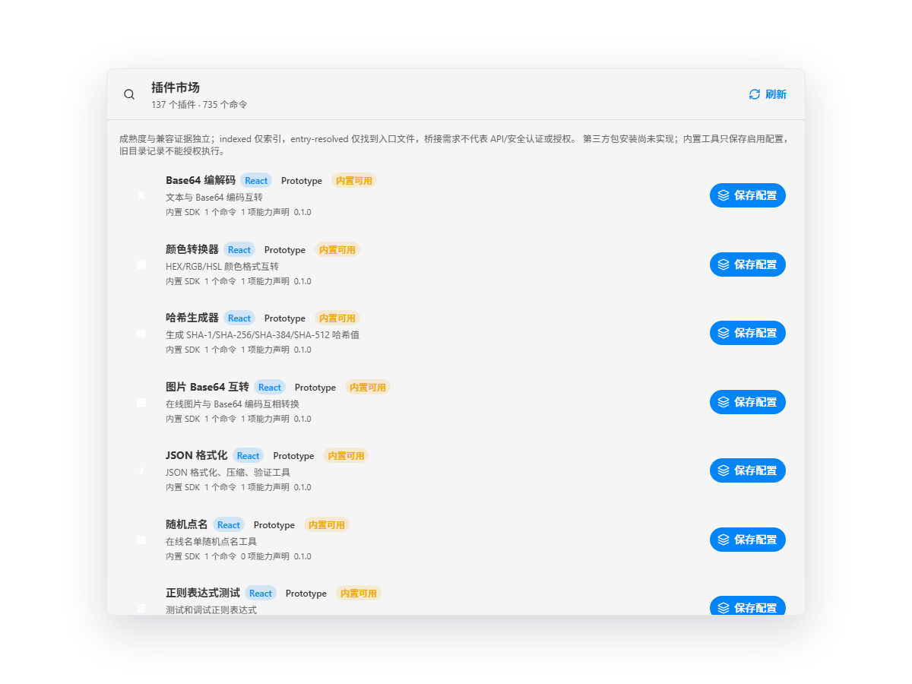
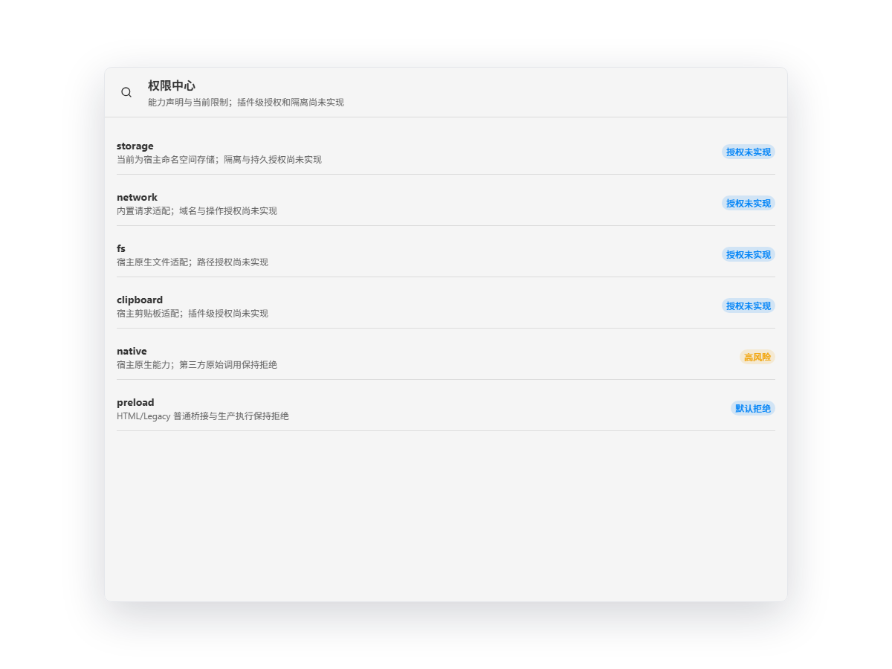

# P0.3c 市场状态与 Phase 0 收口

- 日期：2026-10-04；状态：done；Owner：Codex。
- 范围：内置配置、HTML 目录记录和真实包安装的可见区分。

内置操作显示“保存配置/配置已保存/启用并打开”，移除只称“移除配置记录”。
HTML 在任何已保存状态都显示不可安装并禁用主按钮，handler 同时拒绝；
旧记录仍能停用或移除，不迁移、不删除用户原数据。普通 runner/bridge 的
执行前拒绝继续保留。权限页记录授权与隔离未实现，不显示安全沙箱。
Rust DTO 旧 status 值为兼容元数据，本次不改包协议或 grant 事实。

`docs:check`、`verify:plugin-catalog`、根 lint/check-types/test/build、
`verify:production-entrypoints` 串行通过。根七 workspace tests uncached；
实际两端 production opt-in 重建逐字节一致。新增 2 项展示契约覆盖所有
HTML saved/enabled 状态和内置操作；原模式与入口拒绝回归全部保留。

项目锁定 Playwright Chromium 验证 Desktop 实际前端 `/plugins`、
`/permissions`：HTML 主按钮 disabled，无“安装”按钮；配置保存/启用后进入
真实 SDK Base64 面板，hello 返回 aGVsbG8=；权限限制可见。IPC 使用可丢弃
fixture，不启动原生窗口或访问用户数据库。截图已人工检查，标签无重叠。

按维护者本次明确要求，剩余原生人工复验豁免后关闭 G0；豁免不是实测通过。
已有 P0.2、P0.3a3/b1/b3 的原生人工记录保留。NVDA、其他平台、独立安全
Reviewer 和新的远端 CI 未在本次验证；全部成熟度仍 prototype，SEC 风险 open。
本次审阅：Codex，2026-10-04，结论为状态说明与默认拒绝保持一致，
仅工程自检，不是独立安全批准。涉及 SEC-001/002/006，ADR 无决策变更；
不新增 native API、持久 grant、文件/网络 scope 或 package installation。
