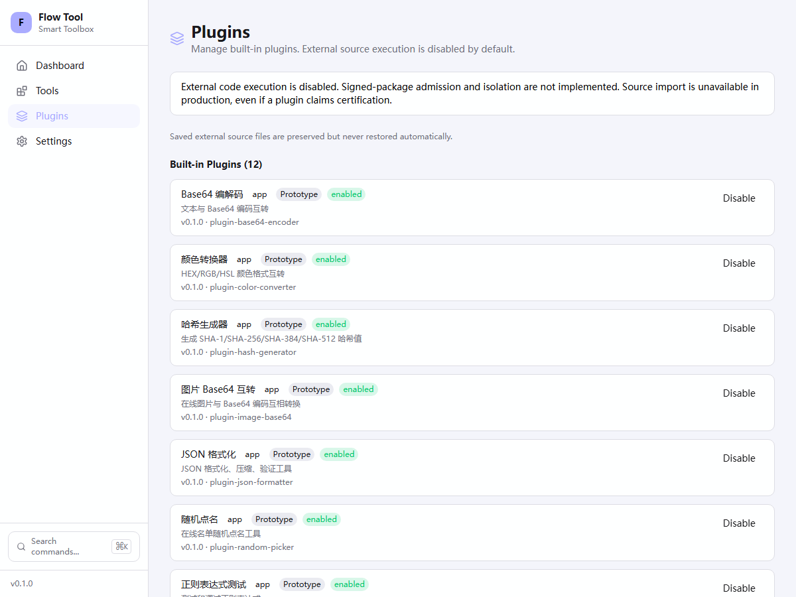
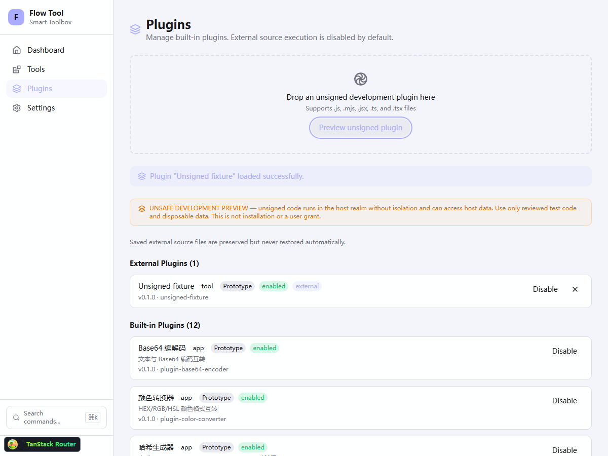

# P0.3b1 SDK / Web 源码入口验收

日期：2026-10-04。工程验证：Codex；不是独立安全 Reviewer 批准。
Desktop HTML/bridge 和 CLI source fallback 不属于本项关闭范围。

## 行为与边界

- 普通 SDK PluginFileLoader 对文件、批量、已解析外部对象和卸载入口返回
  EXTERNAL_CODE_DISABLED；拒绝前无文件读取、registry 或 lifecycle 副作用。
  普通 SDK 不再导出 transpile/needsTranspilation/setupImportMap/bridge URL。
- 危险代码分离到 development 子入口。该入口自己检查 Host 构建环境；DEV
  必须严格为 true，VITE_ENABLE_UNSAFE_PLUGIN_PREVIEW 必须严格为字符串 1。
  没有生产认证布尔开关；manifest、query、localStorage 均不提供授权。
  开发源码的 Host manifest 一律 prototype，不接受自行声明的 production 成熟度。
- Web 文件/enable/reload/unload 服务独立拒绝默认外部入口；不是只隐藏按钮。
  生产不动态导入危险子入口。所有模式都不自动执行/删除 IndexedDB 旧源码，
  连失败恢复也不静默删记录。开发需要重新主动选择审阅过的文件。
- 危险预览仍在主 realm，未签名、无 sandbox/grant/强制终止。只使用可丢弃
  数据，不认证第三方兼容性。T1 内置 registry/executor 是可信 Host API，
  不承诺能限制已经运行在 Host realm 中的恶意代码。

## 自动化与实际浏览器

新增 10 项拒绝回归在原实现全部失败；修复后通过。另有 SDK 六种构建模式
矩阵、没有 Host 环境的公开 development import 及绕过构造器调用 TS-private
方法的拒绝回归；不把 TypeScript private 当作运行时安全边界。构建 fixture 使用
真实实现，没有将实际内置 run() 替换为模拟成功。

| Host 构建 DEV    | opt-in 值                  | 危险开发入口   |
| ---------------- | -------------------------- | -------------- |
| false            | 缺省或字符串 1             | 拒绝           |
| true             | 缺省、字符串 0 或布尔 true | 拒绝           |
| true             | 字符串 1                   | 仅危险开发预览 |
| 无 Host 构建环境 | 任意调用参数               | 拒绝           |

`apps/ui-test/scripts/validate-web-source-gate.ts` 使用锁定 Playwright Chromium、
独立临时 browser context 和 loopback server，阻断全部非 loopback 网络：

1. 实际 Web production preview：无 file input/import-map/SDK 全局，无预览
   按钮；显示拒绝理由。伪 certified query 与 localStorage grant 均无效。
2. 实际默认 Vite dev：同样默认关闭，旧源码原样保留且不执行。
3. 实际显式 opt-in Vite dev：警告可见，Tab/Enter 可触发文件选择；选择带 TS
   类型的 unsigned fixture 后真实源码转译/导入成功、显示 Prototype。刷新后
   此 fixture 也不自动恢复；原恶意旧源码仍保留且未执行。

三种模式无意外 page exception、无非 loopback 请求。原图已由 Codex 检查：
提示与状态可读、无重叠，列表仍能滚动。这不是 NVDA、完整对比度或跨平台验收。
原始截图和 receipt 在忽略目录 execution-validation/p0b1-web。

完整根 docs/catalog/manifest/lint/types/test/build 强制执行、零缓存通过；SDK
86、CLI 33、plugins 41、Web 22、Desktop 25 Bun + 13 Rust、Chromium 59 tests。
十二个真实 compiled built-ins 的 smoke 另有 15 项通过。最终 Web production
preview 复验了实际 Base64/schema/JSON/键盘/脱敏 history、network 取消和 Todo
共享状态。额外明确设置 opt-in=1 重新构建 production，所有文件路径/SHA-256 与
此前生产构建相同，且无开发源码实现、Sucrase、CDN import-map 或预览按钮文本。
这只是 Web artifact 检查；跨宿主的可复现发布门禁待 P0.3b4。chunk-size warning
仍是性能债，不是 lint warning 或安全认证。




## 复现

先按根门禁顺序完成 package prerequisites/test/build，再启动实际 Web preview。
另开两个开发服务器，分别不设置和明确设置 opt-in；它只设置到该子进程，
不得写入生产配置或用户全局环境：

```powershell
bun run --cwd apps/web-vite preview --host 127.0.0.1 --port 4173 --strictPort
# 独立终端，默认关闭：
bun run --cwd apps/web-vite dev --host 127.0.0.1 --port 4176 --strictPort
# 另一个独立终端，测试数据专用：
$env:VITE_ENABLE_UNSAFE_PLUGIN_PREVIEW = '1'
bun run --cwd apps/web-vite dev --host 127.0.0.1 --port 4175 --strictPort
```

```powershell
$env:FLOWTOOLS_GATE_PRODUCTION_URL = 'http://127.0.0.1:4173'
$env:FLOWTOOLS_GATE_DEVELOPMENT_URL = 'http://127.0.0.1:4176'
$env:FLOWTOOLS_GATE_PREVIEW_URL = 'http://127.0.0.1:4175'
node apps/ui-test/scripts/validate-web-source-gate.ts
```

这不是 Windows 前台控制替代方案，不启动 Desktop 或访问用户数据库。关闭自己
启动的开发/preview 服务。完整 P0 收口还需要 CLI/Desktop gate、最终发布产物
门禁和诚实市场/权限状态；12 项 SEC 风险保持 open。
